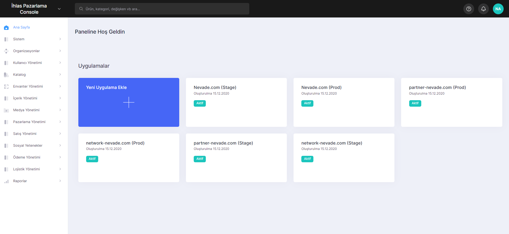

# Features

The feature guides provide in-depth information about the features, including their practical uses, advantages for businesses, and real-world applications.

This information can be valuable for individuals such as **business owners**, **product owners**, or **developers**.

With the Lidia Console, which has an easy menu, you can manage the system, catalogs, contents and many other elements related to your site. Here are a few steps to help you do this:&#x20;

1. **Create your app on Lidia**&#x20;

When you log in to the Lidia console with the e-mail and password you received with the service you receive, the main page welcomes you. You can create a web application, mobile application or desktop application depending on your preference with the add new application button on the home page.

<figure><figcaption>
Create New Application
</figcaption></figure>

2. **Design Your Data Universe**

* Meta Data
* Options
* Features
* Tags
* Categories
* Brands
* Product Families
* Manage Other Contents
* Menus
* Showcases
* Blocks
* Pages
* Lists

<figure><figcaption>
Home Page Screen of Lidia Console
</figcaption></figure>

3. **Upload Products and Their Images**

* Pool
* Live

4. **Use the Application Development Interface (API)**

* Developer Documentation ([https://dev.lidiacommerce.com](../../solutions-overview.md))
* Code Sample
* API Key
