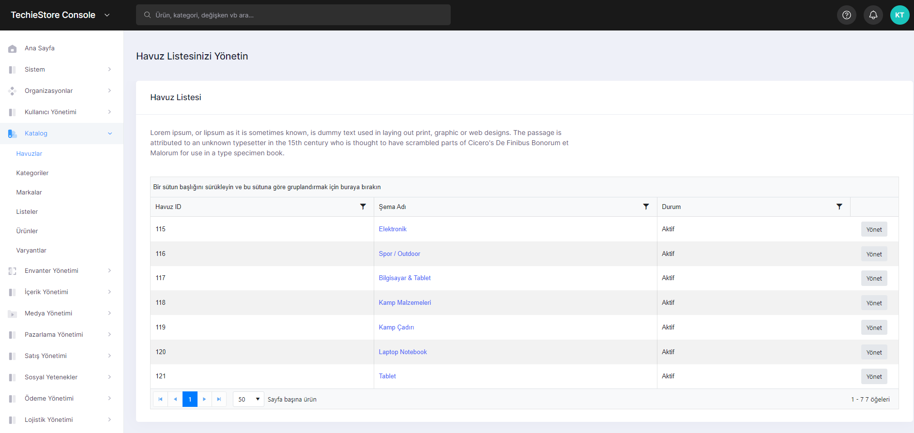
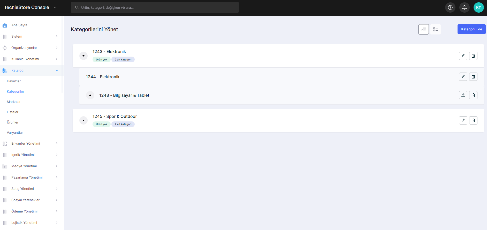
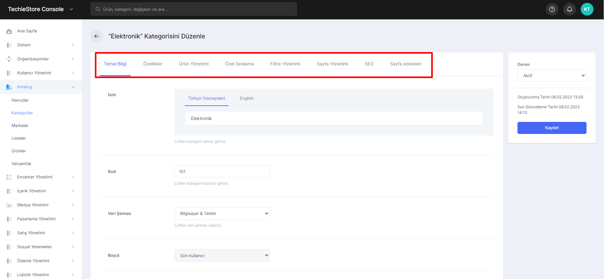
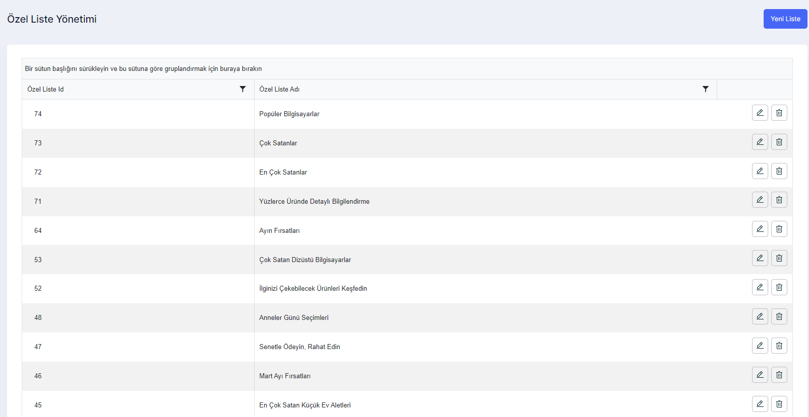
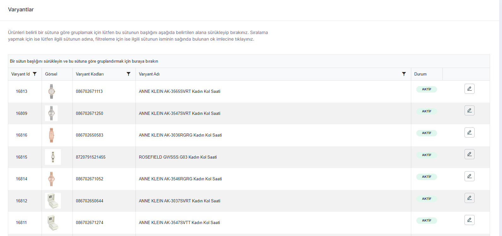

# Catalog

1. Data Pools&#x20;
2. Categories&#x20;
3. Brands&#x20;
4. Lists&#x20;
5. Products
6. Variants

## Data Pools

The page with the schemes specific to the products in the system. You can list and manage the schemas on this page.

<figure><figcaption>
Pool List Management Screen
</figcaption></figure>

## Categories

The page where we can view all product categories in the system. On this page, you can add new categories, edit and delete the categories that have been added. You can also edit the filters of that category while editing the categories.

<figure><figcaption>
Categories Management Screen 
</figcaption></figure>

<figure><figcaption>
Categories Edit Screen 
</figcaption></figure>

## Brands

The page where you can view the brands that are registered in the system or have products. On this page, you can add a new brand, edit and delete the existing brand. You can also manage brand-specific filters and list products while editing brands.

<figure><figcaption>
Brands Management Screen
</figcaption></figure>

## Lists

You can check all the listing criteria in the system from this page. You can add many listing criteria such as bestsellers, July deals, edit and delete added listings.

<figure><figcaption>
List Management 
</figcaption></figure>

## Products

The page where you can manage all the products in the system. On this page, you can add new products, edit and delete the products you have added. You can also manage product features, images, basic information and other products related to the product while editing products.

<figure><figcaption>
Products Management Screen 
</figcaption></figure>

## Variants

Here you can view the variants of the products you have installed.

<figure><figcaption>
Variants Screen
</figcaption></figure>

