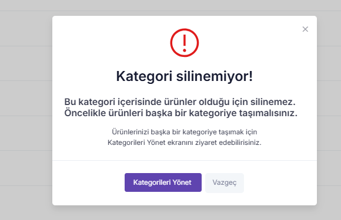

# Delivery Management

The Delivery Management section is where the logistics process is managed end to end from the moment approved orders enter the delivery stage. Once orders are approved, they are converted into deliveries and are listed as independent delivery records on the Delivery Management page.

This section enables sellers to track delivery statuses, monitor shipping processes, and manage all steps until the products reach the customer in a transparent, traceable, and controllable manner.

### **Delivery Processes**&#x20;

Deliveries progress through specific statuses in a flow-based sequence. Depending on the progress of the process, a delivery may pass through the following statuses:

* **Pending:**&#x54;he delivery has not yet been processed. Although the order has been approved, the preparation or logistics process has not started.
* **Ready:** The products included in the delivery have been prepared by the seller and are waiting to be handed over to the shipping provider.
* **Delivery Code Created:** A shipping / consignment code has been generated by the system for the delivery. At this stage, the delivery is ready to be handed over to the shipping company.
* **In Delivery Process:** The delivery is being transported by the shipping company. The logistics process is actively ongoing, and delivery movements are updated during this stage.
* **Returned to Sender:** The delivery could not be delivered to the recipient and has entered the return-to-seller process by the shipping company.
* **Returned:** The delivery was returned by the customer after it was delivered, and the return process has been initiated.
* **Delivered:** The delivery has been successfully completed, the product has reached the recipient, and the delivery process has been closed.

These statuses clearly indicate which stage the delivery is in and help sellers take the correct operational actions at the right time.

### **Delivery Management Page**&#x20;

On the Delivery Management page, all deliveries are displayed in a list with the following information:\
Delivery ID, Order ID, Customer, District / City, Full Address, Status.

This list view allows sellers to easily track all active, ongoing, and completed deliveries from a single screen.

### **Delivery Detail Page**

When navigating to the details of any listed delivery, all information related to the delivery is presented in structured templates.

If the delivery is carried out through a shipping provider integrated with the system, the Shipment Tracking button on the screen redirects the user to the shipment tracking page of the relevant shipping company. This allows real-time tracking of the delivery status through the carrier.

* **Summary Section**

The Summary section at the top of the detail screen allows quick access to the core delivery information. This area includes:\
customer first name, last name, email address, phone number, order number, order reference number, delivery amount, delivery status.

* **Delivery Information**

The Delivery Information section presents detailed recipient and sender information related to the shipment:

**Recipient Information:** recipient name, phone number, mailing address\
**Sender Information:** sender name, sender address

This information is critical to ensure the delivery reaches the correct address and the correct recipient.

* **Delivery Content**

The Delivery Content section details the items included in the delivery. This area displays:\
product name, shipped quantity, unit price, discount amount (if any), total delivery amount.

This allows clear tracking of delivery contents and price breakdowns.

* **Delivery Movements**

The Delivery Movements section presents the main logistics activities in chronological order. Each movement is displayed along with location information, date, and time details.

Example delivery movements:

* Collected Shipment
* Shipment Loaded onto Vehicle
* Shipment Unloaded from Vehicle

This section allows sellers to track the delivery process step by step and analyze the reasons for potential delays.

<figure><figcaption></figcaption></figure>
