# Türkçe

Kullanıcı kılavuz dökümantasyonu 8 ana başlıkta incelenecektir.\

1. [Giriş](turkce.md#giris)
2. [Anasayfa](turkce.md#anasayfa)
3. [Mağaza Yönetimi](turkce.md#magaza-yonetimi)
4. [Ürün Yönetimi](turkce.md#urun-yonetimi)
5. [Satış Yönetimi](turkce.md#satis-yonetimi)
6. [Hedef Yönetimi](turkce.md#hedef-yonetimi)
7. [Medya Yönetimi](turkce.md#medya-yonetimi)
8. [Raporlar](turkce.md#raporlar)

### Giriş

Lidia Merchant Console, platformumuzun satıcılarının ürün bilgilerini toplamaları, düzenlemeleri ve etkili bir şekilde yönetmeleri için özel olarak tasarlanmış bir ara yüzdür. Bu konsol, satıcıların ürünlerini platformumuza yüklemelerine ve ürün bilgilerini güncellemelerine olanak tanır. Ürünlerin özellikleri, teknik detayları, görselleri, videoları ve fiyatlandırma gibi tüm önemli veriler burada toplanır ve kolayca işlenir.

### Anasayfa

Anasayfa, Lidia Merchant Console'e giriş yapıldığında ilk karşılaşılan ekrandır. Bu ekran, satıcının performans analizlerini ve mağazasına ait değerleri gösterir. Ayrıca, üst menüden dil değişikliği yapılabilir ve sol menüden Mağaza Yönetimi, Ürün Yönetimi, Satış Yönetimi, Hedef Yönetimi, Medya Yönetimi ve Raporlar görüntülenebilir.

_**Ana sayfa “İlk Bakış”, “Satış Performansı”, “Mağaza Performansı”, “Ürün Performansı” ile ilgili gösterilen değerleri  içerir.**_

Satış Performansı bölümünde; satış raporları görüntülenebilir ve tarihe göre raporlanabilir.&#x20;

Mağaza Performansı bölümü son iki ay özelinde önemli ve sürekli güncellenen değerleri tablo halinde yansıtmaktadır. Ayrıca kullanıcılar, değerler altında bulunan alt başlıklara tıklayarak ilgili sayfaya gidebilirler.&#x20;

Ürün Performansı bölümü son iki ay özelinde en çok satan ürünleri listeler.&#x20;

## Mağaza Yönetimi

Mağaza yönetimi bölümünde; satıcılar mağaza bilgilerini görüntüleyebilir, kullanıcılarını yönetebilir. _**Mağaza Yönetimi alanı; "Mağaza Detayları" ve "Mağaza Kullanıcıları" olarak 2 bölümden oluşur.**_\

### Mağaza Detayları

Mağaza detayları bölümü satıcıların; temel bilgileri, adres bilgileri, entegrasyon bilgileri ve ayarlar bölümlerinden oluşur. Mağaza detaylarında satıcı mağaza durumunu da değiştirebilir.

_**Mağaza Detaylarında 4 ana bölüm vardır; “Temel bilgiler”, “Adres Bilgileri”, “Entegrasyon Bilgileri” ve “Ayarlar”.**_\
\
Temel Bilgiler bölümünde mağazanın adı, cari ünvanı, vergi dairesi, vergi numarası ve iban bilgileri yer alır. Bu bölümde mağaza yöneticisi iban bilgisini ve mağaza adını değiştirebilir. Iban bilgisi satıcının ödemeyi alacağı iban bilgisidir.

<figure><figcaption>
Temel Bilgiler
</figcaption></figure>

Adres bilgileri bölümünde; mağazanın adres bilgileri ve mevcut depo bilgileri ile depolara ait adresler yer alır. Mağaza yöneticileri, "Depo Ekle" diyerek yeni bir depo oluşturabilirler.

<figure><figcaption>
Adres Bilgileri
</figcaption></figure>

Entegrasyon bilgileri bölümünde; organizasyonumuzun ID ve Erişim anahtarı kodları yer alır. \
\
&#xNAN;**"ID"** ;  Lidia'a kayıtlı organizasyon id'sidir\
&#xNAN;**"Erişim anahtarı"** ; Lidia'a kayıtlı uygulama anahtarıdır. Lidia API ürünümüze bağlanabilmek için kullanılabilen bir koddur.

<figure><figcaption>
Entegrasyon bilgileri 
</figcaption></figure>

Ayarlar bölümünde; \
Satıcı eğer tanımlanmadıysa hizmet vereceği kategorileri ve bölgeleri seçebilir.

<figure><figcaption>
Ayarlar
</figcaption></figure>

### Mağaza Kullanıcıları

Mağaza kullanıcıları bölümünde; satıcının kullanıcılarının bir listesi yer alır. Satıcı yönetici paneline ihtiyaç durmadan bu sayfalardan kullanıcı ekleyebilir. Bu listede kullanıcıların ad-soyad, e-posta adresi, rolü, oluşturma tarihi ve durum bilgisi görüntülenir.&#x20;

<figure><figcaption>
Mağaza kullanıcıları
</figcaption></figure>

Mağaza kullanıcı detayında da kullanıcının listelenen temel bilgileri görüntülenir ve telefon numarası da eğer istenilirse değiştirilebilir.

<figure><figcaption>
Mağaza kullanıcısı detayı
</figcaption></figure>

## Ürün Yönetimi

Ürün Yönetimi bölümünde; satıcılar sattıkları ürünleri görüntüleyebilir, fiyat - stok bilgisini düzenleyebilir, katalogtan ürün ekleyip direkt satışa ürün çıkarabilir ve ürünlerini yönetebilir.

_**Ürün Yönetimi; “Toplu Ürün İşlemleri”, “Fiyat/Stok İşlemleri”, “Katalogdan Ürün Ekle” ve “Ürünlerim” olarak 4 bölüme ayrılır.**_

### Toplu Ürün İşlemleri

Toplu ürün işlemlerinde mevcutta bulunan ürün ailelerini listeleyebilir ve  ürün ailelerine ait ürünleri görüntüleyebilirler.

<figure><figcaption>
Toplu Ürün İşlemleri
</figcaption></figure>

#### Ürün Ailesi Ekleme

Toplu ürün işlemleri sayfasında bulunan "Yeni Ürün Ailesi Ekle"  butona tıklayarak, kategori seçtikten sonra devam diyerek yeni bir ürün ailesi eklenebilir.

<figure><figcaption>
Ürün Ailesi Ekleme
</figcaption></figure>

#### Ürün Ekleme ve Değiştirme

Satıcılar toplu ürün işlemleri sayfasında listelenen ürün aileleri satırında bulunan "Ürünleri Yönet" butonuna tıklayarak ilgili ürün ailesinde bulunan ürünleri görebilir, ürünleri dışa aktarılabilir ve yeni ürünler ekleyebilirler.

_**Ürünleri yönetme sayfası; "Tümü", "Onaya Gönderilmeyen", "Onay Bekleyen", "Onaylananlar" ve "Yayındakiler" olmak üzere 5 bölümden oluşur.**_

"Tümü" sayfasında, havuzda bulunan tüm ürünler listelenir. Satıcılar, havuza ürün eklemek istediğinde "Verileri Dışa Aktar" diyerek örnek exceli indirebilirler. Havuz uygun olan exceli düzenledikten ve yeni ürünleri ekledikten sonra "İçeri Veri Aktar" diyerek havuza ürün ekleyebilirler.

İçe aktarılan ürünler ilk olarak "Onaya Gönderilmeyen" bölümünde listelenir.

<figure><figcaption>
Onaya Gönderilmeyen Sayfası
</figcaption></figure>

Satıcı listelenen ürünlerden, onaya göndermek istediklerini seçebilir veya tümünü onaya gönderebilirler. Onaya gönderilen ürünler "Onay Bekleyen" sayfasında listelenir.

<figure><figcaption>
Onaya Gönderilen Ürünler
</figcaption></figure>

Satıcılar onay bekleyen ürünler arasında, onaya görderilmesi istenmeyen ürünleri seçebilir ve "Seçili Ürünleri Onaydan Geri Çek" butonuna tıklayarak işlemi geri alabilirler. Onaya gönderme işlemi iptal edildiğinde, seçilmiş ürünler ilk aşama olan "Onaya Gönderilmeyen" sayfasına geri alınır.&#x20;

Consol yöneticisi tarafından onaylanan ürünler "Onaylananlar" sayfasında listelenir. Satıcı, onaylanan ürünleri yayına alabilir.&#x20;

### Fiyat / Stok İşlemleri

Fiyat / Stok İşlemleri sayfalarında merchant sistemdeki ürünlerini görüntüleyebilir. Varyantlarının arasından kategori filtresi ile satmak istediği kategoriyi seçip; stok ve fiyat tanımlayarak ürünlerine ekleyebilir. Seçilen varyanta stok eklemek için ilgili satırdaki düzenle butonu ile stok bilgisi eklenerek ürün eklenmesini tamamlanabilir.

<figure><figcaption>
Düzenle
</figcaption></figure> <figure><figcaption>
Stok tanımı
</figcaption></figure>

<figure><figcaption>
Stok ve Fiyat tanımı tamamlandı
</figcaption></figure>

Fiyat stok işlemleri ekranında ayrıca satıcılar kırılım ekle butonu aracılığı ile satır bazında varyantı çoğaltabilir; envanterlerindeki ürünün envanter kırılım kodunu ekleyebilir ve yine aynı şekilde fiyat ve stok tanımı girerek ürününü sisteme tanımlamış olur.

<figure><figcaption>
Satır bazında kırılım ekle
</figcaption></figure> <figure><figcaption>
Yeni kırılım satırı
</figcaption></figure>

<figure><figcaption>
Tanımla
</figcaption></figure> <figure><figcaption>
Yeni kırılım
</figcaption></figure>

Stok ve fiyat tanımı için merchant'lar seçili kategorideki ürünleri veya tüm ürünleri excel ile dışarı aktarıp, excel üzerinden toplu olarak değiştirip tekrar excel ile içeri aktarabilirler; bu sayede merchant'lar toplu şekilde de fiyat / stok güncellesi yapmış olurlar.

<figure><figcaption>
Dışarı aktar
</figcaption></figure> <figure><figcaption>
Dışarı aktar
</figcaption></figure>

Seçilen kategoriyi veya tüm ürünleri excel olarak dışarı aktarabilirsiniz.

<figure><figcaption>
İndir
</figcaption></figure>

İndirilen excel üzerinden istenen değişiklikler yapıldıktan sonra tekrar içeri alınabilir.

<figure><figcaption>
İçeri aktar
</figcaption></figure> <figure><figcaption>
İçeri aktar
</figcaption></figure>

\

### Katalogtan Ürün Ekle

### Ürünlerim

Stok ve fiyat bilgisi tanımlanmış satışta olan veya satışa çıkarılan merchant'ın tüm ürünleri Ürünlerim sayfalarında listelenir.

Ürünlerim sayfalarında merchant'ın sattığı ürünlerin adı, barkodunu, satıcıya ait tekil kodu, ürünün marka ve kategorisi bilgisini, görselini, stok durumunu, komisyon oranını, fiyatını ve durumunu görebilirsiniz. \

<figure><figcaption>
Ürünlerim
</figcaption></figure>

Listelemede Stok durumu "0" olanlar kırmızı bir uyarı ile belirtilir; stok durumu "20" adedin altına düşenler de turuncu uyarı ile belirtilir.

<figure><figcaption>
Uyarıların gösterimi
</figcaption></figure>

## Satış Yönetimi

Satış Yönetimi bölümünde, satıcılar siparişlerini görüntüleyebilir, düzenleyebilir, teslim süreçlerini inceleyebilir ve teslim ettikleri ürünleri denetleyebilirler. Ayrıca, bu ekranlar aracılığıyla sipariş ve teslimat kodlarına erişebilirler. Teslimat profillerinde çalışılan kargo şirketlerinin profilleri oluşturabilir ve müşterilerden gelen iptal ve iade taleplerini görüntüleyebilir, onaylayabilir veya reddedebilir.

_**Satış yönetimi; "Sipariş Yönetimi", "Teslimat Yönetimi", "Teslimat Profili" ve "Talep  Yönetimi" olmak üzere 4 bölümden oluşur.**_

### Sipariş Yönetimi 

Sipariş yönetimi sayfasında müşteriler, tüm siparişlerinin; teslimat kodunu, müşterisinin bilgilerini, toplam tutarı, siparişinin tarihini ve sipariş durumunu görebilir.  \
\

<figure><figcaption>
Sipariş Yönetimi
</figcaption></figure>

Sipariş durumları merchant'ın siparişleri için aldığı kararlara göre listeleme ekranlarında değişir;

* Sipariş ilk sisteme düştüğünde, _Bekliyor,_

<figure><figcaption></figcaption></figure>

* Sipariş sistemden merchant tarafından onaylanırsa, _Hazır,_

<figure><figcaption></figcaption></figure>

* Sipariş kargoya ver denilirse, _Teslimat Sürecinde,_

<figure><figcaption></figcaption></figure>

* Sipariş iptal edilirse, _İptal Edildi,_

<figure><figcaption></figcaption></figure>

* Sipariş teslim edilirse, _Teslim Edildi,_

<figure><figcaption></figcaption></figure>

...statülerinde sipariş listeleme ekranlarında görüntülenir.

\
Üst menüdeki arama kutucuğu ile tüm siparişler arasında arama yapabilir ve filtreleme seçenekleri ile siparişlerinizi filtreleyebilirsiniz. Kolayca siparişler arasında siparişlerin tarihine ve fiyatına göre sıralama yapabilirsiniz.

<figure>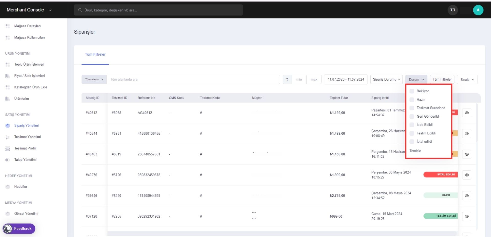<figcaption>
Durum
</figcaption></figure> <figure><figcaption>
Sırala
</figcaption></figure>

<figure>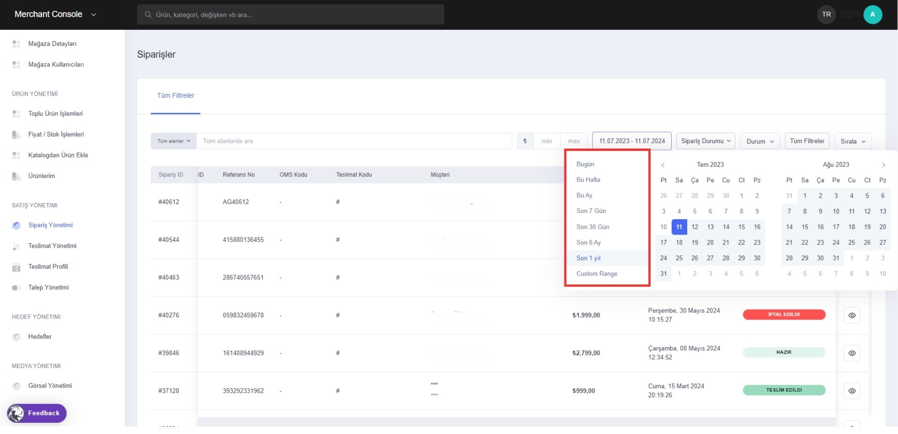<figcaption>
Tarihe Göre Filtreleme
</figcaption></figure>

Herbir sipariş satırındaki en sağdaki görüntüle butonununa tıklayarak sipariş içeriğini görüntüleyebilirsiniz

<figure><figcaption>
Sipariş İçeriği - Görüntüleme
</figcaption></figure> <figure><figcaption>
Sipariş İçeriği Sayfası
</figcaption></figure>

Sipariş içeriğinde merchant müşteri bilgilerine (satın alan müşterinin sistemde kayıtlı e-posta adresi), sipariş edilen ürünün bilgisine, teslimat ve fatura adreslerini görüntüleyebilir. Siparişi için ise; siparişini _onaylayabilir_ ve _reddedebilir._&#x20;

_**Sipariş içeriği sayfası; "Sipariş Özet", Sipariş Hesap Dökümü" ve "Teslimat İçeriği" olmak üzere 3 bölüm içerir.**_

Onaylanan siparişler için detay sayfasında sipariş özeti ve siparişe ait gelir, maliyet listelenmiş halde hesap dökümünde gösterilir.

Siparişi seçili butondan onaylayabilirsiniz; **onaylanan ürünler** için 2 seçenek sunulur,

<figure>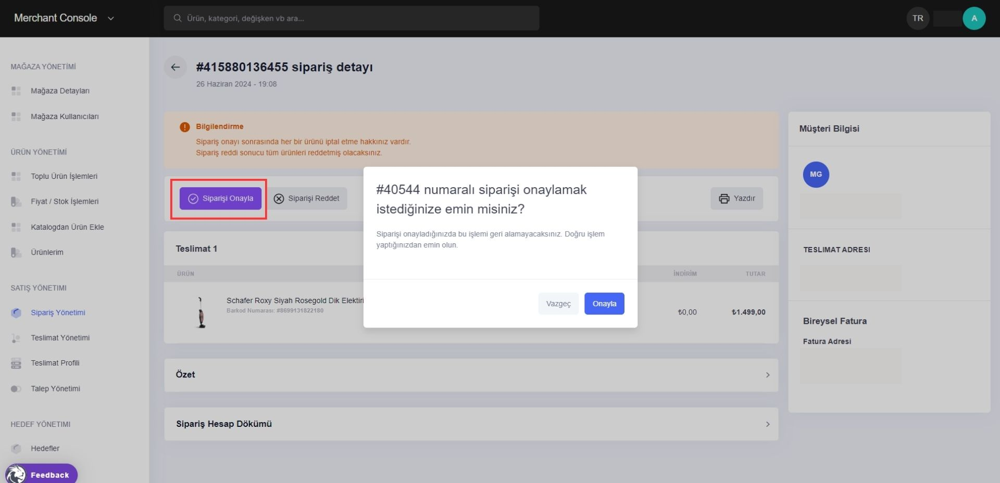<figcaption>
Bekleyen Siparişi Onaylama
</figcaption></figure> <figure>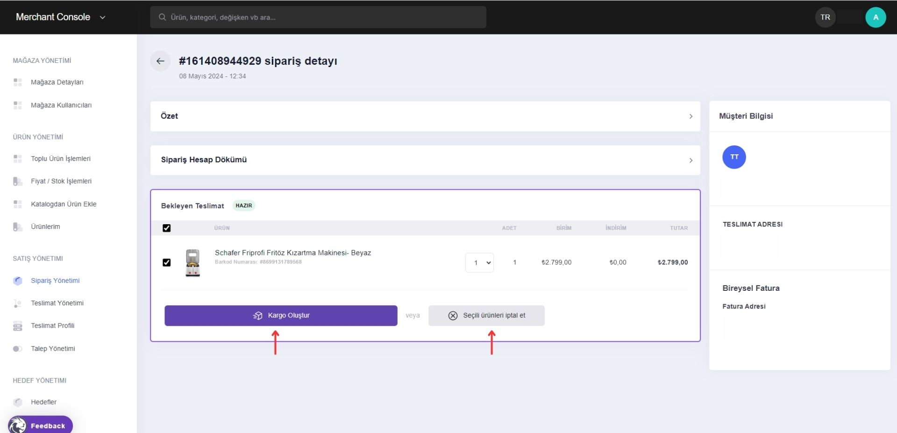<figcaption>
Kargoya Ver / İptal Et
</figcaption></figure>

#### Kargoya Verme

Seçili ürünleri kargoya ver

#### Burada merchant'ın ürününü kargoya vermek için 3 seçeneği vardır;

_1- Kendi anlaşmalı kargom ile kargoya vereceğim_

Burada merchant tanımladığı anlaşmalı kargo şirketlerinden istediğini seçebilir ve oluştur butonu ile teslimatını oluşturabilir.&#x20;

\
Merchant kendi anlaşmalı kargosu ile gönderim sağladığı için, anlaşmalı kargo şirketinin verdiği takip kodunu sisteme "takip kodu" bölümünden tanımlayabilir ve bu sayede merchant ve  müşterisi bu kod ile kargo takibi yapabilir.\

_3- Pazar yeri anlaşmalı kargo ile göndereceğim_

Burada sistem tarafından yapılan seçim, genel teslimat profili ve kullanıcının özelleştirdiği teslimat ayarları doğrultusunda gerçekleşir. Kullanıcılar teslimat ayarlarını değiştirmek isterlerse, ekran içerisinden yönlendirme sağlanır.

.png>)

_2- Kendim teslim edeceğim_

Burada merchant kendim teslim edeceğim diyebilir ve oluştur butonu ile teslimatını oluşturabilir.&#x20;

Merchant kendisi gönderim sağlayacağı için, sistem üzerinden tanımlayacağımız teslimat kodunu sisteme ekleyebilir ve bu sayede merchant ve müşterisi bu kod ile kargo takibi yapabilir. Merchantlar oluşturulan teslimat belgesini görüntüleyip, belgeleri indirebilirler.

\
**Kargo süreci tamamlanan ürünler teslimat yönetimi bölümünde listelenir ve yönetilir.**

#### İptal Etme

Seçili ürünleri iptal et

#### Seçili ürünü yönlendirmelerimiz aracılığıyla iptal edebilirsiniz.

Seçili ürünleri **onaylamadan iptal** edebilirsiniz,\

<figure><figcaption>
Sipariş içeriği
</figcaption></figure> <figure><figcaption>
Red onay ekranı
</figcaption></figure>

<figure><figcaption>
Red
</figcaption></figure>

Sipariş yönetiminde kullanıcı siparişini kargoya vermeden iptal işlemini 2 noktada gerçekleştirebilir;\
\- Siparişi onaylar, kargoya vermeden iptal edebilir\
\- Siparişi onaylamaz, direkt reddedebilir.

### Teslimat Yönetimi

Sipariş yönetiminde kargoya verilen seçili sipariş, teslimat yönetimi sayfalarında listelenir.&#x20;

Bir sipariş içerisinde birden fazla teslimat olması senaryosunda "teslimatlar" ekranında her teslimat ayrı ayrı listelenir.

<figure><figcaption>
Birden fazla teslimat
</figcaption></figure>

Siparişin teslimat ID, sipariş ID, teslimat kanallarını, teslimat kodunu ve durumunu görüntüleyebilirsiniz.

<figure><figcaption>
Teslimat yönetimi ana sayfa
</figcaption></figure>

Birden fazla teslimat olduğu durumlarda merchant aynı sipariş ID'sine sahip birden fazla satırda ürünleri inceleyebilir.&#x20;

<figure><figcaption>
1
</figcaption></figure>

<figure><figcaption>
2
</figcaption></figure>

(1) Sipariş detayda belirtilen **Sipariş ID**'dir. (2) Bu id ile teslimat yönetimi sayfalarında arama yapabilir; (3) siparişin detaylarını görüntüleyebilirsiniz. Teslimatın takibi bu sayfalardan yapılır.

### Teslimat Profili

Teslimat profilleri bölümünde teslimat profilleri ve kargo maliyetlerinin görüntülendiği sayfaları bulunur. \
\
Teslimat profilleri sayfasında anlaşmalı kargo şirketlerimizin profilleri listelenir. Bu kargo şirketlerimiz standart profiller ve oluşturduğunuz profiller olarak 2 şekilde listelenmektedir. Bu listelerin oluşturulma tarihini, güncelleme tarihini, durumunu sayfada kendine ait satırda görüntüleyebilirsiniz.

<figure><figcaption>
Teslimat profili
</figcaption></figure>

Siparişini kargoya vermek isteyen merchant'lara sunulan pazar yeri anlaşmalı kargolar, teslimat profilinde standart profiller sayfalarında listelenir. Standart profilleri görüntülemek için satırda en sağdaki butondan görüntüleme sayfasına gidebilirsiniz.&#x20;

Standart profillerde de tanımlanmış **pazar yeri anlaşmalı kargolarda**;\
\- Kargo eğer 30 desi ve altında ise, Aras Kargo\
\- Kargo eğer 30 desi üstünde ise, Horoz Lojistik\
teslimat sağlayan kargo şirketi olarak seçili gelecektir.

<figure><figcaption>
Standart profiller
</figcaption></figure> <figure><figcaption>
Detay
</figcaption></figure>

Oluşturduğumuz profiller bölümü bayilerin tanımladığı kargo şirketleridir. Oluşturduğumuz profilleri görüntülemek için satırda en sağdaki butondan detaylar sayfasına gidebilirsiniz. Detaylar sayfasında bayilerin anlaşmalı olduğu ve sisteme de tanımını yaptığı tüm kargo şirketleri listelenir. Kargo şirketleri arasında küçük ve büyük kargo öncelik sıralamasını çek sürükle yöntemi ile değiştirebilirsiniz.

<figure><figcaption>
Oluşturduğumuz profiller
</figcaption></figure> <figure><figcaption>
Detay
</figcaption></figure>

Oluşturduğumuz profilleri teslimat profilleri sayfasındaki satırdaki sil butonundan silebilirsiniz veya detay sayfalarındaki durum bölümünden durumunu değiştirebilirsiniz.

<figure><figcaption>
Oluşturduğumuz profiller / Sil
</figcaption></figure> <figure><figcaption>
Oluşturduğumuz profiller / Durum değiştir
</figcaption></figure>

\
Kargo maliyetleri bölümünde entegre edildiği takdirde satıcının görüntüleyebileceği ve inceleyebileceği kargo maliyetlerinin bir listesi bulunur.

<figure><figcaption>
Kargo maliyetleri
</figcaption></figure>

\

### Talep Yönetimi

Talep yönetimi sayfalarından müşterilerin önyüzden gönderdikleri iade ve iptal taleplerini listeler halinde görüntüleyebilirsiniz. Her bir talep satırında talep edilen sipariş id'sini, referans no'sunu, takip kodunu, müşteri bilgisini, talep tipini, talep tutarını, talep tarihini ve durumunu görüntüleyebilirsiniz.

<figure><figcaption>
Talep Yönetimi
</figcaption></figure>

* İade talebi sisteme düştüyse, _Yeni,_

<figure><figcaption></figcaption></figure>

* İptal talebi sisteme düştüyse (Yeni statüsüne düşmemektedir), _Kabul Edildi,_

<figure><figcaption></figcaption></figure>

* Merchant ürünler için kargo kodu girişi yaparsa veya ürünleri teslim aldım der ise, _İşleme Alındı,_

<figure><figcaption></figcaption></figure>

* Merchant'a ürünler ulaştıktan sonra talebi onaylarsa, _Kabul edildi,_

<figure><figcaption></figcaption></figure>

* Merchant'a ürünler ulaştıktan sonra talebi reddederse, _Reddedildi,_

<figure><figcaption></figcaption></figure>

* Merchant ile müşteri arasındaki para akışı süreci tamamlandığında, _Kapandı,_

<figure><figcaption></figcaption></figure>

statülerinde talep yönetimi ekranlarında görüntülenir.

#### İade Talebi

İade talebi süreci

Merchant ürünü kargoya verdikten sonra iade süreci başlayabilir. \
İade sürecinin başlayabilmesi için merchant'ın ürünü _müşteriye ulaştırması ve ödemesini de alma&#x73;_&#x131; gerekir. Bu süreçten sonra 14 gün içerisinde müşterinin iade talebi oluşturma hakkı vardır. İade talebini de müşteri önyüzden gerçekleştirebilir. Müşteri önyüzden iade sürecini bitirdikten sonra bu talep bizim talep yönetimi ekranlarımıza düşmektedir.

Talep yönetimine düşen _Yeni_ statüsündeki talebin içeriğini, satırın sonundaki buton aracılığıyla görüntüleyebilirsiniz.

_İade süreci için merchant 2 farklı hareket edebilir;_&#x20;

* **Kullanıcı önyüzde kargoyu "kendim teslim edeceğim seçeneğini" seçmiş ise "ürünler için kargo kodu girin" butonu aktif olmaz, sadece "ürünler tarafıma ulaştı" butonu aktif olur.**

Merchant iade talebini <mark style="color:green;">onaylamak</mark> istiyorsa; ürünü seçip onaylayabilir.

Onaylama sürecinde merchant onay nedenini,

&#x20; ve isteğe bağlı açıklamasını yazıp talebi onaylayabilir.

Merchant iade talebini <mark style="color:red;">reddetmek</mark> istiyorsa; ürünü seçip reddedebilir.

Reddetme sürecinde reddetme nedenini,

&#x20; ve isteğe bağlı açıklamasını yazıp talebi reddedebilir.

* **Kullanıcı önyüzde ürünü kargo ile iade edeceğim seçmiş ise o zaman 2 buton da aktif olacaktır.**&#x20;

_Ürünler için kargo kodunu girin_

Ürünleri kargo ile gönderecek merchant'lar eğer ürünler için kargo kodunu girin seçeneğini seçer ise açılan pencerede "gönderi takip kodu" bölümünü doldurmaları zorunludur.

Burada merchant kargo şirketinden bir kod yaratıp ve bu kodu buraya eklemelidir. Kargo kodunu ve kargo şirketini seçip oluştur dediğimizde ürünü iade etmek isteyen müşteriye kargo kodu iletilir; önyüzde de bu kodu görüntüleyebilir.

Gönderi kodunu tanımladıktan sonra bu kargolar merchant'a ulaştığında sistem üzerinden ürünü seçip ürünler tarafıma ulaştı diye durumu güncelleyebilir.

&#x20;                  Sonrasında merchant iade talebini onaylayabilir veya reddedebilir.

&#x20;                                        .png>)

&#x20;     .png>).png>)

_Ürünler tarafıma ulaştı_

Buradaki akış yukarıdaki akış ile aynıdır.&#x20;

#### İptal Talebi

İptal talebi süreci

Ürün teslimat aşamasındayken iptal edilirse talep tipi "İptal" olarak talep yönetimi sayfasında listelenir. İptal talebinin detay sayfasında siparişe ait bilgiler ile birlikte iptal nedeni de yazmaktadır.&#x20;

## Hedef Yönetimi

Hedefler, mağaza satıcılarına yönelik hedeflerin görüntülenebildiği alandır.&#x20;

<figure>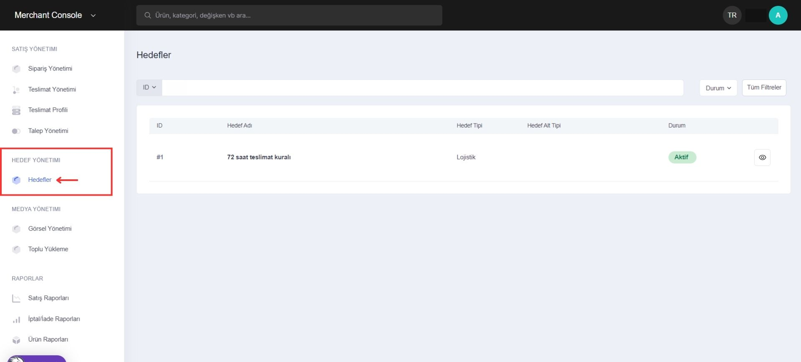<figcaption>
Hedef Yönetimi
</figcaption></figure>

Yönetici tarafından oluşturulan hedefler, hedef yönetimi sayfasında listelenir. \

<figure>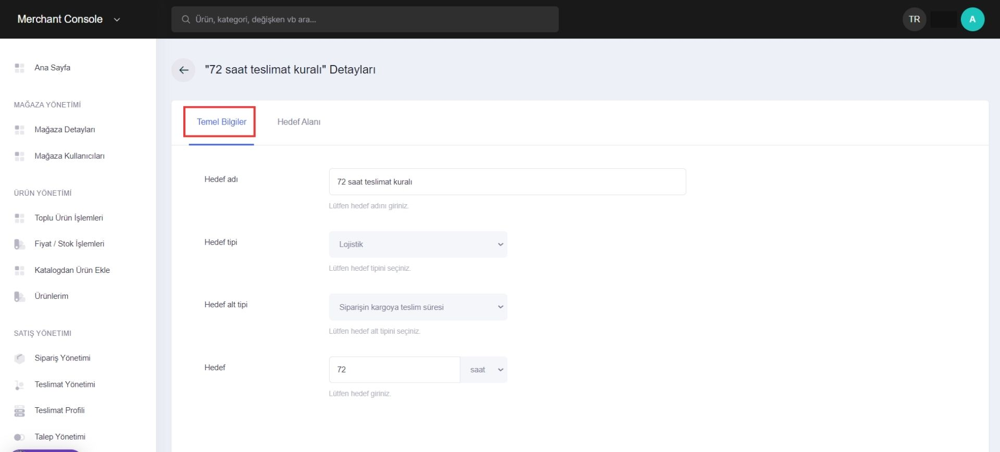<figcaption>
Temel Bilgiler
</figcaption></figure> <figure>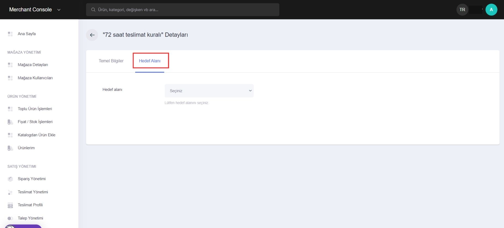<figcaption>
Hedef Alanı
</figcaption></figure>

Listelenen hedeflerde satırda bulunan detay butonuna tıklayarak satıcılar, hedefe ait temel bilgileri ve hedef alanını ayrı olarak inceleyebilirler.

## Medya Yönetimi

Medya Yönetimi, mağazada bulunan medya dosyalarının yönetildiği bölümdür. _**Medya yönetimi; “Görsel Yönetimi” ve “Toplu Yükleme” olarak ikiye ayrılır.**_

### Görsel Yönetimi

Görsel Yönetimi yüklenmiş olan görselleri kategorilere ve alanlarına göre görüntülemeyi sağlar. Görsel yönetimi bölümü filtreleme özellikleri dışında klasörleme ve görsel yükleme olarak iki ana fonksiyon içerir.

<figure><figcaption>
Görsel Yönetimi
</figcaption></figure> <figure>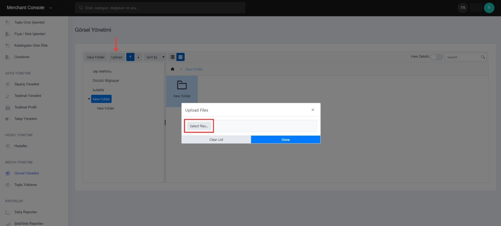<figcaption>
Klasör Oluşturma ve Görsel Yükleme
</figcaption></figure>

Görsel yönetimi, mağazada bulunan mevcut klasörleri ve bu klasörlerdeki resimleri görüntülendiği alandır. Satıcılar isterlerse "Upload" seçeneğini kullanarak belirledikleri klasöre görsel yükleyebilirler.&#x20;

Toplu görsel yükleme için kullanılan; medya yönetimi altında "Toplu Yükleme" sayfasında, rar veya zip formatında bulunan toplu görseller yüklenebilir.&#x20;

### Toplu Yükleme

_**Toplu görsel yükleme işlemi; "Döküman Yükle", "Veriyi Kontrol Et" ve "Tamamlandı" olarak 3 aşamadan oluşur.**_

Doküman yüklemek için "Toplu Doküman YÜkleme" sayfasındaki; "Kategori", "Marka" ve "Ürün" görsel tiplerinden seçim yaptıktan sonra görseller toplu yüklenebilir.

<figure>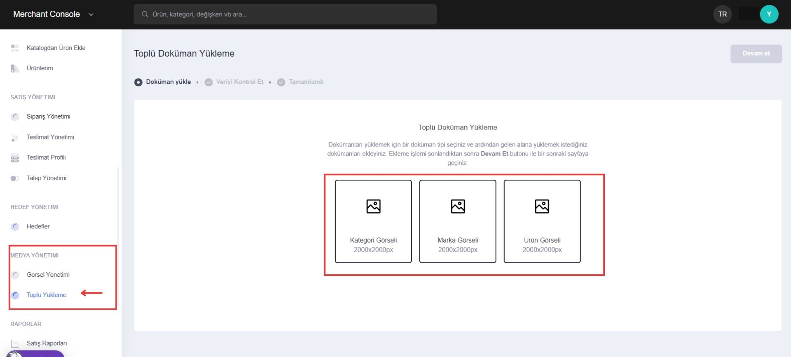<figcaption>
Döküman Tipleri
</figcaption></figure> <figure>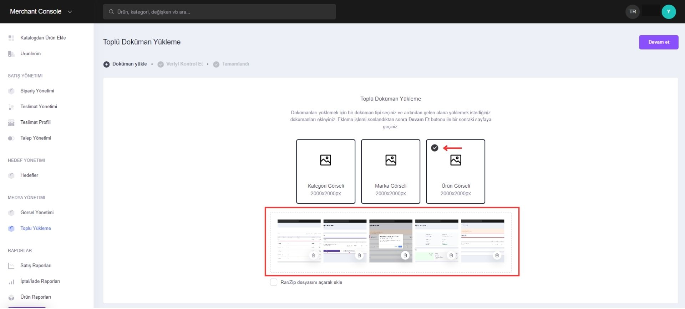<figcaption>
Toplu Yükleme
</figcaption></figure>

Görselleri yükleyip "Devam Et" butonuna tıklandığında veri kontrol aşamasına geçilir. Burada şartlar sağlanmıyorsa hata bildirimi kullanıcıya gözükür ve hatalı görselleri listelenir.

<figure>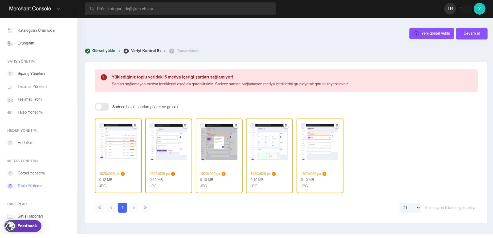<figcaption>
Şartlar Sağlanmıyor Hatası
</figcaption></figure>

Şartlar sağlandığında sistem, görselleri onaylar ve listeler. Kullanıcı devam et butonuna tıkladığında görseller sisteme yüklenir ve görsel yönetimi alanında görüntülenir.

## Raporlar

Raporlar menüsü, platformdaki satış süreçlerinin  raporlandığı bölümdür.&#x20;

_**Raporlar; “Satış Raporları”, “İptal/İade Raporları”, “Ürün Raporları” olarak üçe ayrılır.**_

### Satış Raporları

Satış raporları, belirlenen tarihe göre yapılan satışları raporlamaya olanak tanıyan sayfadır. Dışa aktar seçeneği ile görselleştirilmiş olan satışlar excel formatında indirilebilir.

<figure><figcaption>
Satış Raporları
</figcaption></figure>

### İptal/İade Raporları

İptal/İade Raporları, mağaza satışları sonucunda gerçekleşen iptaller ve iadelerin raporlandığı bölümdür.

### Ürün Raporları

Mağazaya ait ürünlerin ve bu ürünlere ait stok durumlarının raporlandığı bölümdür.

\

