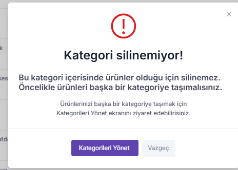

# Lidia 2.2.x release notes

This month's release covers significant updates to various components of the Lidia platform, including the Console, Merchant Console, and Product Information Management (PIM) systems. These improvements aim to optimize workflows and provide a smoother user experience for all platform users.


🔎 **About Release Codes**\
In this document, you'll find release codes for different components of the Lidia platform:

* **LC**: Lidia Console - Enhancements and fixes related to the core management console.
* **LMC**: Lidia Merchant Console - Updates specific to the merchant's tools and workflows.
* **LP**: Lidia PIM (Product Information Management) - Improvements and new features related to product data management.

These codes help you track the specific areas of improvement across the platform.


***

## Releases in 2.2.1 - 4 Feb 2025

### 🚀 **Bug Fixes and Functional Improvements**

* Resolved the issue where newly added values were not included in all options.
* Fixed the issue where password reset and "Forgot Password" emails were not being delivered.
* Addressed the login screen redirection issue on Solution Center pages.
* Resolved the issue where "Forgot Password" redirects were missing on the login page.
* Fixed the dropdown display issue in the Merchant Details section.
* Addressed the incorrect display issue in the Product Inventory Details.
* Fixed the issue where filters could not be added in the Seller Details section.
* Resolved the issue where the return code was not being sent via email.
* Fixed the issue where the search function did not work when adding images to the header menu.
* Resolved the issue where categories were not appearing in filter management.
* Fixed the issue where the copy buttons in the delivery details were not functioning.
* Fixed an issue with exporting data based on filters.
* Resolved the issue where users were redirected to the login screen after entering an incorrect password.
* Fixed the issue where newly added values were not immediately displayed in options.
* Fixed the duplicate record display issue in Delivery Profiles.

### 📈 **Sales Management Enhancements**

#### **Stoppage Tax Implementation** **Release date :**  02/04/2025 **Version number :&#x20;**<mark style="color:purple;">**LC-2.2.1.1 - LMC-2.2.1.1**</mark>

As of 2025, a new regulation enforces a 1% stoppage tax on e-commerce transactions. This regulation applies to amounts deducted by intermediary service providers (e-commerce platforms) from payments made to sellers.

With this update, the stoppage tax information is now displayed clearly and transparently across the platform.

**Implemented Changes**

* **Order Details Page** – The stoppage tax deduction is clearly displayed in the order summary section.
* **Cost Table (Sales Management Screen)** – The stoppage tax is included in the cost calculations.
* **Sales Reports (Platform & Partner Panels)** – The stoppage tax is fully included in the exportable (Excel) report format.
* **Operations, Cost, and Campaign Reports** – The stoppage tax deduction amount, and net payment details are displayed comprehensively.

### 🌟 **User Experience Enhancements**

#### **Custom Error Pages Implementation** **Release date :**  02/04/2025 **Version number :&#x20;**<mark style="color:purple;">**LC-2.2.1.2 - LMC-2.2.1.2**</mark>

In this release, custom error pages were designed and developed to improve user experience for common errors:

* **404 - Page Not Found**: Includes a clear message and navigation options to return to the homepage or the previous page.
* **500 - Internal Server Error**: Displays an informative message with options to navigate back to the homepage or the previous page.
* **"Something Went Wrong"**: A generic error page with redirection options to the homepage or the previous page.

<figure><figcaption>
Somethings went wrong
</figcaption></figure> <figure><figcaption>
500 Error
</figcaption></figure> <figure><figcaption>
404 Error
</figcaption></figure>

#### **Browser Tab Structure** **Release date :**  02/04/2025 **Version number : &#x20;**<mark style="color:purple;">**LMC-2.2.1.3**</mark>

\
The structure of browser tabs has been improved to provide better navigation. For example, the tab now shows the current page followed by the platform name, e.g., **Home | Lidia Partner**, making it easier for users to track their location within the platform.

### 🚚 Delivery Management improvements

#### **Newly Added Shipment Details** **Release date :**  02/04/2025 **Version number : &#x20;**<mark style="color:purple;">**LC-2.2.1.3 - LMC-2.2.1.4**</mark>

Additional shipment movement details have been incorporated into the system to provide users with more detailed tracking.

* **Detailed Shipment Status Information**: More descriptive status updates have been introduced.
* **Status Timestamp**: The exact time of each status update is now displayed.
* **Last Processed Location**: The last recorded location where the shipment was processed is now included.

***

## Releases in 2.2.2 - 18 Feb 2025

### 🚀 Bug Fixes and Functional Improvements

* Fixed issues related to deleted items being displayed in all listings.

### 📁 Catalog Management Enhancements

#### **Managing Categories with Products** Release Date: 02/18/2025 Version Number: <mark style="color:purple;">LC-2.2.2.1</mark>

The system no longer allows the deletion of a category that contains products. To improve user clarity, a warning modal is now displayed during the category deletion process if the category contains products, as shown in the example below.

<figure><figcaption></figcaption></figure>

***

#### **Addition of Rejected Products Section to the Pool** Release Date: 02/18/2025 Version Number: <mark style="color:purple;">LMC-2.2.2.1</mark>

A **"Rejected"** tab has been added to the product pool view. Sellers can now view rejected products separately in a dedicated tab.

<figure><figcaption></figcaption></figure>

***

These updates are designed to enhance both the functionality and usability of Lidia Platform, ensuring a smoother and more efficient experience for all users. Stay tuned for further improvements next month!

\
\
