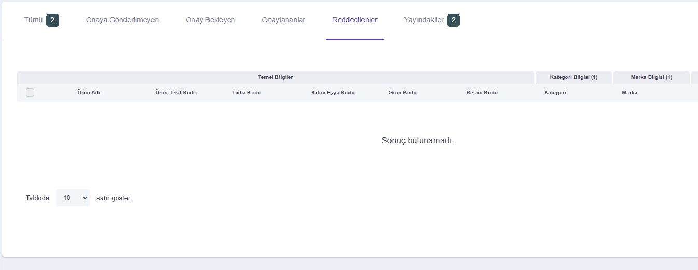

# Lidia 2.2.x sürüm notları

Bu ayki sürüm, Lidia platformunun çeşitli bileşenlerinde önemli güncellemeler içeriyor. Bu bileşenler arasında **Console, Merchant Console ve Ürün Bilgi Yönetimi (PIM) sistemleri** bulunuyor. Yapılan iyileştirmeler, iş akışlarını optimize etmeyi ve tüm platform kullanıcıları için daha akıcı bir deneyim sunmayı amaçlıyor.


🔎 **Sürüm Kodları Hakkında**\
Bu dokümanda, Lidia platformunun farklı bileşenleri için sürüm kodlarını bulabilirsiniz:

* **LC:** Lidia Console – Ana yönetim konsoluna yönelik iyileştirmeler ve hata düzeltmeleri.
* **LMC:** Lidia Merchant Console – Satıcı araçları ve iş akışlarına özel güncellemeler.
* **LP:** Lidia PIM (Ürün Bilgi Yönetimi) – Ürün veri yönetimiyle ilgili geliştirmeler ve yeni özellikler.

Bu kodlar, platform genelindeki iyileştirmelerin hangi alanlara yönelik olduğunu takip etmenize yardımcı olur.


***

## <mark style="color:purple;">**Sürüm 2.2.1 - 4 Şubat 2025**</mark>

### Yeni Geliştirmeler

### 🎯 **Teslimat Yönetimi Geliştirmeleri**

#### Gelişmiş Teslimat Hareketleri Sürüm Tarihi: 02/04/2025 Sürüm Numarası: <mark style="color:purple;">LC-2.2.1.3 - LMC-2.2.1.4</mark>

Gönderi hareket bilgileri sisteme dahil edilerek, kullanıcıların daha ayrıntılı takip yapabilmesi sağlanmıştır.

* **Ayrıntılı Gönderi Durum Bilgisi**: Daha açıklayıcı durum güncellemeleri eklenmiştir.
* **Durum Zaman Damgası**: Her durum güncellemesinin tam zamanı artık görüntülenmektedir.
* **Son İşlem Yapılan Konum**: Gönderinin işlendiği son konum artık sisteme dahil edilmiştir.

### İyileştirmeler

### 💡**Satış Yönetimi İyileştirmeleri**

#### **Stopaj Uygulaması** Sürüm Tarihi: 02/04/2025 Sürüm Numarası: <mark style="color:purple;">LC-2.2.1.1 - LMC-2.2.1.1</mark>

\
2025 yılı itibarıyla, e-ticaret işlemleri üzerinden aracılık hizmeti sağlayan platformların, satıcılara yapılan ödemelerden %1'lik bir stopaj kesintisi yapması gerekmektedir. Bu güncelleme ile, kesilen stopaj bilgisi platform genelinde net bir şekilde görüntülenmektedir.\
**Uygulanan Değişiklikler:**

* **Sipariş Detayları Sayfası**: Stopaj kesintisi, sipariş özeti kısmında açıkça gösterilmektedir.
* **Maliyet Tablosu (Satış Yönetimi Ekranı)**: Vergi kesintisi maliyet hesaplamalarına dahil edilmiştir.
* **Satış Raporları (Platform & Partner Panelleri)**: Stopaj kesintisi, dışa aktarılabilir (Excel) rapor formatlarına tam olarak dahil edilmiştir.
* **Operasyon, Maliyet ve Kampanya Raporları**: Stopaj kesintisi ve net ödeme detayları kapsamlı bir şekilde gösterilmektedir.

### 💡**Kullanıcı Deneyimi İyileştirmeleri**

#### **Özel Hata Sayfaları Uygulaması** Sürüm Tarihi: 02/04/2025 Sürüm Numarası: <mark style="color:purple;">LC-2.2.1.2 - LMC-2.2.1.2</mark>

\
Bu sürümde, kullanıcı deneyimini içinyaygın hata sayfaları tasarlandı ve geliştirildi:

* **404 - Sayfa Bulunamadı**: Açık bir mesaj ve ana sayfaya veya önceki sayfaya dönmek için navigasyon seçenekleri içerir.
* **500 - Dahili Sunucu Hatası**: Anlamlı bir mesaj ve ana sayfaya veya önceki sayfaya yönlendirme seçenekleri sunar.
* **Oops!** : Genel bir hata sayfası, ana sayfaya veya önceki sayfaya yönlendirme seçenekleriyle.

<figure><figcaption>
Sunucu Hatası
</figcaption></figure> <figure><figcaption>
500 Error
</figcaption></figure> <figure><figcaption>
404 Error
</figcaption></figure>

#### **Tarayıcı Sekmesi Yapısı İyileştirmeleri** Sürüm Tarihi: 02/04/2025 Sürüm Numarası: <mark style="color:purple;">LMC-2.2.1.3</mark>

Tarayıcı sekmesi yapısı, daha iyi bir navigasyon sağlamak amacıyla iyileştirilmiştir. Örneğin, sekme artık mevcut sayfayı ve ardından platform adını gösteriyor (örneğin, Home | Lidia Partner), bu da kullanıcıların platformdaki konumlarını daha kolay takip etmelerini sağlıyor.

***

## <mark style="color:purple;">**Sürüm 2.2.2 - 18 Şubat 2025**</mark>

### Yeni Geliştirmeler

### 🎯 Katalog Yönetimi Geliştirmeleri

#### **İçerisinde Ürün Olan Kategorilerin Yönetimi** Sürüm Tarihi: 02/18/2025 Sürüm Numarası: <mark style="color:purple;">LC-2.2.2.1</mark>

İçerisinde ürün olan bir kategori silinmek istendiğinde sistem buna izin vermemektedir. Bu durum kullanıcılar tarafından daha anlaşılır olması için; kategori silme işlemi sırasında eğer kategorinin içerisinde ürün varsa aşağıdaki görseldeki gibi uyarı modalı gösterilmesi sağlanmıştır.\

***

#### **Havuza Reddedilenler Alanının Eklenmesi** Sürüm Tarihi: 02/18/2025 Sürüm Numarası: <mark style="color:purple;">LMC-2.2.2.1</mark>

Ürün havuzu görünümüne "Reddedilenler" sekmesi eklendi. Satıcılar artık reddedilen ürünleri ayrı bir sekmede görüntüleyebilir.&#x20;

<figure><figcaption></figcaption></figure>

***


### **Hata Düzeltmeleri**

* Tüm listelemelerde silinen öğelerin listelenmesi ile ilgili sorunlar giderildi.
* "Şifremi Unuttum" yönlendirmelerinin giriş sayfasında eksik olması sorunu çözüldü.
* İade kodunun e-posta ile gönderilmemesi sorunu çözüldü.
* Kullanıcıların yanlış şifre girildiğinde giriş ekranına yönlendirilmesi sorunu düzeltildi.


Bu güncellemeler, Lidia ürün ailesinin gelişimini hızlandırmak, pazar ve müşteri ihtiyaçlarına uyum sağlamak ve sürdürülebilirliği artırmak için tasarlanmıştır. Tüm kullanıcılar için daha sorunsuz ve verimli bir deneyim sunmayı hedefliyoruz. Gelecek ay daha fazlası için bizi takip etmeye devam edin!

\
\
