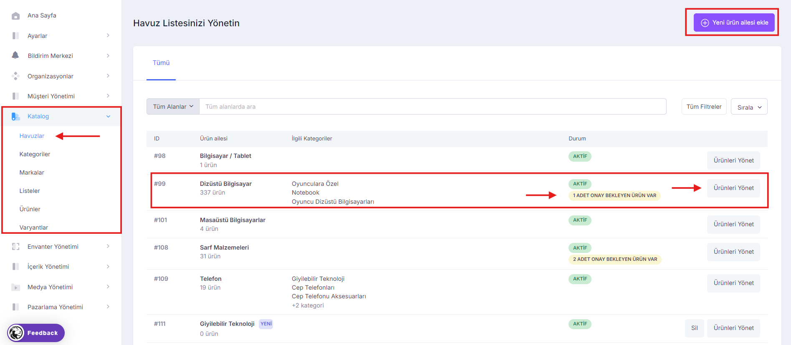
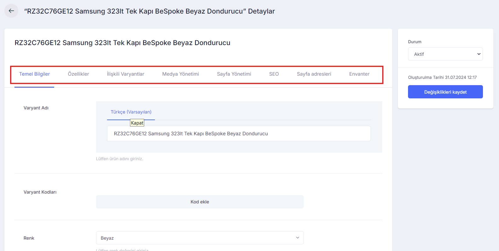
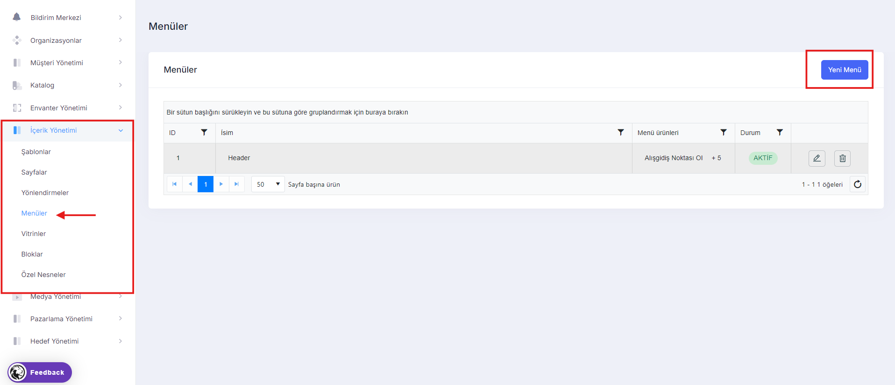
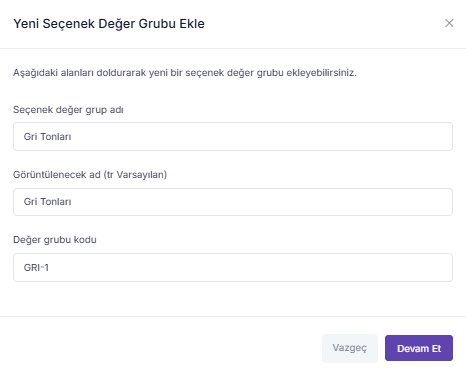

# Türkçe

Kullanıcı dokümantasyonu 14 ana başlıkta incelenecektir.

1. [Ayarlar](./#ayarlar)
2. Organizasyonlar
3. Kullanıcı Yönetimi
4. Katalog
5. Envanter Yönetimi
6. İçerik Yönetimi
7. Medya Yönetimi
8. Pazarlama Yönetimi
9. Satış Yönetimi
10. Çözüm Merkezi
11. Sosyal Yetenekler
12. Ödeme Yöntemi
13. Lojistik Yönetimi
14. Raporlar

### Giriş

Lidia Console, platformumuzun ürün yönetimi için özel olarak tasarlanmış bir yönetici panelidir. Bu panel, platformun yöneticilerine ürün onaylarına ve yönetimine olanak tanır. Ürünlerin onay süreçleri, işlem takibi ve yönetim işlemleri bu konsol üzerinden gerçekleştirilir. Console üzerinden yöneticiler merchantlarını ve bayilerini yönetebilir, önyüzde değişiklikler ve eklemeler yapabilir; ödeme alma ve yönetme gibi işlemlerin yönetimi sağlayabilirler.

### Ayarlar

Ayarlar bölümünde, console yöneticilerinin tüm konsol içeriğini etkili bir şekilde yönetmelerini sağlayan birimlerin ayarlarının düzenlendiği ve eklemelerin yapılabildiği sayfaları bulabilirsiniz.

<figure><figcaption>
Ayarlar 
</figcaption></figure>

> Yetkilendirme

Yetkilendirme bölümü, kullanıcılarımızın console üzerinde kullanıcılar ve sistem üzerinde tanımlanan kullanıcı rollerinin belirlenebildiği ve listelendiği sayfaları içermektedir.

<figure><figcaption>
Yetkilendirme
</figcaption></figure>

_Yetkilendirme bölümünde Kullanıcılar ve Roller olmak üzere iki kategori bulunmaktadır._ \
\
Kullanıcılar sayfasında, console'u kullanacak kullanıcılarımızın listesi görüntülenir. Kullanıcılar bölümünde eklenmiş kullanıcılar detay sayfalarında görüntülenebilir; orada güncellenebilir, kullanıcı silinebilir, liste içerisinde durumuna göre listelenebilir ve ID'si, ismi ve rollerine göre arama bölümünden arama yapılabilir.

<figure><figcaption>
Kullanıcılar
</figcaption></figure>

Kullanıcıların detay sayfalarındaki Yetkiler bölümünde console yöneticileri platforma tanımladıkları kullanıcılarının yetkilerini kısıtlayabilir veya belirleyebilir. Ayrıca detay sayfalarında kullanıcının durumu değiştirilebilir.

<figure><figcaption>
Detay
</figcaption></figure>

 

<figure><figcaption>
Kullanıcı temel bilgiler
</figcaption></figure>

 

<figure><figcaption>
Kullanıcı Yetkiler
</figcaption></figure>

\
\
Kullanıcı detay sayfalarında kullanıcıya özel etiket eklenebilir.&#x20;

<figure><figcaption>
Kullanıcı detay
</figcaption></figure>

 

<figure><figcaption>
Etiket ekle
</figcaption></figure>

\

Roller sayfasında ise belirlenen roller ve bunları kullanan aktif kullanıcı sayısı görüntülenebilir; yeni rol eklenebilir. Adminler de rol olarak belirlenebilir ve düzenlenebilir; sayfalardaki yetkileri düzenlenebilir. Ayrıca pasif olan roller de silinebilir.

<figure><figcaption>
Roller
</figcaption></figure>

<figure><figcaption>
Temel Bilgiler
</figcaption></figure>

 

<figure><figcaption>
Kullanıcılar
</figcaption></figure>

Roller sayfasında role ait temel bilgileri, verilen yetkileri ve role sahip kullanıcıları listeleyebilirsiniz.&#x20;

> Yasal

Yasal bölümü console yöneticilerinin, console’a sistemdeki yasal kullanıcıları tanımladıkları ve bu sorumlunun eklemesi gereken yasal dokümanlarını eklendiği ve sergilendiği sayfalardan oluşur.

<figure><figcaption>
Yasal
</figcaption></figure>

_Yasal bölümünde Sorumlular ve Yasal Dökümanlar olmak üzere iki kategori bulunmaktadır._&#x20;

Sorumlular sayfasında, veri sorumlusunu tanımlayarak, sorumlunun console üzerinde belirtmesi gereken bilgileri ekleyebilirsiniz. Console yöneticisi ayrıca yasal belgeler olarak sorumlu olduğu belgeleri inceleyebilir ve bunları güncel tutmak için gerekli değişiklikleri yapabilir.

<figure><figcaption>
Sorumlular
</figcaption></figure>

Sorumluların detayında sorumlunun temel bilgilerini ve yasal dökümanlarını inceleyebillirsiniz.

<figure><figcaption>
Temel Bilgiler
</figcaption></figure>

 

<figure><figcaption>
Yasal Dökümanlar
</figcaption></figure>

Yasal Dökümanlar sayfalarında sorumlunun yasal dökümanlarını listeleyebilirsiniz ve sorumlu için yeni döküman ekleyebilirsiniz.

<figure><figcaption>
Yasal Dökümanlar
</figcaption></figure>

 

<figure><figcaption>
Yeni ekle
</figcaption></figure>

 

<figure><figcaption>
Yeni ekle
</figcaption></figure>

Ayrıca listelenen dökümanların detaylarına gidilebilir, dökümanlar silinebilir ve dökümanlar detay sayfalarında düzenlenebilir ve durumu değiştirilebilir.

<figure><figcaption>
Döküman detayı
</figcaption></figure>

 

<figure><figcaption>
Temel Bilgiler
</figcaption></figure>

 

<figure><figcaption>
Sürüm Geçmişi
</figcaption></figure>

Yasal dökümanlar sayfalarında tüm yasal dökümanların listelendiği sayfaları görüntüleyebilirsiniz; dökümanları bulundukları satırdaki işlemlerden silebilir, kopyalayabilir veya içeriği görüntüleyecek detay ekranlarına gidebilirsiniz.

<figure><figcaption>
Yasal Dökümanlar
</figcaption></figure>

> Ödeme

Ödeme bölümü console yöneticilerinin ödemeye ait bilgileri yönetebildiği, düzenleyebildiği ve müşterileri için ödeme kuralları belirleyebildiği sayfalardan oluşur. Genel olarak ödeme bölümünde yöneticiler ödeme ayarlarını yönetebilirler.\
\
Ödeme ayarları 7 alt başlıktan oluşur; \
Hizmet Sağlayıcılar,\
Kurumlar,\
Araç Grupları,\
Araçlar,\
Seçenekler,\
BIN Kodları,\
Kurallar.

<figure><figcaption>
Ödeme Ayarları
</figcaption></figure>

\

_Hizmet Sağlayıcılar_

Hizmet sağlayacılar bölümünde ödeme kanalları listelenir. Bu sayfada yeni bir ödeme kanalı eklenebilir, duruma göre listelenebilir veya sıralama seçeneklerinden ödeme kanalları filtrelenebilir.

<figure><figcaption>
Hizmet sağlayıcılar
</figcaption></figure>

Yeni bir hizmet sağlayıcıları eklemek için "yeni ödeme kanalı" ekle diyerek, hizmet sağlayıcılarınıza yenisini ekleyebilirsiniz. Bu alanda yeni ödeme kanalı eklemek için 2 seçenek vardır; \
Tanımlı sağlayıcı seçeneğini seçip, tanımlı sağlayıcıları seçerek devam edebilirsiniz veya\
Yeni bir sağlayıcı ekleyebilirsiniz.

<figure><figcaption>
Yeni sağlayıcı ekle
</figcaption></figure>

Tanımlı sağlayıcı ekle;

<figure><figcaption>
Tanımlı sağlayıcı ekle
</figcaption></figure>

 

<figure><figcaption>
Bölge seç
</figcaption></figure>

 

<figure><figcaption>
Sağlayıcı seç
</figcaption></figure>

Yeni sağlayıcı ekle;

<figure><figcaption>
Yeni sağlayıcı ekle
</figcaption></figure>

 

<figure><figcaption>
Bilgiler
</figcaption></figure>

Hizmet sağlayacıların listeleme ekranlarında herbir satırdaki ikon aracılığı detayına gidilebilir; burada temel bilgileri, seçenekleri, entegrasyon bilgileri ve sağlayıcıya ait işlemler yer alır. Aynı satırda bir hizmet sağlayıcısı da silinebilir.

Temel bilgiler bölümünde sağlayıcıya özel logo da eklenebilir.

<figure><figcaption>
Temel bilgiler
</figcaption></figure>

 

<figure><figcaption>
Logo ekle
</figcaption></figure>

Seçenekler bölümünde sağlayıcıların seçenekleri yer alır ve yeni seçenek eklenebilir.

<figure><figcaption>
Seçenekler
</figcaption></figure>

 

<figure><figcaption>
Yeni seçenek ekle
</figcaption></figure>

Entegrasyon bilgileri bölümünde;

<figure><figcaption>
Entegrasyon Bilgileri
</figcaption></figure>

 

<figure><figcaption>
Canlı ortam
</figcaption></figure>

 

<figure><figcaption>
Test ortamı
</figcaption></figure>

İşlemler;&#x20;

<figure><figcaption>
İşlemler
</figcaption></figure>

_Kurumlar_

Kurumlar bölümünde anlaşmalı kurumlar listelenir. Bu sayfada yeni bir ödeme kurumu eklenebilir, durumuna göre listelenebilir veya sıralama seçeneklerinden ödeme kurumları filtrelenebilir.

<figure><figcaption>
Kurumlar
</figcaption></figure>

Yeni bir hizmet sağlayıcıları eklemek için "yeni ödeme kurumu" ekle diyerek, ödeme kurumlarınıza yenisini ekleyebilirsiniz.

<figure><figcaption>
Yeni ödeme kurumu ekle
</figcaption></figure>

Kurumlar listeleme ekranlarında herbir satırdaki ikon aracılığı detayına gidilebilir; burada temel bilgileri, ödeme araçlarını, BIN kodlarını ve ilgili ödeme kanalına ait bilgiler yer alır. Aynı satırda bir ödeme kurumu da silinebilir.

<figure><figcaption>
Temel Bilgiler
</figcaption></figure>

Ödeme araçları bölümünde; yeni araç ekleyebilirsiniz.

<figure><figcaption>
Ödeme araçları
</figcaption></figure>

 

<figure><figcaption>
Yeni araç ekle
</figcaption></figure>

 

<figure><figcaption>
Araç grubu seç
</figcaption></figure>

 

<figure><figcaption>
Araç tipi seç
</figcaption></figure>

<figure><figcaption>
BIN kodları
</figcaption></figure>

 

<figure><figcaption>
Yeni BIN kodu ekle
</figcaption></figure>

Ödeme kanalları bölümünde taksitli ve taksitsiz ödemeler için sağlayıcı seçilebilir.

<figure><figcaption>
Ödeme kanalı
</figcaption></figure>

_Araç Grupları_

Araç grupları bölümünde araç grupları listelenir.Bu sayfada yeni bir araç grubu eklenebilir, araç olarak filtrelenebilir, durumuna göre listelenebilir veya sıralama seçeneklerinden araçlar da filtrelenebilir.

<figure><figcaption>
Araç Grupları
</figcaption></figure>

Yeni bir araç eklemek için "yeni araç grubu" ekle diyerek, yeni araç ekleyebilirsiniz.

<figure><figcaption>
Yeni araç grubu ekle
</figcaption></figure>

Araçlar listeleme ekranlarında herbir satırdaki ikon aracılığı detayına gidilebilir, aynı satırda bir araç grubu da silinebilir.

<figure><figcaption>
Araçlar
</figcaption></figure>

 

<figure><figcaption>
Detay
</figcaption></figure>

_Araçlar_

Araçlar bölümünde ödeme araçları listelenir. Bu sayfada yeni bir araç eklenebilir, durumuna göre listelenebilir veya sıralama seçeneklerinden araçlar filtrelenebilir.

<figure><figcaption>
Araçlar
</figcaption></figure>

Yeni bir araç eklemek için "yeni araç" ekle diyerek, yeni ödeme aracı ekleyebilirsiniz.

<figure><figcaption>
Yeni ödeme aracı
</figcaption></figure>

Ödeme araçları listeleme ekranlarında herbir satırdaki ikon aracılığı detayına gidilebilir, aynı satırda bir araç grubu da silinebilir.

<figure><figcaption>
Temel Bilgiler
</figcaption></figure>

 

<figure><figcaption>
BIN kodları
</figcaption></figure>

 

<figure><figcaption>
Ödeme seçenekleri
</figcaption></figure>

Araç detaylarında BIN kodları ve ödeme seçenekleri sayfalarında yeni BIN kodları ve ödeme seçeneği eklenebilir.

_Seçenekler_

Ödeme seçenekleri bölümünde seçenekler listelenir.Bu sayfada yeni bir ödeme seçeneği eklenebilir, seçenek olarak filtrelenebilir, durumuna göre listelenebilir veya sıralama seçeneklerinden ödeme seçeneği de filtrelenebilir.

<figure><figcaption>
Seçenekler
</figcaption></figure>

Yeni bir seçenek eklemek için "yeni seçenek" ekle diyerek, ödeme seçeneği ekleyebilirsiniz.

<figure><figcaption>
Seçenek ekle
</figcaption></figure>

Ödeme seçenekleri listeleme ekranlarında herbir satırdaki ikon aracılığı detayına gidilebilir, düzenlenebilir, aynı satırda bir seçenek de silinebilir.&#x20;

<figure><figcaption>
Temel bilgiler
</figcaption></figure>

 

<figure><figcaption>
Teknik parametreler
</figcaption></figure>

_BIN kodları_

BIN Kodları bölümünde BIN kodları listelenir.Bu sayfada yeni bir BIN kodu eklenebilir, durumuna göre listelenebilir veya sıralama seçeneklerinden araç olarak da filtrelenebilir.

<figure><figcaption>
BIN Kodları
</figcaption></figure>

Yeni bir BIN Kodu eklemek için "yeni BIN kodu" ekle diyerek, BIN kodu ekleyebilirsiniz.

<figure><figcaption>
Yeni BIN kodu ekle
</figcaption></figure>

BIN kodları listeleme ekranlarında herbir satırdaki ikon aracılığı aynı satırda bir BIN kodu silinebilir.&#x20;

<figure><figcaption>
BIN kodları
</figcaption></figure>

_Kurallar_

Kurallar bölümünde ödeme kuralları listelenir. Bu sayfada yeni bir ödeme kuralı eklenebilir, durumuna göre listelenebilir. Ayrıca ödeme kuralı satır bazında silinebilir.

<figure><figcaption>
Kurallar
</figcaption></figure>

Yeni bir kural eklemek için "yeni ödeme kuralı" ekle diyerek, ödeme kuralı ekleyebilirsiniz.

<figure><figcaption>
Ödeme kuralı ekle
</figcaption></figure>

Ödeme kurallarında koşulları ve koşulun eylemi belirlenebilir. Koşullar bölümünde ilk koşul olan kategori seçilmeden kurala eylem eklenemez. Ayrıca koşullar bölümünde fiyat hariç her bir koşuldan birer kez seçilebilir; fiyat koşulu ise bir aralık belirleme amacı da olabileceğinden 2 kere seçilebilir.

<figure><figcaption>
Ödeme kuralları
</figcaption></figure>

Eylem bölümünde ödeme türü veya taksit miktarı seçilebilir.&#x20;

<figure><figcaption>
Eylem ekle
</figcaption></figure>

> Lojistik

Lojistik bölümünde console yöneticileri güncelde bulunan hizmet sağlayıcılarını, teslimat profillerini ve teslimat kurallarını görüntüleyip, yönetebilirler.\

\
_Hizmet sağlayıcıları_

Hizmet sağlayıcıları bölümünde, anlaşmalı olduğumuz kargo şirketleri listelenir. Console yöneticileri, platformda entegrasyonu olan tanımlı bir sağlayıcı ekleyebilirler veya teslimatı bir şirkete bağlı olmadan kendileri gerçekleştireceklerse, bunu "kendim teslim edeceğim" seçeneği olarak ekleyebilirler. Ayrıca listelenen hizmet sağlayıcılarında; aktif hizmetler, sağlayıcının durumu, ismi, kodu ve id'si listelenir.&#x20;

<figure><figcaption>
Hizmet sağlayıcıları
</figcaption></figure>

Hizmet sağlayıcıları bölümünde listeleme ekranlarında satır bazında hizmeti silebilirsiniz; yine satır bazında seçili hizmet sağlayıcının detayına gidebilirsiniz.

<figure><figcaption>
Detay
</figcaption></figure>

Hizmet sağlayıcıları detayında; sağlayıcının temel bilgileri, entegrasyon bilgileri ve sağladığı hizmetler görüntülenebilir. Ayrıca yine detayında sağlayıcının durumunu da değiştirebilirsiniz.

<figure><figcaption>
Temel bilgiler
</figcaption></figure>

 

<figure><figcaption>
Entegrasyon bilgileri
</figcaption></figure>

 

<figure><figcaption>
Hizmetler
</figcaption></figure>

\
Entegrasyon bilgileri bölümü, entegre olduğumuz kargo şirketinin canlı ve test ortamları için sağladığı gerekli bilgileri içermektedir. Burada yer alan canlı ortam bilgileri, gerçek kargolar için entegrasyon bilgilerini; test ortamı bilgileri ise test süreçlerinde kullanılan kargolar için entegrasyon bilgilerini içermektedir.

<figure><figcaption>
Canlı ortamı
</figcaption></figure>

 

<figure><figcaption>
Test ortamı
</figcaption></figure>

Hizmetler bölümünde kargo şirketinin verdiği hizmetler listelenir ve yeni hizmet de ekleyebilirsiniz.

<figure><figcaption></figcaption></figure>

 

<figure><figcaption>
Yeni hizmet ekle
</figcaption></figure>

Yeni hizmet bölümünde, hizmetler listesinden birini seçip ekleyebilirsiniz.

<figure><figcaption>
Hİzmet seçenekleri
</figcaption></figure>

 

<figure><figcaption>
Yeni hizmet
</figcaption></figure>

Hizmetler bölümünde, eklediğiniz hizmetin fiyat listesini de güncelleyebilirsiniz.

<figure><figcaption>
Fiyat listesi ekle
</figcaption></figure>

 

<figure><figcaption></figcaption></figure>

> _Teslimat Profilleri_

Teslimat profilleri bölümünde oluşturulan standart profiller yer alır.

<figure><figcaption>
Teslimat profilleri
</figcaption></figure>

Standart profilleri düzenleyebilirsiniz; bulunan listelemede öncelik sıralarını değiştirebilirsiniz.

<figure><figcaption>
Teslimat Profilleri 
</figcaption></figure>

 

<figure><figcaption>
Düzenleme
</figcaption></figure>

Ayrıca standart profilleri detayını görüntüleyebilirsiniz.

<figure><figcaption>
Teslimat Profilleri
</figcaption></figure>

 

<figure><figcaption>
Detay
</figcaption></figure>

> Kurallar

Kurallar sayfası teslimat süreçleri ile ilgili koşul ve eylem belirlemeyi sağlar. Girilen teslimat kuralı, satıcı profillerine admin tarafından tanımlanan kurallardır. Örneğin; 72 Saat Teslimat Kuralı, siparişin 72 saat içerisinde teslim edilmesi gerektiğini ifade eder.

<figure><figcaption>
Kurallar Sayfası
</figcaption></figure>

 

<figure><figcaption>
Kural Ekleme
</figcaption></figure>

> Ticari

Ticari bölümünde ürünlere, ürün ailelerine ve kategorilere vb. Alanlara yönelik komisyonlar belirlenebilir. _**Ticari bölümü; "Komisyon Oranları" ve "Komisyon Kuralları" olmak üzere 2 bölümden oluşur.**_

> Komisyon Oranları

Belirlenen ürün özelliği veya kategorilere ait komisyon oranlarının listelenebildiği ve düzenlenebildiği bölümdür.&#x20;

<figure><figcaption>
Komisyon Oranları
</figcaption></figure>

 

<figure><figcaption>
Komisyon Düzenleme ve Silme
</figcaption></figure>

Komiyon kuralı, sağ üstte bulunan "Yeni Komisyon Ekle" butonu ile yeni komisyon eklenebilir. Oluşturulan kayıtlar listeleme sayfasında bulunan düzenle seçeneği ile komisyon değerleri düzenlenebilirken, silme seçeneği ile de listeden kaldırılabilir.

> Komisyon Kuralları

Belirlenen ürün özelliği, kategorilere veya satıcılara yönelik komisyon oranlarının belirlendiği bölümdür.&#x20;

<figure><figcaption>
Komisyon Kuralları
</figcaption></figure>

 

<figure><figcaption>
Komisyon Kuralı Ekleme
</figcaption></figure>

Yeni komisyon kurallı ekleyerek koşul olarak satıcı seçilebilir ve komisyon değeri belirlenebilir.

> ### Katalog

Katalog menüsü altında bulunan sayfalar, ürünlerin organize edilmesi, yönetilmesi ve düzenlenmesi için kullanılır.&#x20;

> #### Ürün Aileleri

Ürün Aileleri sayfası, benzer özelliklere sahip ürünleri gruplamak için kullanılır. Örneğin, bir elektronik mağazasında "Telefonlar" veya "Bilgisayarlar" gibi ürün aileleri oluşturulabilir.

<figure><figcaption>
Ürün Aileleri Yönetim Sayfası
</figcaption></figure>

Veri şeması adı ve kodunun girdikten sonra oluşturulan ürün ailesi için düzenleme, kopya oluşturma ve silme işlemleri yapılabilir. Düzenle seçeneği, ilgili ürün ailesine ait temel bilgileri ve veri şeması alanlarına yönelik düzenleme işlemi yapılabilmesini sağlar.

<figure><figcaption>
Temel Bilgiler
</figcaption></figure>

 

<figure><figcaption>
Veri Şeması Alanları
</figcaption></figure>

> #### Ürün İlişkileri

Ürün ilişkileri, önerilen ürünler, ek satışlar, setler veya paketler gibi farklı türde ilişkilendirmeleri atamak için ürünler arasında bağlantılar oluşturmanıza olanak tanır.

Ürün ilişkileri, ürünlerin birbiriyle bağlantılı olduğu durumları ve ilişkili ürünlerin birbirine nasıl bağlı olduğunu tanımlar. Console yöneticileri, farklı türlerdeki ürün ilişkilerini yönetebilir ve bu ilişkileri kullanarak ürün verilerini etkili bir şekilde organize edebilir.

Birkaç yaygın ürün ilişkisi türü aşağıda belirtilmiştir:

* Ana Ürün ve Alt Ürün İlişkisi: Bir ürünün ana ürün olarak tanımlanması ve alt ürünlerinin (varyasyonlar, renk seçenekleri, boyut seçenekleri gibi) bu ana ürüne bağlı olarak tanımlanmasıdır. Bu ilişki, bir ürünün farklı varyasyonlarının veya seçeneklerinin yönetimini kolaylaştırır.
* İlgili Ürün İlişkisi: Bir ürünün diğer ürünlerle ilişkilendirilmesidir. Örneğin, bir çanta ürünü ile buna uygun bir cüzdan ürünü arasında ilişki kurulabilir. Bu ilişki, müşterilere ilgili ürünleri keşfetme ve kombine etme imkanı sunar.
* Aksesuar Ürün İlişkisi: Bir ürünün aksesuarları ile ilişkilendirilmesidir. Örneğin, bir kamera ürünü ile ona ait bir kamera çantası ve lens koruyucu gibi aksesuarlar arasında ilişki kurulabilir. Bu ilişki, müşterilere uygun aksesuarları keşfetme ve satın alma süreçini kolaylaştırır.

<figure><figcaption>
Ürün İlişkileri Yönetim Sayfası
</figcaption></figure>

<figure><figcaption>
Ürün İlişkisi Ekleme Ekranı
</figcaption></figure>

 

<figure><figcaption>
Ürün İlişkisi Düzenleme
</figcaption></figure>

> #### Veri Kilitleri

Veri kilitleri, sistem içinde ürün verilerinin güvenliğini sağlamak ve değişikliklerin kontrol altında tutulmasını sağlamak için kullanılan mekanizmalardır. Veri kilitleri, kullanıcıların belirli ürün veya ürün grubu verilerini güncellerken, başka kullanıcıların aynı verilere aynı anda erişmelerini engelleyerek çakışmaları önler.

<figure><figcaption>
Veri Kilitleri Yönetim Sayfası
</figcaption></figure>

Veri kilitleri, aşağıdaki durumlarda kullanışlıdır:

* Eş zamanlı güncelleme: Birden fazla kullanıcının aynı anda aynı ürün veya ürün grubu üzerinde güncelleme yapması durumunda veri kilitleri, güncellemelerin çakışmasını önler ve tutarlı bir veri durumunu korur.
* Veri güvenliği: Veri kilitleri, yetkisiz kullanıcıların belirli ürün verilerini değiştirmesini veya silmesini engeller ve veri güvenliğini sağlar.
* İçerik yönetimi: Console yöneticileri, belirli bir ürün veya ürün grubu üzerinde çalışırken, veri kilitleri sayesinde o ürün veya ürün grubunun verilerini güncellemek, düzenlemek veya silmek gibi değişiklikleri kontrol edebilir.
* Çakışan güncellemeleri önleme: Birden fazla kullanıcının aynı anda aynı ürün üzerinde güncelleme yapması durumunda veri kilitleri, güncellemelerin çakışmasını engelleyerek veri bütünlüğünü korur.
* Veri yönetimi süreçlerini düzenleme: Veri kilitleri, Console yöneticilerinin belirli ürün verilerini güncellerken, değişikliklerin uygun süreçlere göre yönetilmesini sağlar ve veri yönetimi süreçlerini düzenler.

Console'da kullanım sektörüne, ihtiyaçlarına ve iş gereksinimlerine göre farklı veri kilitleri kullanabilir ve veri kilitlerini kendi veri yönetimi süreçlerine uygun olarak özelleştirebilir.

> #### Özellikler

Özellikler menüsü, ürünlere eklenebilecek özel niteliklerin tanımlandığı bölümdür. Bu özellikler, ürünlerin daha ayrıntılı ve spesifik tanımlanmasını sağlar. _**Özellikler bölümünde “Özellik Grupları” ve “Özellikler” olarak iki sayfa bulunur.**_

> **Özellikler**

Bu özellikler grupları Lidia Console yöneticisini ihtiyaçlarına göre arttırılabilir.

* **Temel Özellikler:** Bu özellik grubu, ürünlerinizin temel bilgilerini içerir. Ürün adı, marka, model, SKU (Stok Tutma Birimi) numarası, ağırlık, boyut, renk gibi temel bilgiler bu özellik grubu altında yer alır.
* **Fiziksel Özellikler:** Bu özellik grubu, ürünlerinizin fiziksel niteliklerini içerir. Malzeme türü, şekil, yüzey dokusu, dayanıklılık gibi fiziksel özellikler bu grup altında yer alabilir.
* **Teknik Özellikler:** Bu özellik grubu, ürünlerinizin teknik ayrıntılarını içerir. İşlemci hızı, bellek kapasitesi, bağlantı protokolleri gibi teknik bilgiler bu grup altında yer alabilir.
* **Görsel Özellikler:** Bu özellik grubu, ürünlerinizin görünümü ve estetik özelliklerini içerir. Renk seçenekleri, desenler, tasarım özellikleri gibi görsel bilgiler bu grup altında yer alabilir.
* **Kullanım Özellikleri:** Bu özellik grubu, ürünlerinizin kullanımıyla ilgili bilgileri içerir. Kullanım talimatları, güvenlik önlemleri, kullanım süreçleri gibi kullanım bilgileri bu grup altında yer alabilir.
* **Lojistik ve Nakliye Özellikleri:** Bu özellik grubu, ürünlerinizin lojistik ve nakliye ile ilgili bilgilerini içerir. Ağırlık, boyut, nakliye yöntemleri, paketleme bilgileri gibi lojistik ve nakliye bilgileri bu grup altında yer alabilir.
* **Garanti ve Servis Özellikleri:** Bu özellik grubu, ürünlerinizin garanti süresi, servis seçenekleri, müşteri hizmetleri bilgilerini içerir.
* **Fiyatlandırma ve İndirim Özellikleri:** Ürünün fiyatlandırma bilgilerini, indirimlerini, promosyonlarını içeren bir özellik grubudur. Ürünün fiyatı, indirim yüzdesi, promosyon kodları gibi fiyatlandırma ve indirim özellikleri bu grubun altında yer alabilir.

<figure><figcaption>
Özellik Ekleme Ekranı
</figcaption></figure>

 

<figure><figcaption>
Özellikler Ekranı
</figcaption></figure>

Lidia Console, ürünlerinizin özelliklerini ve bilgilerini gruplar halinde düzenleyerek daha etkili bir ürün yönetimi süreci sağlar. İşte Lidia Console içinde bulunan özellik gruplarına bir bakış:

> **Özellik Grupları**

<figure><figcaption>
Özeliik Grupları 
</figcaption></figure>

**Ürün Açıklamaları:** Ürünün detaylı açıklamalarının yer aldığı özelliktir. Ürünün özellikleri, avantajları, kullanım talimatları, bakım yönergeleri gibi bilgiler ürün açıklamalarına örnek olarak verilebilir.

**Ürün Resimleri:** Ürüne ait resimlerin yönetildiği özelliktir. Ürünün ana resmi, ek resimleri, farklı açılardan görüntüleri, renk seçeneklerini gösteren resimler, ürünün kullanım resimleri gibi bilgiler ürün resimleri kategorisine örnek olarak verilebilir.

**Ürün Özellikleri:** Bir ürünün temel nitelikleri ve ayrıntılarıdır. Örnek olarak, ürünün adı, markası, modeli, SKU (Stok Tutma Birimi) numarası, ağırlığı, boyutları, renkleri, malzemesi, garanti süresi, üretim yeri gibi bilgiler ürün özelliklerine örnek olarak verilebilir.

* Uygulama üzerinde verisi yönetilecek olan ürünlerin olası özellikleri merkezi olarak tanımlanabilmektedir. Örnek ürün özellikleri aşağıdaki gibidir:
  * Kapasite
  * Garanti Süresi
  * Ekran Boyutu
  * Ürün Malzamesi

<figure><figcaption>
Temel Bilgiler
</figcaption></figure>

 

<figure><figcaption>
İlişkili Değerler
</figcaption></figure>

> #### Seçenekler

Seçenekler menüsü, ürünlere eklenebilecek farklı seçeneklerin tanımlandığı ve yönetildiği bölümdür. Seçenekler, müşterilerin ürünleri özelleştirmesine veya çeşitli varyasyonlar arasında seçim yapmasına olanak tanır.

* Uygulama üzerinde verisi yönetilecek olan ürünlerin olası seçenekleri merkezi olarak tanımlanabilmektedir. Örnek seçenekleri özellikleri aşağıdaki gibidir:
  * Renk
  * Beden

Yeni seçenek eklerken seçenek grubu, seçenek adı, görüntülenecek ad, seçenek kodu ve veri tipi (metin, tam sayı, ondalıklı sayı, ölçü) eklenmelidir.

<figure><figcaption>
Seçenekler Ekranı
</figcaption></figure>

> **Seçenek Grupları**

Seçenek Grupları sayfası, benzer seçeneklerin gruplandığı bölümdür. Örneğin, "Renkler" veya "Bedenler" gibi gruplar oluşturulabilir. Bu, seçeneklerin daha organize bir şekilde yönetilmesini sağlar.

<figure><figcaption>
Seçenek Grupları
</figcaption></figure>

> **Seçenek Değer Grupları**

Seçenek Değer Grupları sayfası, belirli bir seçenek için olası değerlerin gruplandığı bölümdür. Örneğin, "Renkler" grubu altında "Kırmızı", "Mavi", "Yeşil" gibi değerler bulunabilir.

<figure><figcaption>
Seçenek Değer Gupları
</figcaption></figure>

> **Seçenek Değerleri**

Seçenek Değerleri sayfası, belirli bir seçenek için tanımlanmış değerlerin yönetildiği bölümdür. Bu değerler, müşterilerin ürün özelleştirmeleri sırasında seçim yapabileceği seçenekleri içerir.

<figure><figcaption>
Seçenek Değerleri
</figcaption></figure>

> Etiketler

Etiket çeşitleri;&#x20;

\
Genel etiket: Sistem genelinde kullanılan özel bir kategoriye girmeyen etiket tipidir. Metinsel etiketseldir.

Nitelik etiket: Sistem genelinde sadece işlevsel olarak kullanılan son kullanıcıya gösterilmemesi tavsiye edilen etiketlerdir. Metinsel etiketlerdir.

Rozet etiket: kullanıcı ara yüzünde gösterilmesi tavsiye edilen etikete bağlı bulunan görselin kullanıldığı etiket tipidir. Görsel bazlı etiketlerdir.

Grup etiket: Uygulamada kullanılan belli veri nesnelerini (ürün,kategori,marka, dokümanlar vb) gruplayan etiketlerdir.&#x20;

Yönetim etiket: Yönetimsel ihtiyaçlar için kullanılan kullanıcı önyüzünde görüntülenemeyen etiketlerdir.

<figure><figcaption>
İçerik Etiketleri
</figcaption></figure>

 

<figure><figcaption>
Katalog Etiketleri
</figcaption></figure>

<figure><figcaption>
Etiket Ekleme
</figcaption></figure>

Katalog Etiketleri sayfası, ürün katalogları için kullanılan etiketlerin yönetildiği alandır. Bu etiketler, ürünlerin belirli kategorilere veya gruplara ayrılmasını kolaylaştırır.

İçerik Etiketleri sayfası, web sitesi içeriği için kullanılan etiketlerin yönetildiği alandır. Bu etiketler, içeriklerin belirli temalar veya konular altında toplanmasını sağlar.

Müşteri Etiketleri sayfası, müşterilere atanan etiketlerin yönetildiği alandır.

## Bildirim Merkezi

Bildirim merkezi, console yöneticilerinin mağazalar ve sistem üzerinde yapılan değişiklikler, güncellemeler ve eklentiler için bilgilendirildiği bölümdür.

<figure><figcaption>
Bildirim Merkezi
</figcaption></figure>

 

<figure><figcaption>
Bildirim Tipleri
</figcaption></figure>

## Organizasyonlar

Organizasyonlar menüsü, platformda yer alan çeşitli organizasyonların ve bu organizasyonların yönetildiği bölümdür.&#x20;

_**Organizasyonlar, “Bayiler”, “Başvurular”, “Üye İş Yerleri”, “Müşteriler”, ve “Tüm Organizasyonlar” olarak 5 sayfa içerir**_

### Başvurular

Başvurular sayfası, platforma yeni katılmak isteyen üye işyerlerinin veya bayilerin başvurularının yönetildiği alandır.

<figure><figcaption>
Başvurular Sayfası
</figcaption></figure>

Başvurular sayfasında, yapılan başvurular listelenebilir ve detayına giderek incelemeler yapılabilir. Durum sütunu sayesinde yapılan başvurunun ne durumda olduğu gözlemlenebilir.

### Üye İşyerleri

Üye İşyerleri sayfası, platformda faaliyet gösteren mevcut üye işyerlerinin yönetildiği alandır.

<figure><figcaption>
Üye İşyerleri
</figcaption></figure>

Console yöneticileri, üye işyeri listeleme sayfasından detaya giderek mağazaya yönelik bilgileri, satış grafiğini ve mağaza performansını görüntüleyebilirler.

<figure><figcaption>
Üye İşyeri Detay Sayfası
</figcaption></figure>

### Müşteriler

Müşteriler sayfası, platforma kayıtlı olan müşterilerin yönetildiği alandır.

### Bayiler

Bayiler sayfası, platformda faaliyet gösteren bayilerin yönetildiği alandır.

<figure><figcaption>
Bayiler Sayfası
</figcaption></figure>

### Tüm Organizasyonlar

Tüm Organizasyonlar sayfası, platformda yer alan tüm organizasyonların toplu olarak görüntülendiği ve yönetildiği alandır.

<figure><figcaption>
Tüm Orgnaizasyonlar
</figcaption></figure>

## Müşteri Yönetimi

Müşteri Yönetimi menüsü, müşterilerin ve müşteri ilişkilerinin yönetildiği bölümdür. _**Müşteri yönetimi; “Müşteriler", “İzinler” ve "Referans Kod"  olarak üçe ayrılır.**_

### Müşteriler&#x20;

Müşteriler sayfası, platforma kayıtlı olan müşterilerin bilgilerinin görüntülendiği ve yönetildiği alandır. Listelenen bir müşteri detayına tıklayarak; [Temel Bilgi](https://stage-console.nevade.com/identity/users/55091#tab\_info), [Teslimat Adresleri](https://stage-console.nevade.com/identity/users/55091#tab\_adresses), [Fatura Adresleri](https://stage-console.nevade.com/identity/users/55091#tab\_billingInfo), [Siparişler](https://stage-console.nevade.com/identity/users/55091#tab\_orders), [Ödemeler](https://stage-console.nevade.com/identity/users/55091#tab\_transactions), [İzinler verilerine ulaşabilir ve düzenleyebiliriz.](https://stage-console.nevade.com/identity/users/55091#tab\_consents)

<figure><figcaption>
Müşteriler Sayfası
</figcaption></figure>

 

<figure><figcaption>
Müşteri Detay Sayfası
</figcaption></figure>

### İzinler

İzinler sayfası, müşterilere ve kullanıcılara tanımlanan izinlerin yönetildiği alandır. Bu izinler; “SMS” ve “Mail” atılması ile ilgili izinleri içerir.

### Referans Kod

Referans kodu, müşterilere yönelik referans olunabilecek kodların tanımlandığı yerdir. Console yöneticileri mevcut eklenmiş referans kodlarını listeleyebilir ve detaya giderek geçerlilik tarihlerini düzenleyebilirler.

<figure><figcaption>
Referanslar Sayfası
</figcaption></figure>

 

<figure><figcaption>
Referans Kod Detay 
</figcaption></figure>

## Katalog

Katalog menüsü, ürün kataloglarının ve kategorilerle  ilgili verilerin yönetildiği bölümdür.&#x20;

_**Katalog bölümü; “Havuzlar”, “Kategoriler”, “Markalar”, “Listeler”, “Ürünler” ve “Varyantlar” olarak altı bölüme ayrılır.**_

### Havuzlar

Havuzlar sayfası, ürün ailelerinin kategorize edildiği bölümdür. “Yeni Ürün Ailes Ekle” diyerek belirli bir kategoriye veya alt dallarında bulunan alanlara yeni ürün ailesi eklenebilir. Havuzlar sayfasında bulunan satırlarda, havuz içerisinde kaç adet ürün olduğu, ilgili kategori bilgileri ve havuzda kaç adet bekleyen ürün olduğu bilgisi görüntülelenebilir.

<figure><figcaption>
Havuzlar
</figcaption></figure>

 

<figure><figcaption>
Yeni Havuz Oluşturma
</figcaption></figure>

Console yöneticileri, havuzlardaki ürünleri "Ürünleri Yönet" seçeneği ile görüntüleyebilirler.

<figure><figcaption>
Onay Bekleyen Ürünler
</figcaption></figure>

Console yöneticileri, havuzlarda merchantlar tarafından onaya gönderilen ürünleri onaylama ve reddetme işlemlerini bu sayfada gerçekleştirir. Onaylanan ürünler "Onaylananlar" sayfasında görüntülenir.&#x20;

<figure><figcaption>
Onaylananlar Sayfası
</figcaption></figure>

 

<figure><figcaption>
Reddedilenler Sayfası
</figcaption></figure>

Onaylanan ürünleri listeleyen yöneticiler, yayınlamak istedikleri ürünleri seçerek "Seçilen Ürünleri Yayınla" seçeneği ile ürünleri yayına alabilirler. Aynı zamanda yöneticiler "Seçilen ürünleri onaydan geri çek" seçeneği ile ürünleri tekrar onay bekleyenler sayfasına alabilirler.

Reddedilen ürünler merchant tarafında reddedilen ürünler olarak görüntülenir ve merchantlar ürünlerde düzenleme işlemleri yaptıktan sonra tekrar onaya gönderebilirler.

<figure><figcaption>
Yayındakiler Sayfası
</figcaption></figure>

### Kategoriler

Kategoriler sayfası, kategorilerin yönetildiği alandır. Console yöneticileri yeni kategoriler ekleyebilir veya mevcut kategorileri değiştirebilirler.

<figure><figcaption>
Kategoriler Yönetim Sayfası
</figcaption></figure>

 

<figure><figcaption>
Yeni Kategori Ekleme
</figcaption></figure>

Console yöneticileri, mevcut kategorileri son kullanıcıların görüntülediği formatta listeleyebilir, yeni kategoriler oluşturabilir ve her bir kategori için düzenleme işlemleri gerçekleştirebilirler.&#x20;

<figure><figcaption>
Kategori Düzenleme Sayfası
</figcaption></figure>

Kategori düzenleme sayfasında kategorilerin temel bilgilerini, özelliklerini, kategori içerisinde bulunan ürünlerin yönetimini, filtre yönetim seçenekleri vb. işlemleri gerçekleştirebilirler.&#x20;

### Markalar

Markalar sayfası, platformda yer alan ürün markalarının listelendiği ve yönetildiği alandır.

<figure><figcaption>
Markalar
</figcaption></figure>

 

<figure><figcaption>
Yeni Marka Ekleme
</figcaption></figure>

Console yöneticileri, markalar sayfasında mevcut markaları ve markalara ait alt markaları listeleyebilir, her bir marka için düzenleme işlemlerini gerçekleştirebilirler.

<figure><figcaption>
Marka Düzenleme Sayfası
</figcaption></figure>

Marka düzenleme işlemleri, kategori düzenleme sayfasında olduğu gibi markaların; temel bilgilerini, özelliklerini, marka içerisinde bulunan ürünlerin yönetimini, filtre yönetim seçenekleri vb. işlemleri gerçekleştirebilirler.&#x20;

### Listeler

Listeler sayfası, belirli ürün listelerinin oluşturulduğu ve yönetildiği alandır. Örneğin; “Yeni Liste Ekle” diyerek, “Anneler Günü” ve “Çok Satanlar” vb. listeler oluşturulabilir.&#x20;

Console yöneticileri oluşturulan listelerin detaylarına inerek; listelerin içerdiği ürünleri, sayfa adreslerini, özelliklerini ve SEO verilerini düzenleyebilir ve yönetebilirler.

<figure><figcaption>
Listeler
</figcaption></figure>

Liste düzenleme işlemleri, marka düzenleme sayfasında olduğu gibi listelerin; temel bilgilerini, özelliklerini, marka içerisinde bulunan ürünlerin yönetimini, filtre yönetim seçenekleri vb. işlemleri gerçekleştirebilirler.&#x20;

<figure><figcaption>
Liste Düzenleme Sayfası
</figcaption></figure>

 

<figure><figcaption>
Yeni Liste Ekleme
</figcaption></figure>

### Ürünler

Ürünler sayfası, platformda yer alan tüm ürünlerin görüntülendiği alandır. Console yöneticileri listelenen ürünlerde düzenle seçeneği ile Kategori, Ürün İlişkileri, Varyantlar, Medya, Sayfa adresleri ve SEO verilerini yönetebilirler.

<figure><figcaption>
Ürünler
</figcaption></figure>

 

<figure><figcaption>
Ürünler Detay Sayfası
</figcaption></figure>

### Varyantlar

Varyantlar sayfası, ürünlere ait varyantların yönetildiği alandır. Console yöneticileri ilgili varyantın detayına giderek; varyanta ait temel bilgileri, özelliklerini, ilişkili varyantları, medya, sayfa ve SEO yönetimi gibi düzenlemeleri görüntüleyebilirler ve yönetebilirler. Ayrıca envanter sekmesi ile ilgili varyantın fiyat ve stok bilgilerinide görüntüleme imkanları vardır.

<figure><figcaption>
Varyantlar
</figcaption></figure>

 

<figure><figcaption>
Varyant Detay
</figcaption></figure>

## Envanter Yönetimi

Envanter Yönetimi sayfası, platformda yer alan ürünlerin mağaza, stok ve envanter bilgilerinin yönetildiği alandır. _**Envanter Yönetimi; “Mağazalar”, “Depolar” ve “Fiyat ve Stok” olarak üçe ayrılır.**_

### Mağazalar ve Depolar

Mağazalar sayfası, platformda yer alan fiziksel veya sanal mağazaların yönetildiği alan iken Depolar sayfası ise platformda yer alan depoların yönetildiği alandır. Console yöneticileri “Yeni Mağaza Ekle” diyerek depo kodu bilgisi ile yeni mağaza oluşturabiliriz.

<figure><figcaption>
Mağazalar
</figcaption></figure>

 

<figure><figcaption>
Depolar
</figcaption></figure>

### Fiyat ve Stok

Fiyat ve Stok sayfası, ürünlerin verilerinin ve depolar ile mağazalara ait stok bilgilerinin yönetildiği alandır. Console yöneticileri, listeleme ekranında ilgili ürüne ait stok durumlarını ve fiyat bilgilerini görüntüleyebilirler.&#x20;

Ürünler üzerine tıklayarak ürünlere ait detay sayfalarına erişilebilir.&#x20;

<figure><figcaption>
Fiyat ve Stok
</figcaption></figure>

 

<figure><figcaption>
Detay Sayfası
</figcaption></figure>

## İçerik Yönetimi

İçerik Yönetimi menüsü, web sitesi içeriğinin yönetildiği bölümdür. _**İçerik Yönetimi; “Şablonlar”, “Sayfalar”,”Yönlendirmeler”, “Menüler”, “Vitrinler”, “Bloklar” ve “Özel Nesneler” olarak 7 bölüme ayrılır.**_

### Şablonlar

Şablonlar sayfası, web sitesi ve platform için kullanılan sayfa şablonlarının oluşturulduğu alandır. Console yöneticileri, “Yeni Şablon Ekle” diyerek şablon adı girdikten sonra listelenen şablonu düzenleyebilirler.

Örneğin; “Vitrin Sayfası” tipinde bir şablon oluşturarak bu sayfanın nasıl görüneceği ve hangi özelliklerde olacağı manuel belirlenebilir.

<figure><figcaption>
Şablonlar
</figcaption></figure>

### Sayfalar

Sayfalar bölümü, web sitesinde yer alan sayfaların görüntülendiği ve düzenlendiği alandır.&#x20;

<figure><figcaption>
Sayfa Yönetimi
</figcaption></figure>

### Yönlendirmeler

Yönlendirmeler (Linkler) sayfası, web sitesi ve platform üzerindeki yönlendirmelerin (URL yönlendirmeleri) yönetildiği alandır. Örneğin; eski bir sayfaya ait URL, yeni bir sayfaya atanabilir.

<figure><figcaption>
Yönlendirmeler
</figcaption></figure>

### Menüler

Menüler sayfası, web sitesindeki sayfalardaki Header ve Footer gibi alanlarda bulunan Menülerin ve içeriklerinin yönetildiği alanlardır.

<figure><figcaption>
Menüler
</figcaption></figure>

 

<figure><figcaption>
Menü Düzenleme Sayfası
</figcaption></figure>

### Vitrinler

Vitrinler sayfası, web sitesinde öne çıkarılan ürünlerin veya içerikleri oluşturma ve düzenleyebilme özelliği sağlayan ana bölümdür.

<figure><figcaption>
Vitrinler 
</figcaption></figure>

<figure><figcaption>
Vitrin Bilgileri
</figcaption></figure>

 

<figure><figcaption>
Vitrin Sayfaları
</figcaption></figure>

### Bloklar

Bloklar sayfası, web sitesinde yer alan örneğin; “300 TL Altına Taksit Seçeneği Yok” gibi içerik bloklarının yönetildiği alandır.&#x20;

<figure><figcaption>
Bloklar
</figcaption></figure>

 

<figure><figcaption>
Blok düzenleme Sayfası
</figcaption></figure>

### Özel Nesneler

Özel Nesneler sayfası, platforma özel olarak tanımlanan içerik nesnelerinin yönetildiği alandır.

## Medya Yönetimi

Medya Yönetimi menüsü, platformda kullanılan medya dosyalarının yönetildiği bölümdür. _**Bu alan; “Medya Yönetimi”, “Toplu Yükleme”, “Görseller”, “Dosyalar” ve “Videolar” olarak 5 bölüm içerir.**_

Console üzerinde ürün verisi ile eşleştirilebilecek aşağıdaki medya ögeleri de yönetilebilmektedir:

* Ürün görselleri
* Ürün dosyaları
* Ürün videoları

<figure><figcaption>
Medya Yönetimi Sayfası
</figcaption></figure>

Medya listesi bölümünde kullanıcılar, önceden yüklenmiş medya verilerini listeleyebilirler.

<figure><figcaption>
Medya Düzenleme 
</figcaption></figure>

 

<figure><figcaption>
Kullanım Alanları 
</figcaption></figure>

Medya listesinde kullanıcılar, detay ekranına giderek medya verilerini ve ilgili tanımlanmış kullanım alanlarını görüntüleyebilirler.

### Toplu Yükleme

Toplu Yükleme sayfası, birden fazla medya dosyasının aynı anda yüklenmesini sağlayan bölümdür. İlgili dosya türünü seçtikten sonra istenilen dosyalar yüklenebilir.

<figure><figcaption>
Toplu Yükleme
</figcaption></figure>

 

<figure><figcaption>
Veri Kontrol Aşaması
</figcaption></figure>

Toplu doküman yüklemek için veri tipini seçerek ilgili veriler platforma yüklenmelidir. Devam et butonu ile veri kontrol aşamasına geçildikten sonra tekrar veri ekleyebilir ya da işlem tamamlanabilir.

<figure><figcaption>
Görseller
</figcaption></figure>

 

<figure><figcaption>
Dökümanlar
</figcaption></figure>

 

<figure><figcaption>
Videolar
</figcaption></figure>

* Ürün görselleri bölümünde; yüklenmiş olan görseller görüntülenebilir ve dosyalanabilir.
* Ürün dosyaları bölümünde; yüklenmiş olan .docx veya .pdf formatında dokümanların görüntülendiği veya dosyalanabildiği ekrandır.
* Ürün videoları bölümünde; yüklenmiş olan ürün videolarının görüntülendiği veya dosyalanabildiği ekrandır.

## Pazarlama Yönetimi

Pazarlama Yönetimi menüsü, platformda gerçekleştirilen Kampanya ve Kuponların yönetildiği bölümdür.

#### Kampanyalar

Kampanyalar sayfası, belirli kampanyaların oluşturulduğu ve yönetildiği alandır. Örneğin; oluşturulan bir kampanyayı görüntüleyerek, kampanya koşullarını, kitlesi, miktar ve ödül kriterlerini belirleyebiliriz.

<figure><figcaption>
Kampanyalar
</figcaption></figure>

 

<figure><figcaption>
Yeni Kampanya Ekle
</figcaption></figure>

Kampanyalar sayfasında console yöneticileri, kayıtlı tüm kampanyaları listeleyebilir. Kampanyaları detaylı sınıflandırılması için sayfada bulunan tab'ler kullanılabilir;

* Tümü; Kayıtlı olan, aktif/pasif tüm kampanyaların görüntülendiği sayfadır.
* Yayında olanlar; tarihi sona ermemiş ve pasif durumunda olan kampanyaların listelendiği sayfadır.
* Yayında olmayanlar; kullanıcı tarafından pasif veya donduruldu durumunda olan kampanyaların listelendiği sayfadır.
* Süresi dolanlar; tarihi sona ermiş ve sistem tarafından pasif durumunda olan kampanyaların listelendiği sayfadır.

<figure><figcaption>
Yayında Olanlar
</figcaption></figure>

 

<figure><figcaption>
Yayında Olmayanlar
</figcaption></figure>

 

<figure><figcaption>
Süresi Dolanlar
</figcaption></figure>

Console yöneticileri, kampanya detayına giderek; kampanya performansları, kitle, koşul/ ödüller, kurallar, ayarlar, kampanya özellikleri, sayfa yönetimi, SEO bilgileri ve sayfa adresleri gibi alanları yönetebilir ve düzenleyebilirler.

<figure><figcaption>
Kampanya Detay Sayfası
</figcaption></figure>

### Kuponlar

Kuponlar sayfası, indirim kuponlarının oluşturulduğu ve yönetildiği alandır. Örneğin; console yöneticileri, belirlenen miktarda bir satış yapılması koşulu belirleyerek satış sonrası kupon oluşmasını sağlayabilirler.

<figure><figcaption>
Kuponlar
</figcaption></figure>

 

<figure><figcaption>
Yeni Kupon Ekleme
</figcaption></figure>

Kuponları detaylı sınıflandırılması için sayfada bulunan tab'ler kullanılabilir;

* Tümü; Kayıtlı olan, aktif/pasif tüm kuponların görüntülendiği sayfadır.
* Pasif; pasif durumunda olan kuponların listelendiği sayfadır.
* Süresi dolmuş; tarihi sona ermiş ve sistem tarafından pasif durumunda olan kuponların listelendiği sayfadır.

<figure><figcaption>
Pasif 
</figcaption></figure>

 

<figure><figcaption>
Süresi Dolmuş
</figcaption></figure>

Console yöneticileri, kupon detayına giderek; kupon gösterge paneline erişebilir ve koşul/ ödüller, kupon kodları, genel ayarlar ve maliyet ayarları gibi alanları yönetebilir ve düzenleyebilirler.

<figure><figcaption>
Kupon Düzenleme Sayfası
</figcaption></figure>

## Hedef Yönetimi

Hedefler, mağaza satıcılarına yönelik hedeflerin görüntülenebildiği alandır.&#x20;

<figure><figcaption>
Hedef Yönetimi
</figcaption></figure>

Yönetici tarafından oluşturulan hedefler, hedef yönetimi sayfasında listelenir.&#x20;

<figure><figcaption>
Temel Bilgiler
</figcaption></figure>

 

<figure><figcaption>
Hedef Alanı
</figcaption></figure>

Listelenen hedeflerde satırda bulunan detay butonuna tıklayarak satıcılar, hedefe ait temel bilgileri ve hedef alanını ayrı olarak inceleyebilirler.

## Satış Yönetimi&#x20;

Satış Yönetimi menüsü, platformdaki satış süreçlerinin gözlemlendiği bölümdür. _**Satış Yönetimi; “Siparişler”, “Teslimat Yönetimi” ve “Talepler” olarak 3 ana bölümden oluşur.**_

### Siparişler

Siparişler sayfası, müşterilerin verdiği siparişleri ve bu siparişlere ait durumları görüntüleyebildiğimiz alandır. Console yöneticileri siparişlerin detaylarını görüntüleyerek ödeme kanalı ve miktarı gibi verilere ulaşabilirler.

<figure><figcaption>
Sipariş Yönetimi
</figcaption></figure>

Sipariş durumları merchant'ın siparişleri için aldığı kararlara göre consolemlisteleme ekranlarında değişir;

* Yeni sipariş geldiğinde ve merchant console’da “Bekliyor” durumunda olan siparişler Console’da, “İşleme Alındı” durumunda listelenir;

<figure><figcaption>
İşleme Alındı
</figcaption></figure>

* Merhanct’ın onayladığı ve Merchant Console’da “Hazır” durumunda olan siparişler Console’da, “Hazırlandı” durumunda listelenir;

<figure><figcaption>
Hazırlandı 
</figcaption></figure>

* Merhanct’ın kargoya verdiği ve Merchant Console’da “Teslimat Sürecinde” durumunda olan siparişler Console’da, yine “Hazırlandı” durumunda listelenir;

<figure><figcaption>
Teslimat Sürecinde  
</figcaption></figure>

* İade edilen siparişler Merchant Console’da “İade Edildi” durumunda olan siparişler Console’da, “İade Edildi” durumunda listelenir;

<figure><figcaption>
İade Edildi
</figcaption></figure>

* İptal edilen siparişler Merchant Console’da “İptal Edildi” durumunda olan siparişler Console’da, “İptal Edildi” durumunda listelenir;

<figure><figcaption>
İptal Edildi
</figcaption></figure>

* Teslim edilen siparişler Merchant Console’da “Teslim Edildi” durumunda olan siparişler Console’da, “Teslim Edildi” durumunda listelenir;

<figure><figcaption>
Teslim Edildi
</figcaption></figure>

Console yöneticileri sipariş detayına giderek; "Sipariş Özeti", "Sipariş Hesap Dökümü", "Sipariş İçeriği", "Ödeme Bilgileri" ve "Müşteri Bilgilerini" görüntüleyebilirler.

<figure><figcaption>
Özet Bilgi ve Müşteri Bilgisi
</figcaption></figure>

Özet bilgide müşteri adı ve mail adresi ile birlikte; sipariş numarası, sipariş tarihi, tutarı ve sipariş durumu görüntülenir. Ayrıca sağ tarafta bulunan müşteri bilgisi paneli ile adres bilgileri ve ilgili müşterinin gerçekleştirmiş olduğu sipariş sayıları belirtilir.

<figure><figcaption>
Sipariş Hesap Dökümü
</figcaption></figure>

Sipariş hesap dökümü ile console yöneticileri, siparişe ait gelir ve maliyetleri görüntüleyebilir.

<figure><figcaption>
Sipariş İçeriği
</figcaption></figure>

Sipariş içeriği bölümünde siparişe ait ürün verileri ile birlikte console yöneticileri, sipariş hareketleri alanında işlem adımlarını ve tarihlerini görüntüleyebilirler.

<figure><figcaption>
Ödeme Bilgileri
</figcaption></figure>

Ödeme bilgileri bölümünde ödeme yöntemi, ödeme aracı ve ödeme tutarı gösterilir.

### Teslimat Yönetimi

Teslimat Yönetimi menüsü, platformdaki teslimat süreçlerinin görüntülendiği bölümdür.

<figure><figcaption>
Teslimat Yönetimi
</figcaption></figure>

Teslimatlar sayfasında console yöneticileri teslimatlara ait; ilgili sipariş id'si, alıcı adı soy adı, adres ve teslimat durumlarının bilgilerini listeleyebilirler.

<figure><figcaption>
Teslimat Detayı
</figcaption></figure>

Console yöneticileri teslimat detayı sayfası ile teslimatlara ait bilgileri detaylıca görüntüleyebilirler. Ayrıca kargo takibi seçeneği ile ilgili teslimat sağlayıcısının kargo takip sayfasına giderek, kargo hareketlerini detaylıca inceleyebilirler.

> Teslimat Durumları

<figure><figcaption>
Teslimat Durumları
</figcaption></figure>

* Yeni sipariş geldiğinde teslimat, “Bekliyor” durumunda listelenir;
* Merhanct’ın kargo oluşturduğu ve teslimat detayında "Kargo ve teslimat kodu oluşturuldu durumunda olan teslimatlar, “Teslimat Kodu Oluşturuldu” durumunda listelenir;
* Hizmet sağlayıcıların kargoyu teslim aldıkları ve “Kargo Teslim Sürecinde” durumunda olan teslimatlar, “Teslimatta” durumunda listelenir;
* Teslimat detayında “Alıcıya Teslim Edildi” durumunda olan teslimatlar, “Teslim Edildi” durumunda listelenir;

### Talepler

Talepler sayfası, müşterilerden gelen “İptal” ya da “İade” taleplerinin görüntülendiği alandır.

<figure><figcaption>
Talepler 
</figcaption></figure>

Console yöneticileri platform müşterilerinin, teslimat ve siparişler için taleplerini listeleyebilirler aynı zamanda ilgili talep detaylarına giderek; sipariş bilgileri, talep bilgileri ve talebi onaylanan ürünler gibi bilgileri inceleyebilirler.

> Talep Durumları

<figure><figcaption>
Yeni
</figcaption></figure>

* Teslim edilen sipariş sonrası alıcı tarafından iade talebi oluştuğunda, “Yeni” durumunda iade talebi listelenir;

<figure><figcaption>
Kabul Edildi
</figcaption></figure>

* "Yeni" durumundaki iade taleplerinin onaylanması sonucu ya da kargo teslimat sürecine girmeyen siparişler için alıcı tarafından yollanan iptal talepleri, "Kabul Edildi" durumunda listelenir.

<figure><figcaption>
Reddedildi
</figcaption></figure>

* "Yeni" durumundaki iade taleplerinin satıcı tarafından reddedilmesi sonucu iade talepleri; "Reddedildi" durumunda listelenir.

<figure><figcaption>
İşleme alındı
</figcaption></figure>

* İade talebi onaylanan siparişlerin tekrar teslimat sürecine girmesi sonucu iade talepleri; "İşleme alındı" durumunda listelenir.

<figure><figcaption>
Tamamlandı
</figcaption></figure>

* Alıcının satın alım yaptığı ara yüzde ilgili taleplerin sonuçlandığını belirtmesi durumunda ilgili talepler console'da; "Tamamlandı" durumunda listelenir.

## Çözüm Merkezi

### İletişim

Çözüm Merkezi iletişim sayfası, müşteri taleplerinin yönetildiği alandır. Fatura talebi, iptal ve iade gibi talepleri bulunan müşterilerin ve bu müşterilere ait verilerin listelendiği alandır.

<figure><figcaption>
İletişim Sayfası
</figcaption></figure>

## Sosyal Yetenekler

### Kullanıcı Listeleri

Kullanıcı Listeleri sayfası, platformdaki kullanıcıların listelendiği ve yönetildiği alandır.

## Ödeme Yönetimi

Ödeme Yönetimi menüsü, platformdaki ödeme işlemlerinin yönetildiği bölümdür. _**“Ödemeler” ve “Para İadeleri” olarak ikiye ana bölümden oluşur.**_

### Ödemeler

Ödemeler sayfası, müşterilerden gelen ödemelerin listelendiği ve ödeme detaylarının görüntülendiği alandır.

<figure><figcaption>
Ödemeler
</figcaption></figure>

### Para İadeleri

Para İadeleri sayfası, müşterilerden gelen iade taleplerinin ve bu taleplerin durumlarının görüntülendiği alandır.

<figure><figcaption>
Para İadeleri
</figcaption></figure>

 

<figure><figcaption>
Para İade Detayı
</figcaption></figure>

Console yöneticileri iade talepleri için oluşturulan para iadelerini detayına giderek onaylama ve reddetme işlemlerini gerçekleştirebilirler.

## Raporlar

Raporlar menüsü, platformdaki çeşitli faaliyetlerin ve metriklerin raporlandığı ve bu raporların dışa aktarıldığı bölümdür.&#x20;

_**Raporlar; “Satışlar”, “Operasyonlar”, “Maliyetler”,“Kullanıcılar”, “Talep Raporu”. “Üye İşyerleri”, “Ürünler, “Sepetler”, “Siparişler”, “Pazarlama” olarak 9 bölümden oluşur.**_

<figure><figcaption>
Satış Raporu
</figcaption></figure>

 

<figure><figcaption>
Operasyon Raporu
</figcaption></figure>

 

<figure><figcaption>
Maliyet Raporu
</figcaption></figure>

