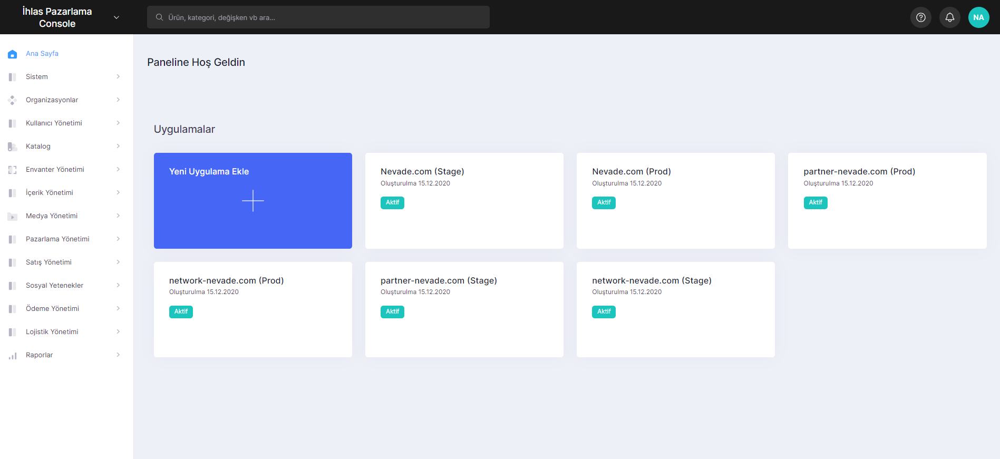

# Features

The feature guides provide in-depth information about the features, including their practical uses, advantages for businesses, and real-world applications.

This information can be valuable for individuals such as **business owners**, **product owners**, or **developers**.

With the Lidia Console, which has an easy menu, you can manage the system, catalogs, contents and many other elements related to your site. Here are a few steps to help you do this:&#x20;

<figure><figcaption>
Home Page Screen of Lidia Console
</figcaption></figure>

1. **Create your app on Lidia**&#x20;
2. **Design Your Data Universe**

* Meta Data
* Options
* Features
* Tags
* Categories
* Brands
* Product Families
* Manage Other Contents
* Menus
* Showcases
* Blocks
* Pages
* Lists

3. **Upload Products and Their Images**

* Pool
* Live

4. **Use the Application Development Interfcae (API)**

* Developer Documentation ([https://dev.lidiacommerce.com](../../lidia-merchant-console/about.md))
* Code Sample
* API Key
