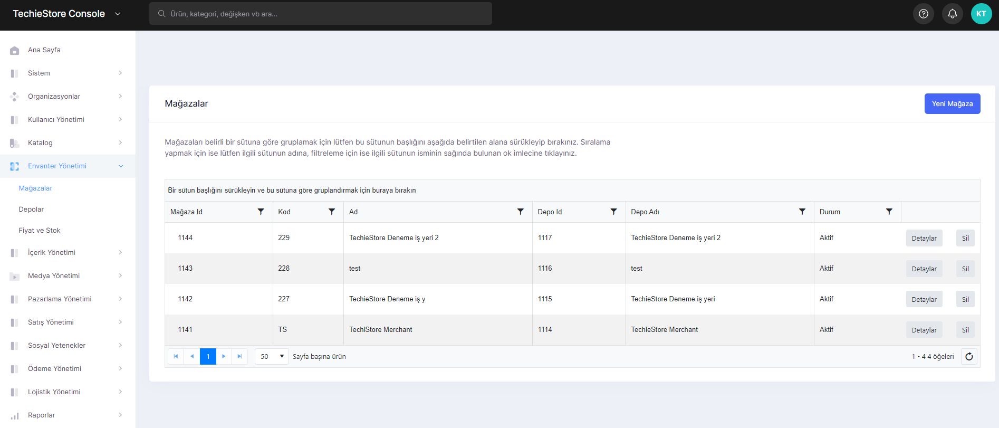
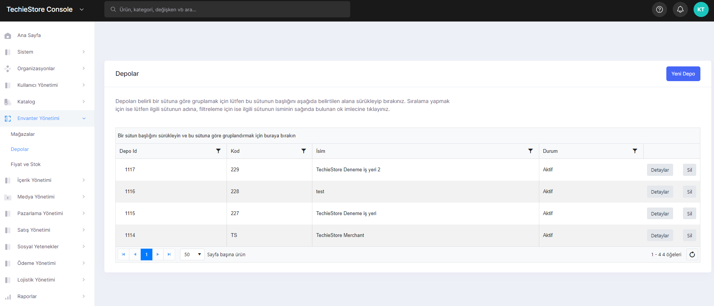

# Inventory Management

There are sections where you can manage these inventories. It consists of 3 main parts. These are:

1. Stores
2. Warehouses&#x20;
3. Price and Stock

## <mark style="color:blue;">1. Stores</mark>

The page where the stores in the system are listed. On this page, you can view the stores belonging to the brands in the system, create a new store with the warehouse information of the store, edit and delete the existing stores.

<figure><figcaption>
Stores Screen
</figcaption></figure>

## <mark style="color:blue;">2. Warehouses</mark>

The page where you can manage the warehouses used by the stores in the system. On this page, you can create the repository required to create a store, edit and delete previously created repositories.

<figure><figcaption>
Warehouses Screen
</figcaption></figure>

## <mark style="color:blue;">3. Price and Stock</mark>

The page with the price lists of the products in the warehouse of the stores and also in the system. On this page, you can create a new price list, edit and delete created price lists.
