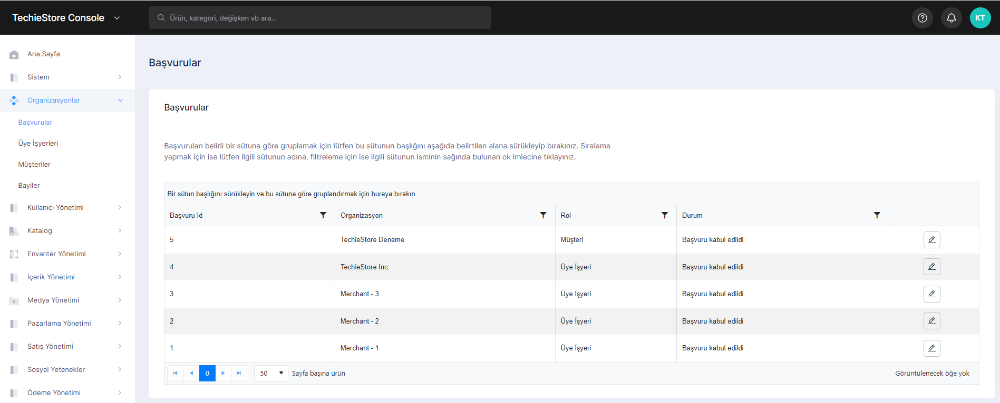

# Organizations

In this section, 4 different operations can be performed.

## 1. Applications

Sub-headings such as Application ID, Organization, Role and Status can be viewed with the applicant customers and member businesses.

<figure><figcaption>
Applications Screen
</figcaption></figure>

## 2. Merchants

In this section you can view the name of the merchants. You can add new merchants, import or export data.

<figure><figcaption>
Merchants Screen
</figcaption></figure>

## 3. Clients

Clients might be displayed in this section. You can add new clients or delete new clients.

## 4. Retailer

You can view all the retailers in this section.
