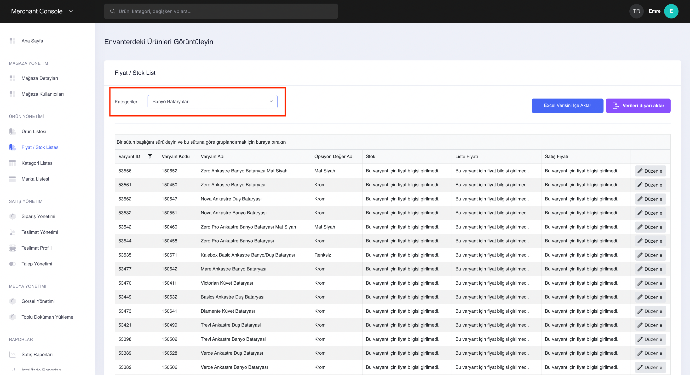
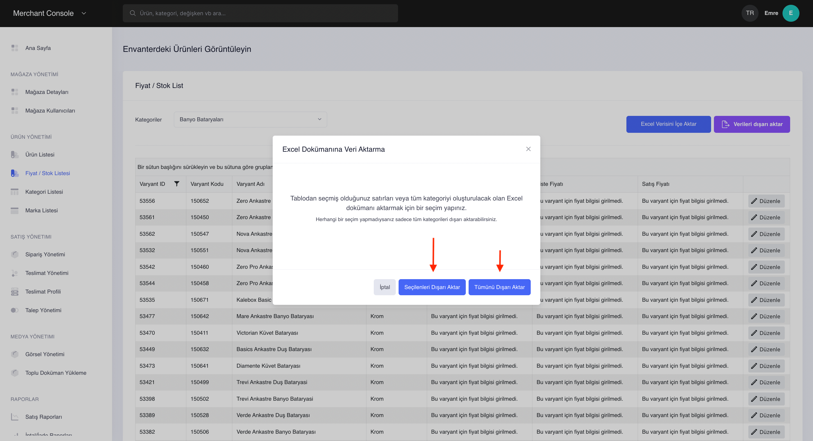
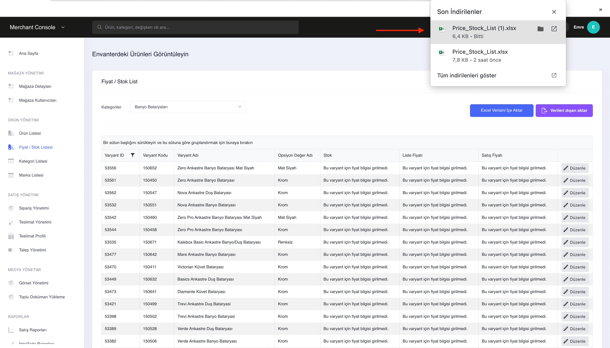
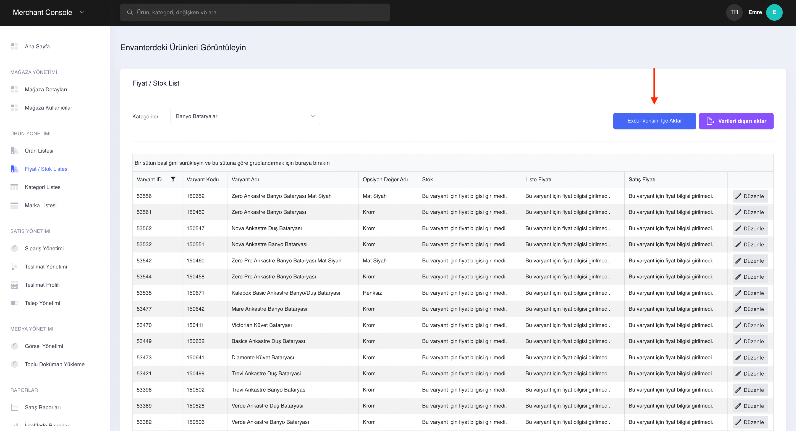
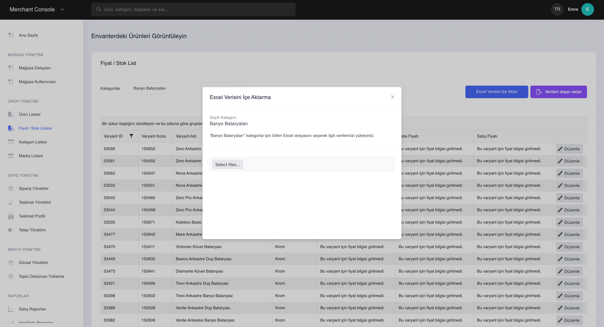
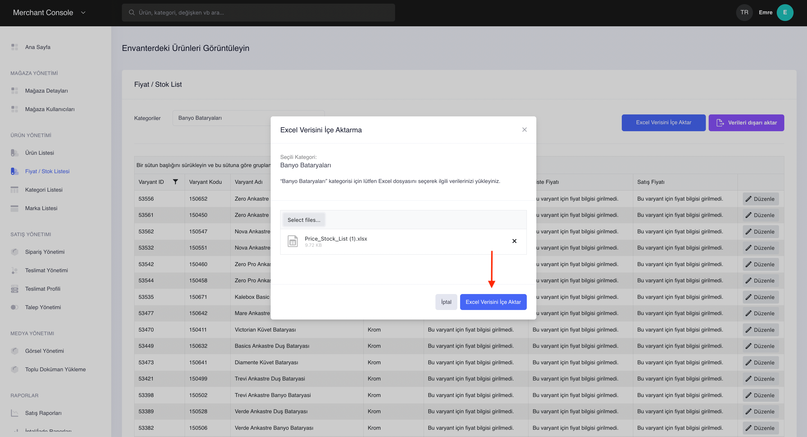

# Türkçe

Kullanıcı dokümantasyonu 6 ana başlıkta incelenecektir.\

1. [Anasayfa](turkce.md#anasayfa)
2. [Mağaza Yönetimi](turkce.md#magaza-yoenetimi)
3. [Ürün Yönetimi](turkce.md#ueruen-yoenetimi)
4. [Satış Yönetimi](turkce.md#satis-yoenetimi)
5. [Medya Yönetimi](turkce.md#medya-yoenetimi)
6. [Raporlar](turkce.md#raporlar)

### Giriş

Lidia Merchant Console, platformumuzun satıcılarının ürün bilgilerini toplamaları, düzenlemeleri ve etkili bir şekilde yönetmeleri için özel olarak tasarlanmış bir ara yüzdür. Bu konsol, satıcıların ürünlerini platformumuza yüklemelerine ve ürün bilgilerini güncellemelerine olanak tanır. Ürünlerin özellikleri, teknik detayları, görselleri, videoları ve fiyatlandırma gibi tüm önemli veriler burada toplanır ve kolayca işlenir.

### Anasayfa

Anasayfa, Lidia Merchant Console'e giriş yapıldığında ilk karşılaşılan ekrandır. Bu ekran, satıcının performans analizlerini ve mağazasına ait değerleri gösterir. Ayrıca, üst menüden dil değişikliği yapılabilir ve sol menüden mağaza yönetimi, ürün yönetimi, satış yönetimi, medya yönetimi ve raporları görüntülenebilir.

<figure><figcaption>
Anasayfa
</figcaption></figure>

### Mağaza Yönetimi

Mağaza yönetimi bölümünde; satıcılar mağaza bilgilerini görüntüleyebilir, kullanıcılarını yönetebilir.\

> Mağaza Detayları

Mağaza detayları bölümü satıcıların; temel bilgileri, adres bilgileri, entegrasyon bilgileri ve ayarlar bölümlerinden oluşur. Mağaza detaylarında satıcı mağaza durumunu da değiştirebilir.\
\
Temel Bilgiler bölümünde mağazanın adı, cari ünvanı, vergi dairesi, vergi numarası ve iban bilgileri yer alır. Bu bölümde mağaza yöneticisi iban bilgisini ve mağaza adını değiştirebilir.

<figure><figcaption>
Temel Bilgiler
</figcaption></figure>

Adres bilgileri bölümünde; mağazanın adres bilgileri yer alır.

<figure><figcaption>
Adres Bilgileri
</figcaption></figure>

Entegrasyon bilgileri bölümünde;&#x20;

<figure><figcaption>
Entegrasyon bilgileri 
</figcaption></figure>

Ayarlar bölümünde;

<figure><figcaption>
Ayarlar
</figcaption></figure>

> Mağaza Kullanıcıları

Mağaza kullanıcıları bölümünde; satıcının kullanıcılarının bir listesi yer alır. Bu listede kullanıcıların ad-soyad, e-posta adresi, rolü, oluşturma tarihi ve durum bilgisi görüntülenir.&#x20;

<figure><figcaption>
Mağaza kullanıcıları
</figcaption></figure>

Mağaza kullanıcı detayında da kullanıcının listelenen temel bilgileri görüntülenir ve telefon numarası da eğer istenilirse değiştirilebilir.

<figure><figcaption>
Mağaza kullanıcısı detayı
</figcaption></figure>

###

###

### Ürün Yönetimi

Ürün Yönetimi bölümünde; satıcılar sattıkları ürünleri görüntüleyebilir, fiyat - stok bilgisini düzenleyebilir, katalogtan ürün ekleyip direkt satışa ürün çıkarabilir ve ürünlerini yönetebilir.

<figure><figcaption>
Toplu Ürün İşlemleri
</figcaption></figure>

> Fiyat / Stok İşlemleri

<figure><figcaption>
Fiyat / Stok İşlemleri
</figcaption></figure>

Fiyat / Stok Listesi sayfalarında merchant sistemdeki ürünlerini görüntüleyebilir. Varyantlarının arasından kategori filtresi ile satmak istediği kategoriyi seçip; stok ve fiyat tanımlayarak ürünlerine ekleyebilir. Seçilen varyanta stok eklemek için ilgili satırdaki düzenle butonu ile stok bilgisi eklenerek ürün eklenmesini tamamlanabilir.

<figure><figcaption>
Düzenle
</figcaption></figure>

 

<figure><figcaption>
Stok tanımı
</figcaption></figure>

<figure><figcaption>
Stok ve Fiyat tanımlandır
</figcaption></figure>

Stok ve fiyat tanımı için merchant'lar seçili kategorideki ürünleri veya tüm ürünleri excel ile dışarı aktarıp, excel üzerinden toplu olarak değiştirip tekrar excel ile içeri aktarabilirler; bu sayede merchant'lar toplu şekilde de fiyat / stok güncellesi yapmış olursunuz.

<figure><figcaption></figcaption></figure>

 

<figure><figcaption>
Dışarı aktar
</figcaption></figure>

Seçilen kategoriyi veya tüm ürünleri excel olarak dışarı aktarabilirsiniz.

<figure><figcaption>
İndir
</figcaption></figure>

 

<figure><figcaption>
Excel 
</figcaption></figure>

İndirilen excel üzerinden istenen değişiklikler yapıldıktan sonra tekrar içeri alınabilir.

<figure><figcaption>
İçeri aktar
</figcaption></figure>

 

<figure><figcaption></figcaption></figure>

 

<figure><figcaption>
İçeri aktar
</figcaption></figure>

> Ürün Listesi

Stok ve fiyat bilgisi tanımlanmış satışta olan veya satışa çıkarılan merchant'ın tüm ürünleri Ürün Listesi sayfalarında listelenir.

Ürün listesi sayfalarında merchant'ın sattığı ürünlerin durumunu, ürün id'sini, görselini, ürünün ismini ve ürünün kodunu görebilirsiniz.&#x20;

<figure><figcaption>
Ürün Listesi
</figcaption></figure>

<figure><figcaption>
Detaylar
</figcaption></figure>

Ürün listesi sayfasındaki her ürünün detayını "detaylar" butonu ile görüntüleyebilirsiniz. Ürün detay sayfalarında ürünün tüm temel bilgilerine ve ürüne ait satıcının envanterindeki bilgilerine de erişebilirsiniz.

<figure><figcaption>
Temel Bilgiler
</figcaption></figure>

 

<figure><figcaption>
Envanter Yönetimi
</figcaption></figure>

> Kategori Listesi

Katalog listesi sayfalarında merchant'lar kategorileri görüntüleyebilir ve seçtikleri kategorinin detaylarını inceleyebilirler.

<figure><figcaption>
Kategoriler
</figcaption></figure>

 

<figure><figcaption>
Detay
</figcaption></figure>

> Marka Listesi

Marka listesi sayfalarında merchant'lar markalarını görüntüleyebilir ve seçtikleri markanın detaylarını inceleyebilirler.

<figure><figcaption>
Marka Listesi
</figcaption></figure>

 

<figure><figcaption>
Detaylar
</figcaption></figure>

### Satış Yönetimi

Satış Yönetimi bölümünde, satıcılar siparişlerini görüntüleyebilir, düzenleyebilir, teslim süreçlerini inceleyebilir ve teslim ettikleri ürünleri denetleyebilirler. Ayrıca, bu ekranlar aracılığıyla sipariş ve teslimat kodlarına erişebilirler. Teslimat profillerinde çalışılan kargo şirketlerinin profilleri oluşturabilir ve müşterilerden gelen iptal ve iade taleplerini görüntüleyebilir, onaylayabilir veya reddedebilir.

> Sipariş Yönetimi

<figure><figcaption>
<strong>Sipariş Yönetimi</strong> 
</figcaption></figure>

Sipariş yönetimi sayfasında müşteriler, tüm siparişlerinin; teslimat kodunu, müşterisinin bilgilerini, toplam tutarı, siparişinin tarihini ve sipariş durumunu görebilir.  \
\

Sipariş durumları merchant'ın siparişleri için aldığı kararlara göre listeleme ekranlarında değişir;

* Sipariş ilk sisteme düştüğünde, _Bekliyor,_

<figure><figcaption></figcaption></figure>

* Sipariş sistemden merchant tarafından onaylanırsa, _Hazır,_

<figure><figcaption></figcaption></figure>

* Sipariş kargoya ver denilirse, _Teslimat Sürecinde,_

<figure><figcaption></figcaption></figure>

* Sipariş iptal edilirse, _İptal Edildi,_

<figure><figcaption></figcaption></figure>

* Sipariş teslim edilirse, _Teslim Edildi,_

<figure><figcaption></figcaption></figure>

statülerinde sipariş listeleme ekranlarında görüntülenir.

\
\
Üst menüdeki arama kutucuğu ile tüm siparişler arasında arama yapabilir ve filtreleme seçenekleri ile siparişlerinizi filtreleyebilir, fiyat aralığı belirleyip arama yapabilir ve kolayca siparişler arasında siparişlerin tarihine ve fiyatına göre sıralama yapabilirsiniz.

<figure><figcaption>
Durum
</figcaption></figure>

 

<figure><figcaption>
Fiyat Aralığı - Sırala
</figcaption></figure>

\

Herbir sipariş satırındaki en sağdaki görüntüle butonununa tıklayarak sipariş içeriğini görüntüleyebilirsiniz.

<figure><figcaption>
Görüntüleme
</figcaption></figure>

 

<figure><figcaption>
Sipariş İçeriği
</figcaption></figure>

Sipariş içeriğinde merchant müşteri bilgilerine (satın alan müşterinin sistemde kayıtlı e-posta adresi), sipariş edilen ürünün bilgisine, teslimat ve fatura adreslerini görüntüleyebilir. Siparişi için ise; siparişini _onaylayabilir_ ve _reddedebilir._&#x20;

Siparişi seçili butondan onaylayabilirsiniz; **onaylanan ürünler** için 2 seçenek sunulur,

<figure><figcaption>
Onayla
</figcaption></figure>

 

<figure><figcaption>
Kargo &#x26;  İptal
</figcaption></figure>

Seçili ürünleri kargoya ver

Burada merchant'ın ürününü kargoya vermek için 2 seçeneği vardır;

_1- Kendi anlaşmalı kargom ile kargoya vereceğim_

Burada merchant tanımladığı anlaşmalı kargo şirketlerinden istediğini seçebilir ve oluştur butonu ile teslimatını oluşturabilir.&#x20;

\
Merchant kendi anlaşmalı kargosu ile gönderim sağladığı için, anlaşmalı kargo şirketinin verdiği takip kodunu sisteme "takip kodu" bölümünden tanımlayabilir ve bu sayede merchant ve  müşterisi bu kod ile kargo takibi yapabilir.\

_2- Kendim teslim edeceğim_

Burada merchant kendim teslim edeceğim diyebilir ve oluştur butonu ile teslimatını oluşturabilir.&#x20;

Merchant kendisi gönderim sağlayacağı için, sistem üzerinden tanımlayacağımız teslimat kodunu sisteme ekleyebilir ve bu sayede merchant ve müşterisi bu kod ile kargo takibi yapabilir. Merchantlar oluşturulan teslimat belgesini görüntüleyip, belgeleri indirebilirler.

\
**Kargo süreci tamamlanan ürünler teslimat yönetimi bölümünde listelenir ve yönetilir.**

Seçili ürünleri iptal et

Seçili ürünü yönlendirmelerimiz aracılığıyla iptal edebilirsiniz.

Seçili ürünleri **onaylamadan iptal** edebilirsiniz,\

<figure><figcaption>
Sipariş içeriği
</figcaption></figure>

 

<figure><figcaption>
Red onay ekranı
</figcaption></figure>

<figure><figcaption>
Red
</figcaption></figure>

Sipariş yönetiminde kullanıcı siparişini kargoya vermeden iptal işlemini 2 noktada gerçekleştirebilir;\
\- Siparişi onaylar, kargoya vermeden iptal edebilir\
\- Siparişi onaylamaz, direkt reddedebilir.

> Teslimat Yönetimi

Sipariş yönetiminde kargoya verilen seçili sipariş, teslimat yönetimi sayfalarında listelenir.&#x20;

Bir sipariş içerisinde birden fazla teslimat olması senaryosunda "teslimatlar" ekranında her teslimat ayrı ayrı listelenir.

<figure><figcaption>
Birden fazla teslimat
</figcaption></figure>

Siparişin teslimat ID, sipariş ID, teslimat kanallarını, teslimat kodunu ve durumunu görüntüleyebilirsiniz.

<figure><figcaption>
Teslimat yönetimi ana sayfa
</figcaption></figure>

(2) Sipariş detayda belirtilen **Sipariş ID**'dir. (3) Bu id ile teslimat yönetimi sayfalarında arama yapabilir; (4) siparişin detaylarını görüntüleyebilirsiniz. Teslimatın takibi bu sayfalardan yapılır.

Birden fazla teslimat olduğu durumlarda merchant aynı sipariş ID'sine sahip birden fazla satırda ürünleri inceleyebilir.&#x20;

<figure><figcaption>
1
</figcaption></figure>

 

<figure><figcaption>
2
</figcaption></figure>

<figure><figcaption>
3
</figcaption></figure>

 

<figure><figcaption>
4
</figcaption></figure>

> Teslimat Profili

Teslimat profilleri sayfasında anlaşmalı kargo şirketlerimizin profilleri listelenir. Bu kargo şirketlerimiz standart profiller ve oluşturduğunuz profiller olarak 2 şekilde listelenmektedir. Bu listelerin oluşturulma tarihini, güncelleme tarihini, durumunu sayfada kendine ait satırda görüntüleyebilirsiniz.

<figure><figcaption>
Teslimat profili
</figcaption></figure>

Siparişini kargoya vermek isteyen merchant'lara sunulan pazar yeri anlaşmalı kargolar, teslimat profilinde standart profiller sayfalarında listelenir. Standart profilleri görüntülemek için satırda en sağdaki butondan görüntüleme sayfasına gidebilirsiniz.&#x20;

Standart profillerde de tanımlanmış **pazar yeri anlaşmalı kargolarda**;\
\- Kargo eğer 30 desi ve altında ise, Aras Kargo\
\- Kargo eğer 30 desi üstünde ise, Horoz Lojistik\
teslimat sağlayan kargo şirketi olarak seçili gelecektir.

<figure><figcaption>
Standart profiller
</figcaption></figure>

 

<figure><figcaption>
Detay
</figcaption></figure>

Oluşturduğumuz profiller bölümü bayilerin tanımladığı kargo şirketleridir. Oluşturduğumuz profilleri görüntülemek için satırda en sağdaki butondan detaylar sayfasına gidebilirsiniz. Detaylar sayfasında bayilerin anlaşmalı olduğu ve sisteme de tanımını yaptığı tüm kargo şirketleri listelenir. Kargo şirketleri arasında küçük ve büyük kargo öncelik sıralamasını çek sürükle yöntemi ile değiştirebilirsiniz.

<figure><figcaption>
Oluşturduğumuz profiller
</figcaption></figure>

 

<figure><figcaption>
Detay
</figcaption></figure>

Oluşturduğumuz profilleri teslimat profilleri sayfasındaki satırdaki sil butonundan silebilirsiniz veya detay sayfalarındaki durum bölümünden durumunu değiştirebilirsiniz.

<figure><figcaption>
Oluşturduğumuz profiller / Sil
</figcaption></figure>

 

<figure><figcaption>
Oluşturduğumuz profiller / Durum değiştir
</figcaption></figure>

> Talep Yönetimi

Talep yönetimi sayfalarından müşterilerin önyüzden gönderdikleri iade ve iptal taleplerini listeler halinde görüntüleyebilirsiniz. Her bir talep satırında talep edilen sipariş id'sini, referans no'sunu, takip kodunu, müşteri bilgisini, talep tipini, talep tutarını, talep tarihini ve durumunu görüntüleyebilirsiniz.

<figure><figcaption>
Talep Yönetimi
</figcaption></figure>

* İade talebi sisteme düştüyse, _Yeni,_

<figure><figcaption></figcaption></figure>

* İptal talebi sisteme düştüyse (Yeni statüsüne düşmemektedir), _Kabul Edildi,_

* Merchant ürünler için kargo kodu girişi yaparsa veya ürünleri teslim aldım der ise, _İşleme Alındı,_

<figure><figcaption></figcaption></figure>

* Merchant'a ürünler ulaştıktan sonra talebi onaylarsa, _Kabul edildi,_

<figure><figcaption></figcaption></figure>

* Merchant'a ürünler ulaştıktan sonra talebi reddederse, _Reddedildi,_

<figure><figcaption></figcaption></figure>

* Merchant ile müşteri arasındaki para akışı süreci tamamlandığında, _Kapandı,_

<figure><figcaption></figcaption></figure>

statülerinde talep yönetimi ekranlarında görüntülenir.

İade talebi süreci

Merchant ürünü kargoya verdikten sonra iade süreci başlayabilir. \
İade sürecinin başlayabilmesi için merchant'ın ürünü _müşteriye ulaştırması ve ödemesini de almas_ı gerekir. Bu süreçten sonra 14 gün içerisinde müşterinin iade talebi oluşturma hakkı vardır. İade talebini de müşteri önyüzden gerçekleştirebilir. Müşteri önyüzden iade sürecini bitirdikten sonra bu talep bizim talep yönetimi ekranlarımıza düşmektedir.

Talep yönetimine düşen _Yeni_ statüsündeki talebin içeriğini, satırın sonundaki buton aracılığıyla görüntüleyebilirsiniz.

_İade süreci için merchant 2 farklı hareket edebilir;_&#x20;

* **Kullanıcı önyüzde kargoyu "kendim teslim edeceğim seçeneğini" seçmiş ise "ürünler için kargo kodu girin" butonu aktif olmaz, sadece "ürünler tarafıma ulaştı" butonu aktif olur.**

Merchant iade talebini <mark style="color:green;">onaylamak</mark> istiyorsa; ürünü seçip onaylayabilir.

Onaylama sürecinde merchant onay nedenini,

&#x20; ve isteğe bağlı açıklamasını yazıp talebi onaylayabilir.

Merchant iade talebini <mark style="color:red;">reddetmek</mark> istiyorsa; ürünü seçip reddedebilir.

Reddetme sürecinde reddetme nedenini,

&#x20; ve isteğe bağlı açıklamasını yazıp talebi reddedebilir.

* **Kullanıcı önyüzde ürünü kargo ile iade edeceğim seçmiş ise o zaman 2 buton da aktif olacaktır.**&#x20;

_Ürünler için kargo kodunu girin_

Ürünleri kargo ile gönderecek merchant'lar eğer ürünler için kargo kodunu girin seçeneğini seçer ise açılan pencerede "gönderi takip kodu" bölümünü doldurmaları zorunludur.

Burada merchant kargo şirketinden bir kod yaratıp ve bu kodu buraya eklemelidir. Kargo kodunu ve kargo şirketini seçip oluştur dediğimizde ürünü iade etmek isteyen müşteriye kargo kodu iletilir; önyüzde de bu kodu görüntüleyebilir.

Gönderi kodunu tanımladıktan sonra bu kargolar merchant'a ulaştığında sistem üzerinden ürünü seçip ürünler tarafıma ulaştı diye durumu güncelleyebilir.

&#x20;                  Sonrasında merchant iade talebini onaylayabilir veya reddedebilir.

&#x20;                                        .png>)

&#x20;     .png>).png>)

_Ürünler tarafıma ulaştı_

Buradaki akış yukarıdaki akış ile aynıdır.&#x20;

İptal talebi süreci

Müşterilerimiz bir önyüzden sipariş verdiğinde bu siparişimiz merchant console'a düşüyor. Bu siparişi merchant console üzerinden onaylayana kadar, müşteri siparişini iptal edebilir. Böyle bir durumda müşteri iptal talebini merchant'ın onaylamasına reddetmesine bakmadan direkt olarak ürünü iptal edebilir.

Merchant kargoya verdikten sonra iade süreci başlar. İade sürecinin başlayabilmesi için merchant'ın ürünü müşteriye ulaştırması ve ödemesini de alması gerekir. Bu süreçten sonra 14 gün içerisinde müşterinin iade talebi oluşturma hakkı vardır. İade talebini de müşteri önyüzden gerçekleştiriyor. Müşteri önyüzden iade sürecini bitirdikten sonra bu talep bizim talep yönetimi ekranlarımıza düşüyor.&#x20;

İade süreci için merchant 2 farklı hareket edebilir; \
kullanıcı önyüzde kargoyu kendim teslim edeceğim seçmiş ise ürünler için kargo kodu girin butonu aktif olmaz, sadece tarafıma ulaştı butonu aktif oluyor.&#x20;

kullanıcı önyzüde kargoyu kargo ile teslim edeceğim seçmiş ise o zaman 2 buton da aktif oluyor.

Gönderi kodu ekle;\
burada müşteri kendi anlaşmalı kargosundan aldığı kargo kodunu buraya yazar. burada merchant kargo şirketinden bir kod yaratacak ve bu kodu buraya ekleyecek. Kargo kodunu girip kargo şirketini girip oluştur dediğinde müşteriye kargo kodu iletilir; önyüzde bu kodu görebilir. bu kargolar merchanta ulaştığında sistem üzerinden ürünü seçip ürünler tarafıma ulaştı diye belirtebilir. Sonrasında iade talebini onaylayabilir veya reddedebilir.

### Medya Yönetimi

### Raporlar

