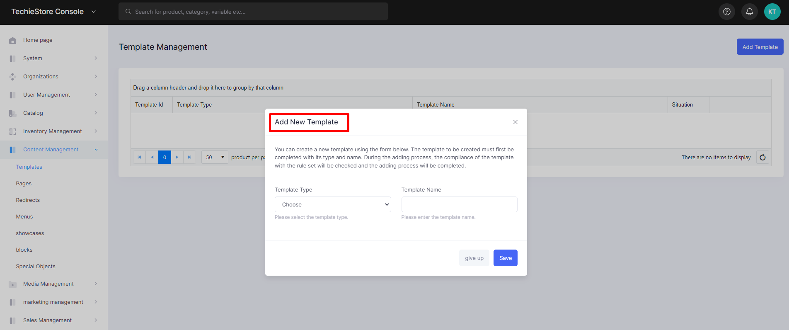
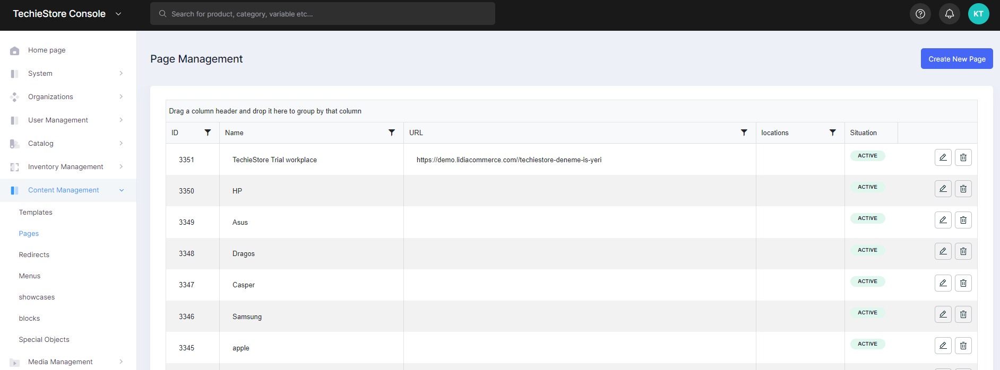
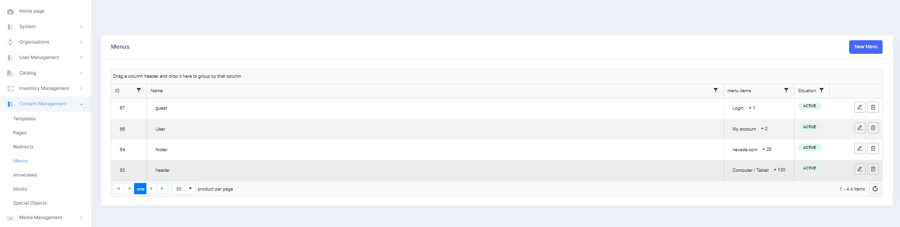
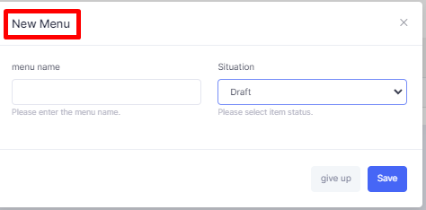
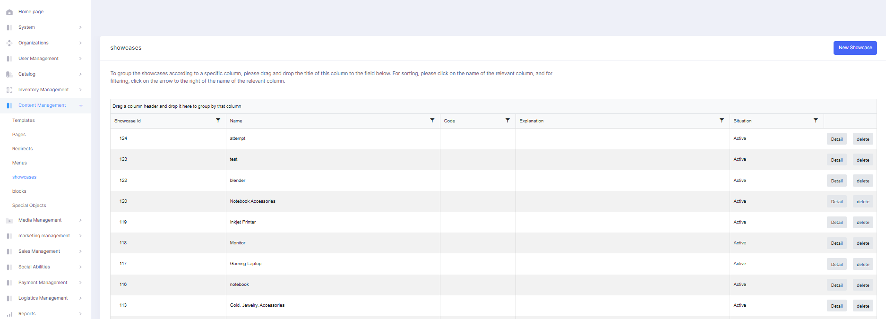
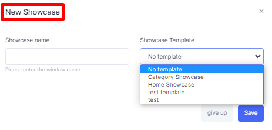
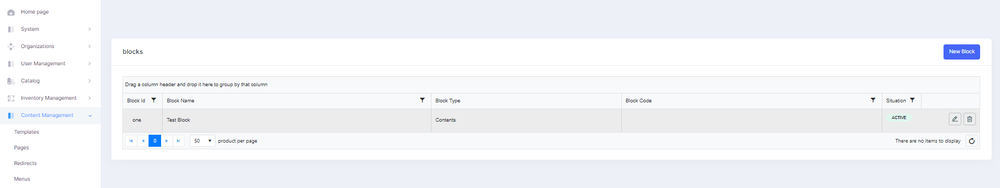
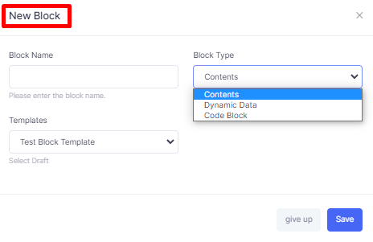
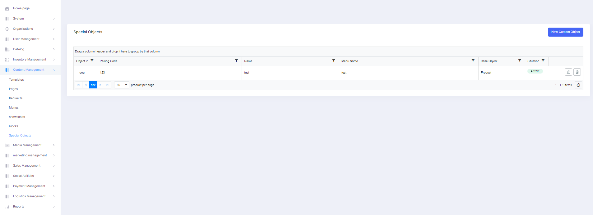
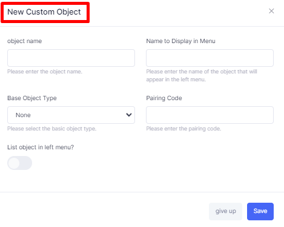

# Content Management

It is the section that supports the collection, management and publication of information in any form or medium.

It consists of 7 subheadings:&#x20;

1. Templates&#x20;
2. Pages&#x20;
3. Redirections&#x20;
4. Menus&#x20;
5. Showcases&#x20;
6. Blocks
7. Custom Objects

## Templates

Templates typically include elements such as the header, navigation menu, search bar, product listings, product images, product descriptions, customer reviews, and more.

<figure><figcaption>
Add New Template Screen
</figcaption></figure>

<figure><figcaption>
Template Management Screen
</figcaption></figure>

## Pages

The page where all existing pages on the website are managed. On this page, you can create a new page with its own URL, edit and delete existing pages.

<figure><figcaption>
Page Management Screen
</figcaption></figure>

<figure><figcaption>
Creating New Page Screen 
</figcaption></figure>

## Redirections

The page that allows the URLs in the system to redirect from the old version to the new one. After defining the old URL and the new URL on this page, you complete the process by entering a redirect code. You can also edit and delete existing redirects.

## Menus

The page with all the menus in certain places on the site, such as the top of the home page, the product listing page. On this page, you can create a new menu, edit and delete previously created menus. In addition, while creating a menu, you can manage all the sub-items in the menu.

<figure><figcaption>
Menus Screen
</figcaption></figure>

<figure><figcaption>
Adding New Menu 
</figcaption></figure>

## Showcases

On the system home page, product listing pages, etc. The page where the display windows, that is, the billboards, are managed. On this page, you can create a new showcase, edit and delete created showcases.

<figure><figcaption>
Showcase Screen 
</figcaption></figure>

<figure><figcaption>
Adding New Showcases Screen
</figcaption></figure>

## Blocks

They are components that are centrally managed on the site and can be used on many pages.

<figure><figcaption>
Blocks Screen
</figcaption></figure>

<figure><figcaption>
Adding New Blocks
</figcaption></figure>

## Custom Objects

The page where special objects that are not required to appear in the menus in the system are managed. On this page, you can create a new object, edit and delete created objects. These objects include categories, brands, products, variants, campaigns and stores.

<figure><figcaption>
Custom Object Screen
</figcaption></figure>

<figure><figcaption>
Adding New Custom Object Screen
</figcaption></figure>

