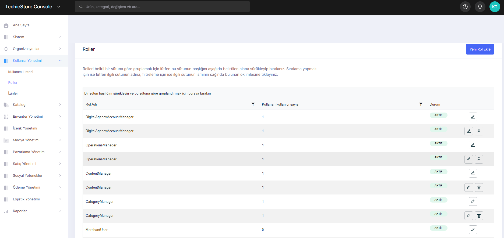
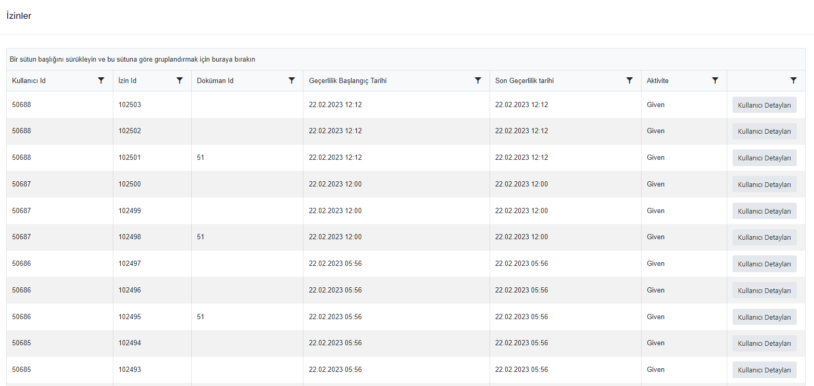

# User Management

In this section 3 different operations can be performed.

1. User List
2. Roles
3. Permissions

## User List

In this section, you can list all registered users, add new users and edit and delete added users.

<figure><figcaption>
User List Screen
</figcaption></figure>

## Roles

In this section, you can view the roles that will be given to active users. You can also add new roles, edit and delete existing roles such as User, Network User, Network Admin.

<figure><figcaption>
Roles Screen
</figcaption></figure>

## Permissions

The page where the permissions used in the system are given to active users in the system. In this page, you can only list the granted permissions and users.

<figure><figcaption>
Permission Screen
</figcaption></figure>
