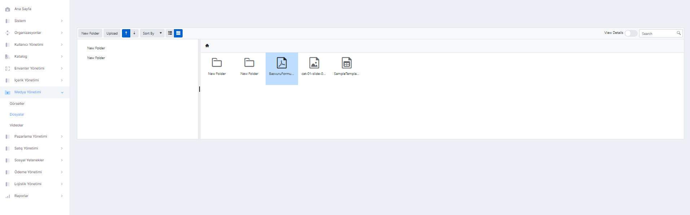

# Media Management

It is the section where media management such as editing images, files and videos of your current page, and adding new content is done.

## Images

You can manage all the images used in the system. On this page, you can separate the images with files according to their usage, add a new image, rename the added image, change its location and delete it.

<figure><figcaption>
Images Screen
</figcaption></figure>

## Files

The page where you can manage the files used in the system. On this page, you can add new files, rename the added file, change its location and delete it.

<figure><figcaption>
Files Screen
</figcaption></figure>

## Videos

The page where the videos in the system are located and managed. On this page, you can add a new video to the system, reassign and delete the added video.
