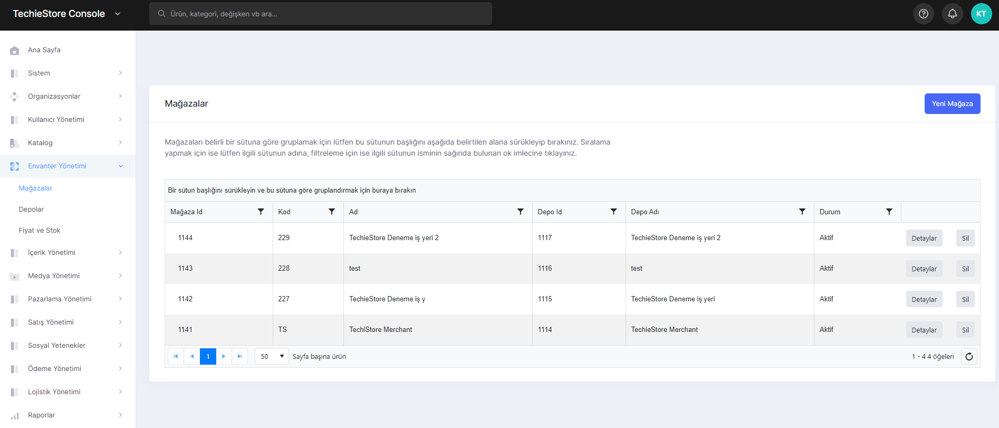
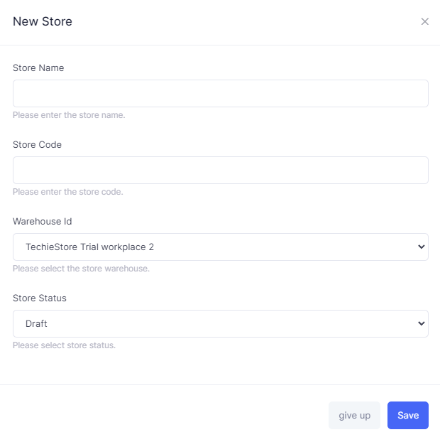
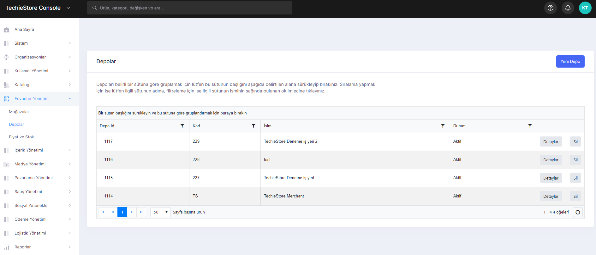
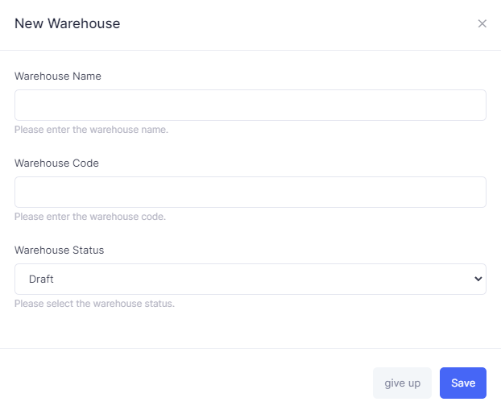
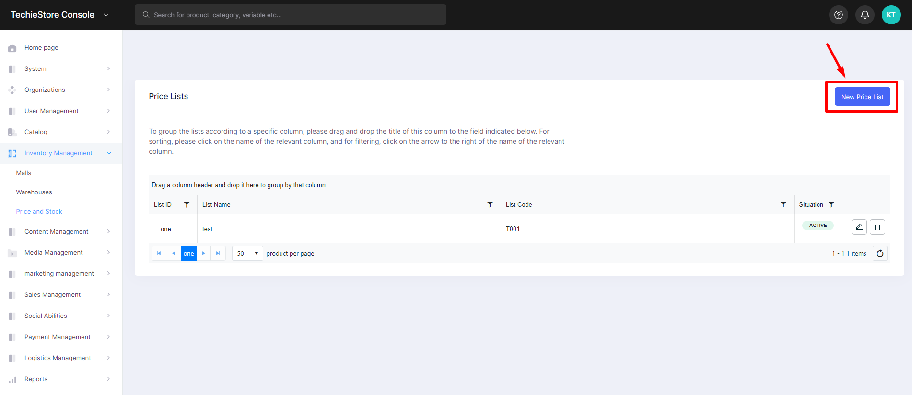

# Inventory Management

Effective inventory management is crucial for businesses to fulfill customer demand. Upon the arrival of goods, inventory management involves receiving, counting, sorting, and organizing stock in an efficient manner.

Having the appropriate inventory management system is vital in preventing the unnecessary storage of surplus inventory, which can lower holding costs. Tracking inventory can be a tedious process if lacking automated and efficient inventory control software.

There are sections where you can manage these inventories. It consists of 3 main parts. These are:

1. Stores
2. Warehouses&#x20;
3. Price and Stock

## Stores

The page where the stores in the system are listed. On this page, you can view the stores belonging to the brands in the system, create a new store with the warehouse information of the store, edit and delete the existing stores.

<figure><figcaption>
Stores Screen
</figcaption></figure>

<figure><figcaption>
New Store Addition Screen
</figcaption></figure>

## Warehouses

The page where you can manage the warehouses used by the stores in the system. On this page, you can create the repository required to create a store, edit and delete previously created repositories.

Warehouse management involves arranging and supervising all aspects of the warehouse to ensure it functions in the most effective way possible.

Typical activities include organizing the warehouse layout, managing inventory and new stock, fulfilling orders through activities such as picking, packing and shipping, and monitoring and enhancing the overall performance of the warehouse.

<figure><figcaption>
Warehouses Screen
</figcaption></figure>

You can add new warehouses.

<figure><figcaption>
New Warehouse Adding
</figcaption></figure>

## Price and Stock

The page with the price lists of the products in the warehouse of the stores and also in the system. On this page, you can create a new price list, edit and delete created price lists.

<figure><figcaption>
Price Lists Screen 
</figcaption></figure>

