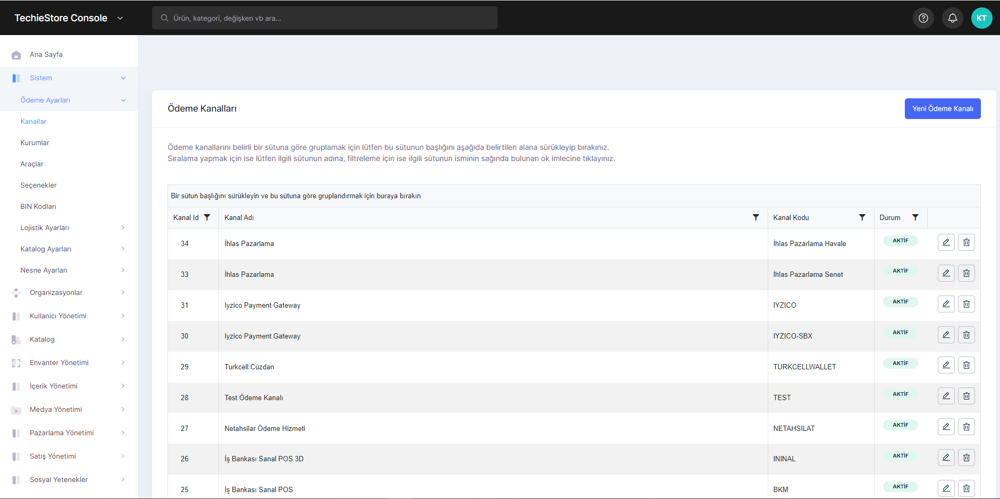
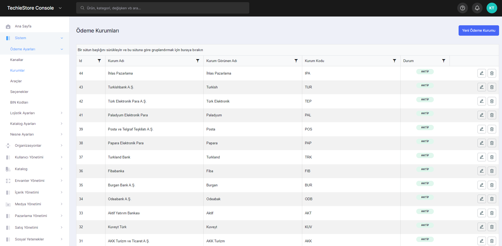

# System

You might display 4 payment settings in the system:

1. Payment Settings
2. Logistic Settings
3. Catalog Settings
4. Object Settings

## Payment Settings

In this section, sections related to payment settings can be viewed. Channels, institutions, tools, options, BIN Codes.

**Payment Channels**

You can display how to make payments in the payment channels section.

<figure><figcaption>
Payment Channel Screen
</figcaption></figure>

**Institutions**

You can manage payment institutions in the institutions section. You can add a new one or edit or delete an existing banks. We can cite banks as an example to these institutions.

<figure><figcaption>
Institutions Screen
</figcaption></figure>

**Payment Instruments**

In this area, you can manage the payment instruments to be used in the system. You can add a new tool (credit card, money order, etc.), edit and delete previously added tools.

<figure><figcaption>
Payment Instruments Screen 
</figcaption></figure>

**Payment Options**

You can check the payment options you encounter while making a payment in the system on this page. You can offer privileges to your customers with new options such as installments and interest.

<figure><figcaption></figcaption></figure>

**BIN Codes**

This section is where Bank Identification Numbers might be displayed. Helps merchants and payment processors verify the legitimacy of a payment card and ensure that transactions are routed to the correct bank or financial institution for processing.

<figure><figcaption>
BIN Codes Screen 
</figcaption></figure>

## Logistic Settings

**Warehouse Management**

Keeping the track of stock inflows into the warehouse is one of the primary functions of the Warehouse Management System. It enables warehouse management with the perfect insights to understand the availability of stock, stock processing and stock replenishment needs.

**Delivery Management**

Delivery management is the process of planning, organizing, and controlling the movement of goods or services from a supplier to a customer. You can manage all your deliveries in this section.

**Providers**

You might display delivery channels such as cargo and logistic firms.

## Catalog Settings

**Product Families**

* **Product Families**\
  The section where you can manage the data schemes related to the data of the products entered into the system. In this section you can create, edit and delete a new data scheme for each different product.

<figure><figcaption></figcaption></figure>

* **Product Families Drafts**\
  You can create the data schemes that we add in the product families section as a draft in this section.

**Properties Management**

* **Properties**\
  You can follow the features of the products added to the system on this page. You can add, edit and delete a new feature.

<figure><figcaption>
Properties Screen 
</figcaption></figure>

* **Property Groups** \
  A page where you can manage the groups in which the properties you add on the properties page are based on their categories. You can edit and delete these property groups.

**Option Management**

* **Options**\
  A page where you can manage the options available on the products. Internal memory options in phones and color options in clothes are examples of these options.

<figure><figcaption>
Options Screen
</figcaption></figure>

* **Option Group**\
  A page where you can manage the groups in which the options we have added in the Options section are according to their categories.
* **Option Values**\
  A page where we can define an option using the options option groups available in the system. You can edit and delete these option values.
* **Option Value Groups**\
  A page where you can manage the groups where the option values in the system are found according to their categories.

**Tag Management**

On this page, you can add new tags, edit and delete added tags.

<figure><figcaption>
Tag Management Screen 
</figcaption></figure>

**Product Relations**

**Data Locks**

## Object Settings

**Extensions**
