# Türkçe Dokumantasyon

Kullanıcı dokümantasyonu 8 ana başlıkta incelenecektir.

1. [Anasayfa](turkce.md#anasayfa)
2. Ayarlar
   1.

### Giriş

Lidia ürün bilgi yönetimi (PIM) yazılımı, şirketler tarafından ürün bilgileri, özellikler, teknik özellikler, resimler, videolar, fiyatlandırma, ürün belgeleri gibi veriler dahil olmak üzere ürün bilgilerini toplamak, düzenlemek ve işlemek için kullanılır.

### Anasayfa

Anasayfa Lidia PIM’e giriş yapıldığında ilk karşılaşılan ekrandır. Bu ekranda sol menüde yönetim süreçlerini yapabilir, hesap bilgileri ve organizasyonlar görüntülenebilir dil değişikliği yapılabilir.

Anasayfa 3 ayrı bölümde bir dashboard görüntüleniyor. Bunlar:

* Gelen Veri
* Canlı Veri
* Dışa Aktarım

**Gelen Veri:** Bu bölümde ürün havuzunda kaç tane ürününüzün olduğunu, havuz kayıtlarını, hatalı kayıtları ve yayına hazır kayıtlarınızın görüntülendiği bölümdür. PIM sistemine dış kaynaklardan, genellikle ürün verilerinin başlangıç noktası olarak kullanılan kaynaklardan gelen verileri ifade eder. Bu veriler, ürünlerin temel bilgilerini içerebilir ve farklı kaynaklardan gelerek PIM sistemine entegre edilir. Örnek olarak, ürün tedarikçilerinden, üreticilerden, pazar yerlerinden veya diğer veri kaynaklarından alınan ürün verileri gelen veri olarak adlandırılabilir.

<figure><figcaption>
Gelen Veri
</figcaption></figure>

**Canlı Veri:** Canlı veri bölümünde ürün, kategori, liste, varyant,marka ve medya sayısınının görüntülendiği bölümdür. Aynı zamanda bu bölümlere hızlı geçiş sağlanabilir. PIM sistemine entegre edilmiş diğer sistemlerle gerçek zamanlı olarak paylaşılan verileri ifade eder. PIM sistemi, e-ticaret platformları, ERP (Enterprise Resource Planning) sistemleri, CRM (Customer Relationship Management) sistemleri ve diğer entegre sistemlerle veri paylaşımı yapabilir. Bu sayede güncel ve doğru veriler canlı olarak PIM sistemi üzerinde güncellenir ve diğer sistemlerle senkronize kalır.

<figure><figcaption>
Canlı Veri
</figcaption></figure>

<figure><figcaption>
Canlı Veri Kısa Yolları
</figcaption></figure>

**Dışa Aktarım:** Bu bölümde ise kanallar ve akış sayısını görüntüleyebilir, bu bölümlere hızlı geçiş yapabilirsiniz. Ürün verilerinin, belirli formatlarda veya belirli hedeflere dışarıya aktarılması işlemidir. PIM sistemi, ürün verilerini farklı kanallar, platformlar veya formatlar için dışarı aktarabilir. Örneğin, e-ticaret web siteleri, pazar yerleri, dijital kataloglar veya üçüncü taraf entegrasyonlar gibi çeşitli hedeflere doğru dışarıya aktarım yapılabilir. Bu dışarıya aktarılan veriler, genellikle güncel ve doğru ürün bilgilerini içerir ve hedef sistemlerde kullanılır.

<figure><figcaption>
Dışa Aktarım
</figcaption></figure>

Gelen veri, canlı veri ve dışarı aktarım, PIM sistemi içinde ürün veri yönetiminin temel süreçlerini kapsar. Gelen veri, ürün verilerinin PIM sistemi içine aktarılmasını sağlar. Canlı veri, diğer sistemlerle gerçek zamanlı olarak veri paylaşımını ve senkronizasyonu sağlar. Dışarı aktarım ise, PIM sistemi üzerinde yönetilen ürün verilerinin farklı hedeflere dışarıya aktarılmasını sağlar. Bu süreçler, PIM sistemi üzerinde ürün verilerinin etkili ve verimli bir şekilde yönetimini sağlar ve doğru, güncel ve tutarlı ürün bilgilerini çeşitli kanallar ve sistemler arasında paylaşmayı kolaylaştırır.

Ana Sayfada sol menüde PIM’in kontrolünü sağlanacağı bölümler bulunuyor.&#x20;

<figure><figcaption>
PIM Sol Menü
</figcaption></figure>

Hesap Bilgileri, organizasyonlarınızı ya da kullandığınız dili değiştirmek için sağ üste bulunan profil kısmına tıklayarak düzenleyebilirsiniz.&#x20;

<figure>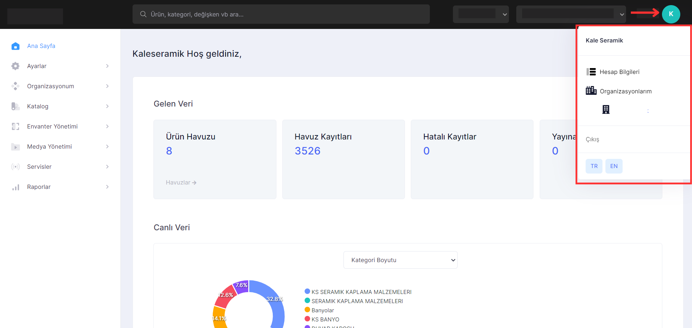<figcaption>
Profil 
</figcaption></figure>

<figure>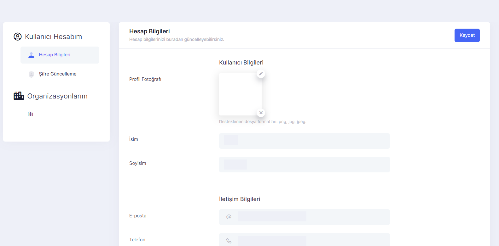<figcaption>
Hesap Bilgileri Ekranı 
</figcaption></figure>

* Kullanıcı bilgileri bölümden aşağıdaki bilgileri düzenleyebilirsiniz:&#x20;
* Profil resmi
* İsim, soyisim&#x20;
* E-posta adresi&#x20;
* Telefon numarası&#x20;
* Şifre güncellemesi yapılabilir.

<figure>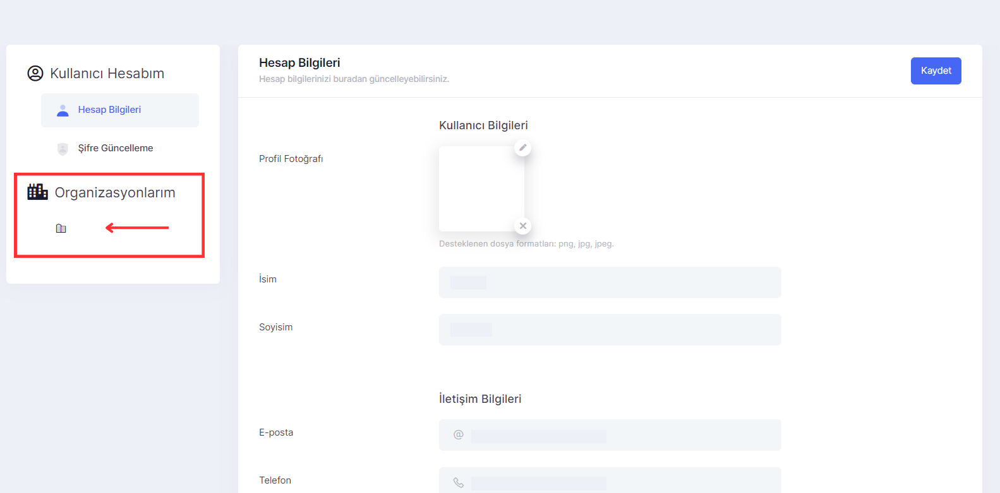<figcaption>
Organizasyonlarım Ekranı 
</figcaption></figure>

* Organizasyon detayları altında yer alan organizasyon adı ve açıklama alanının güncellenmesi
* Organizasyon aktif aboneliklerinin görüntülenmesi
* Organizasyon kullanıcılarının yönetimi (Sadece “Uygulama Yöneticisi” rolüne sahip kullanıcılar yaratılabilir ve güncellenebilir)
* Mevcut Lidia uygulamalarının (console, merchant console vb.) görüntülenmesi

## Ayarlar

Ayarlar bölümünde, PIM kulanıcılarının tüm platform içeriğini etkili bir şekilde yönetmelerini sağlayan birimlerin ayarlarının düzenlendiği ve eklemelerin yapılabildiği sayfalar bulunur. _**Ayarlar bölümü; "Yetkilendirme", "Üyeler", "Katalog", "Lokalizasyon" ve "Konfigürasyon" olmak üzere 5 ana başlıktan oluşur.**_

### Yetkilendirme

Yetkilendirme bölümü, PIM üzerinde kullanıcıların ve sistem üzerinde tanımlanan kullanıcı rollerinin belirlenebildiği ve listelendiği sayfaları içermektedir.

_**Yetkilendirme bölümünde "Kullanıcılar" ve "Roller" olmak üzere iki kategori bulunmaktadır.**_&#x20;

### Kullanıcılar

Kullanıcılar sayfasında, PIM’i kullanacak kullanıcılarımızın listesi görüntülenir. Kullanıcılar bölümünde eklenmiş kullanıcılar detay sayfalarında görüntülenebilir; orada güncellenebilir, kullanıcı silinebilir ve liste içerisinde durumuna göre listelenebilir.

<figure>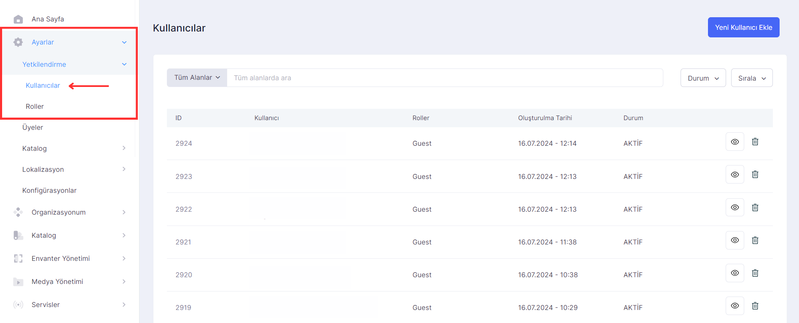<figcaption>
Kullanıcılar 
</figcaption></figure>

Yeni kullanıcı ekle butonuna tıklanarak kullanıcı ekledikten sonra listeye eklenen kullanıcı detaylı incelenebilir ve düzenlenebilir.

<figure>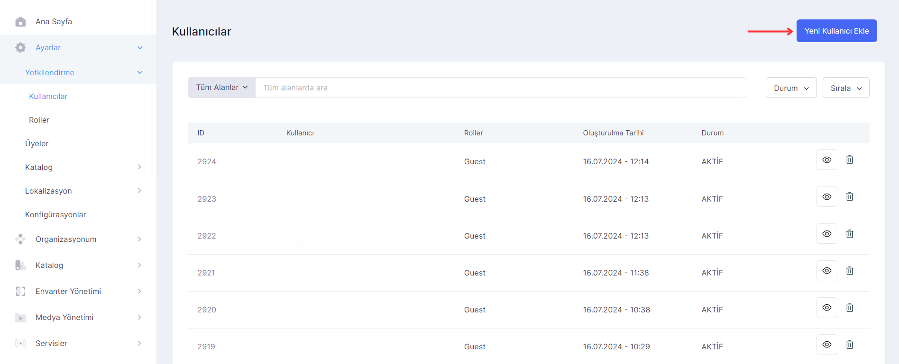<figcaption>
Kullanıcı Ekleme
</figcaption></figure>

 

<figure>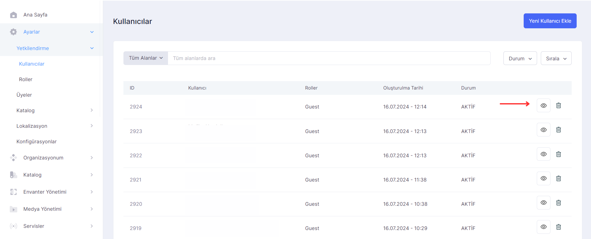<figcaption>
Kullanıcı Detay Butonu
</figcaption></figure>

Oluşturulan kullanıcılar tekrar düzenlenebilir eklemeler veya güncellemeler yapılabilir.

<figure><figcaption>
Kullanıcı Ekleme Sayfası
</figcaption></figure>

 

<figure>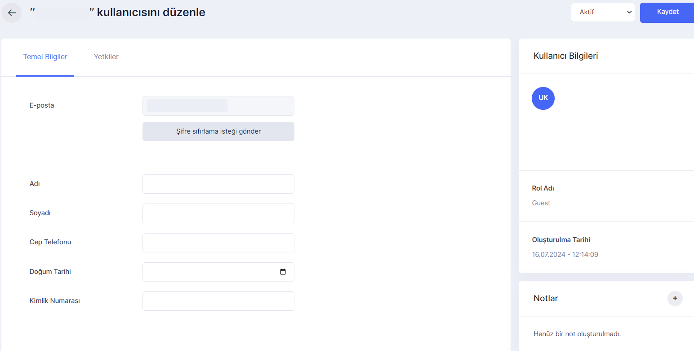<figcaption>
Kullanıcı Düzenleme
</figcaption></figure>

### Roller

Roller sayfasında ise belirlenen roller ve bunları kullanan aktif kullanıcı sayısı görüntülenebilir; yeni rol eklenebilir. Adminler de rol olarak belirlenebilir ve düzenlenebilir; sayfalardaki yetkileri düzenlenebilir. Ayrıca pasif olan roller de silinebilir.

<figure>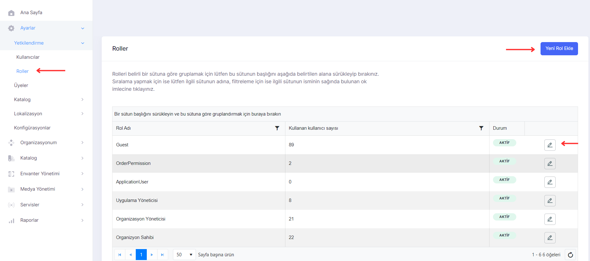<figcaption>
Roller Sayfası
</figcaption></figure>

Roller sayfasında sistemde daha önceden oluşturulmuş roller ve bu rollere ait kullanıcı sayıları görüntülenir.&#x20;

<figure><figcaption>
Yeni Rol Ekleme
</figcaption></figure>

 

<figure><figcaption>
Rol Detayı
</figcaption></figure>

Yeni rol ekleme ekranında; rol adı, isteğe bağlı kullanıcı tanımlama ve mevcut yetki şablonu belirlenerek yeni rol eklenebilir. Eklenen yeni rol roller sayfasında listelenir. Rol detayına giderek seçili rol için değişiklikler ve güncellemeler yapılabilir.

### Üyeler

PIM sisteminde tanımladığımız kullanıcıların listelenmesi ve erişim durumlarını değiştirip güncelleme yapabildiğimiz alandır. Tanımlanan kullanıcıların düzenlenmesi buradan yapılır.

<figure>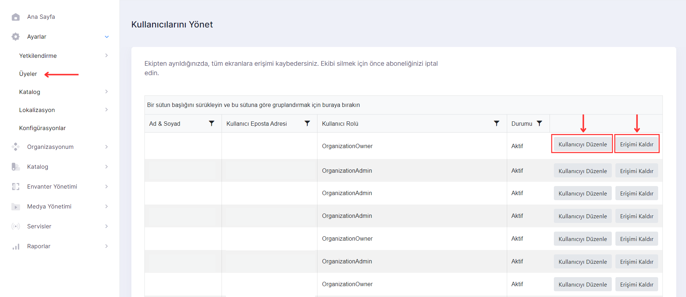<figcaption>
Üyeler Sayfası
</figcaption></figure>

Kullanıcıyı düzenleme ekranı "Yetkilendirme" bölümü içerisindeki "Kullanıcılar" sayfasında bulunan kullanıcı düzenleme sayfası ile aynıdır.

<figure>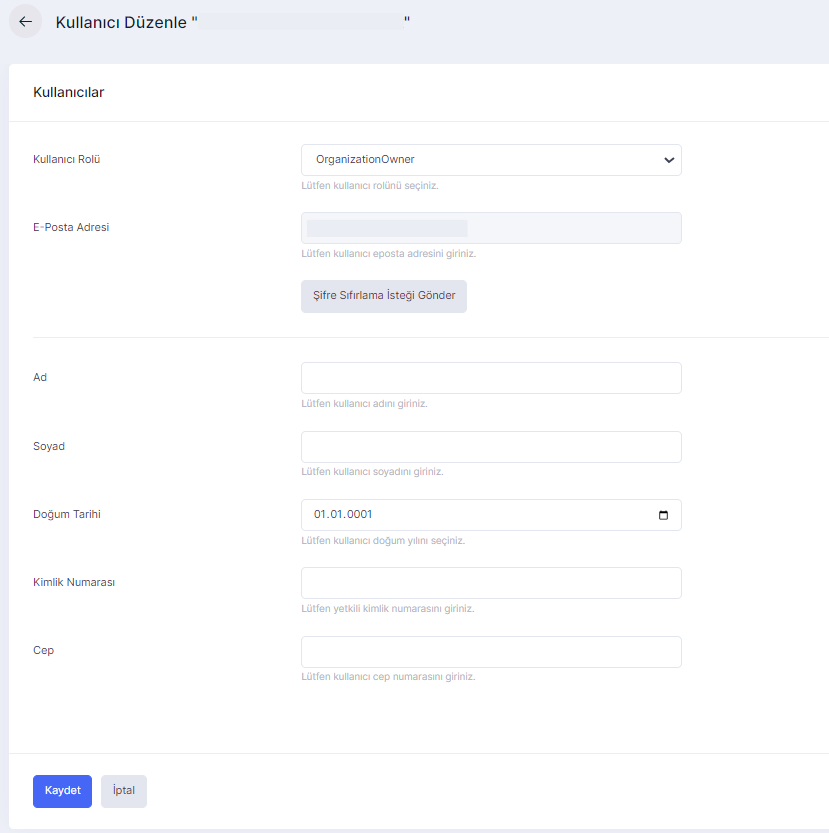<figcaption>
Kullanıcıyı Düzenle Ekranı
</figcaption></figure>

 

<figure>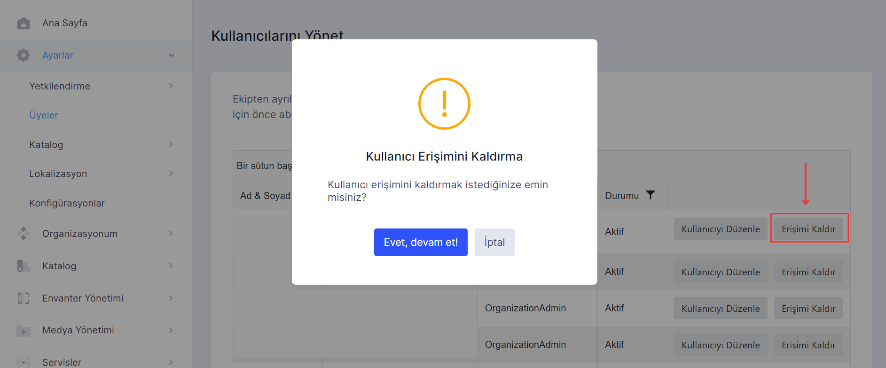<figcaption>
Erişimi Kaldırma
</figcaption></figure>

### Katalog

Katalog menüsü altında bulunan sayfalar, ürünlerin organize edilmesi, yönetilmesi ve düzenlenmesi için kullanılır.&#x20;

#### Ürün Aileleri

Ürün Aileleri, bir PIM sistemi içindeki ürün verilerinin organizasyonunu, yapılanmasını ve ilişkilerini tanımlayan yapısal bir plan veya modeldir. Ürün aileleri, ürün verilerini belirli bir standart veya format içinde tutarak, veri tutarlılığını, doğruluğunu ve erişilebilirliğini sağlamaya yardımcı olur.

Lidia PIM kullanıcıları veri uzayını yukarıda başlıklarda tanımladıktan sonra, bu tanımlar kullanılarak yönetilecek ürün verisinin doğruluğunu kalitesinin kontrol altında tutulmasını sağlayacak olan veri şemaları oluşturulabilmektedir.

<figure><figcaption>
Yeni Veri Şeması Oluşturma
</figcaption></figure>

 

<figure><figcaption>
Oluşturma Ekranı
</figcaption></figure>

Yeni veri şeması eklendikten sonra şemanın detayını inerek bilgileri görüntülenebilir ve ürün ailesi içerisinde tanımlanan alanlar düzenlenebilir.

<figure><figcaption>
Veri Şeması Alanı 
</figcaption></figure>

 

<figure><figcaption>
Veri Şeması Alanı Düzenleme Ekranı
</figcaption></figure>

#### Koleksiyonlar

PIM'de koleksiyonlar, benzer ürünleri bir araya getirmek için kullanılan bir özelliktir. Koleksiyonlar, bir ürün kategorisi veya tema altında bulunan benzer ürünleri gruplandırmak için kullanılabilir. Bu, ürün verilerini daha etkili bir şekilde yönetmeye ve organize etmeye yardımcı olur. Koleksiyonlar, ürün verilerini daha kolay filtreleme, sıralama, güncelleme ve raporlama imkanı sağlar.

<figure><figcaption>
Koleksiyonlar
</figcaption></figure>

#### Özellikler

Özellikler menüsü, ürünlere eklenebilecek özel niteliklerin tanımlandığı bölümdür. Bu özellikler, ürünlerin daha ayrıntılı ve spesifik tanımlanmasını sağlar. _**Özellikler bölümünde “Özellik Grupları” ve “Özellikler” olarak iki sayfa bulunur.**_

<figure><figcaption>
Özellikler Ekranı
</figcaption></figure>

 

<figure><figcaption>
Özellik Ekleme Ekranı
</figcaption></figure>

Bu özellikler grupları Lidia PIM kullanıcısının ihtiyaçlarına göre arttırılabilir.

* **Temel Özellikler:** Bu özellik grubu, ürünlerinizin temel bilgilerini içerir. Ürün adı, marka, model, SKU (Stok Tutma Birimi) numarası, ağırlık, boyut, renk gibi temel bilgiler bu özellik grubu altında yer alır.
* **Fiziksel Özellikler:** Bu özellik grubu, ürünlerinizin fiziksel niteliklerini içerir. Malzeme türü, şekil, yüzey dokusu, dayanıklılık gibi fiziksel özellikler bu grup altında yer alabilir.
* **Teknik Özellikler:** Bu özellik grubu, ürünlerinizin teknik ayrıntılarını içerir. İşlemci hızı, bellek kapasitesi, bağlantı protokolleri gibi teknik bilgiler bu grup altında yer alabilir.
* **Görsel Özellikler:** Bu özellik grubu, ürünlerinizin görünümü ve estetik özelliklerini içerir. Renk seçenekleri, desenler, tasarım özellikleri gibi görsel bilgiler bu grup altında yer alabilir.
* **Kullanım Özellikleri:** Bu özellik grubu, ürünlerinizin kullanımıyla ilgili bilgileri içerir. Kullanım talimatları, güvenlik önlemleri, kullanım süreçleri gibi kullanım bilgileri bu grup altında yer alabilir.
* **Lojistik ve Nakliye Özellikleri:** Bu özellik grubu, ürünlerinizin lojistik ve nakliye ile ilgili bilgilerini içerir. Ağırlık, boyut, nakliye yöntemleri, paketleme bilgileri gibi lojistik ve nakliye bilgileri bu grup altında yer alabilir.
* **Garanti ve Servis Özellikleri:** Bu özellik grubu, ürünlerinizin garanti süresi, servis seçenekleri, müşteri hizmetleri bilgilerini içerir.
* **Fiyatlandırma ve İndirim Özellikleri:** Ürünün fiyatlandırma bilgilerini, indirimlerini, promosyonlarını içeren bir özellik grubudur. Ürünün fiyatı, indirim yüzdesi, promosyon kodları gibi fiyatlandırma ve indirim özellikleri bu grubun altında yer alabilir.

Lidia PIM, ürünlerinizin özelliklerini ve bilgilerini gruplar halinde düzenleyerek daha etkili bir ürün yönetimi süreci sağlar. İşte Lidia PIM içinde bulunan özellik gruplarına bir bakış:

<figure><figcaption>
Özellik Grupları Ekranı
</figcaption></figure>

 

<figure><figcaption>
Yeni Özellik Grubu Ekleme
</figcaption></figure>

**Özellik Grubu**

**Ürün Açıklamaları:** Ürünün detaylı açıklamalarının yer aldığı özelliktir. Ürünün özellikleri, avantajları, kullanım talimatları, bakım yönergeleri gibi bilgiler ürün açıklamalarına örnek olarak verilebilir.

**Ürün Resimleri:** Ürüne ait resimlerin yönetildiği özelliktir. Ürünün ana resmi, ek resimleri, farklı açılardan görüntüleri, renk seçeneklerini gösteren resimler, ürünün kullanım resimleri gibi bilgiler ürün resimleri kategorisine örnek olarak verilebilir.

**Ürün Özellikleri:** Bir ürünün temel nitelikleri ve ayrıntılarıdır. Örnek olarak, ürünün adı, markası, modeli, SKU (Stok Tutma Birimi) numarası, ağırlığı, boyutları, renkleri, malzemesi, garanti süresi, üretim yeri gibi bilgiler ürün özelliklerine örnek olarak verilebilir.

* Uygulama üzerinde verisi yönetilecek olan ürünlerin olası özellikleri merkezi olarak tanımlanabilmektedir. Örnek ürün özellikleri aşağıdaki gibidir:
  * Kapasite
  * Garanti Süresi
  * Ekran Boyutu
  * Ürün Malzamesi

#### Seçenekler

Seçenekler menüsü, ürünlere eklenebilecek farklı seçeneklerin tanımlandığı ve yönetildiği bölümdür. Seçenekler, müşterilerin ürünleri özelleştirmesine veya çeşitli varyasyonlar arasında seçim yapmasına olanak tanır.

* Uygulama üzerinde verisi yönetilecek olan ürünlerin olası seçenekleri merkezi olarak tanımlanabilmektedir. Örnek seçenekleri özellikleri aşağıdaki gibidir:
  * Renk
  * Beden

Yeni seçenek eklerken seçenek grubu, seçenek adı, görüntülenecek ad, seçenek kodu ve veri tipi (metin, tam sayı, ondalıklı sayı, ölçü) eklenmelidir.

\

<figure><figcaption>
Seçenekler Ekranı
</figcaption></figure>

 

<figure><figcaption>
Yeni Seçenek Ekranı
</figcaption></figure>

**Seçenek Değer Grupları**

Seçenek Değer Grupları sayfası, belirli bir seçenek için olası değerlerin gruplandığı bölümdür. Örneğin, "Renkler" grubu altında "Kırmızı", "Mavi", "Yeşil" gibi değerler bulunabilir.

<figure><figcaption>
Seçenek Değer Grupları Ekranı
</figcaption></figure>

 

<figure><figcaption>
Seçenek Değer Grubu Ekleme
</figcaption></figure>

**Seçenek Grupları**

Seçenek grupları belli seçeneklerinin gruplandığı bölümdür. Gruplandırılan bu seçenekler isimlendirilebilir. Örnek olarak; oluşturulan renk seçeneklerini kırmızı şeklinde gruplanabilir. Buradan kırmızı olarak olarak gruplandırılan kırmızı seçenek grubu yönetilebilir.

<figure><figcaption>
Seçenek Grupları Ekranı
</figcaption></figure>

<figure><figcaption>
Seçenek Grubu Düzenleme Ekranı
</figcaption></figure>

 

<figure><figcaption>
Yeni Seçenek Grubu Ekleme
</figcaption></figure>

#### Veri Kitleleri

Veri Kilitleri sayfası, belirli verilerin yanlışlıkla değiştirilmesini önlemek için kullanılır. Bu, ürün bilgileri veya fiyatlar gibi kritik verilerin sabitlenmesini sağlar.

**Ürün İlişkileri**

Ürün ilişkileri, bir PIM (Product Information Management) sistemi içinde bulunan ürünler arasındaki ilişkileri ifade eder. Ürün ilişkileri, ürünlerin birbiriyle bağlantılı olduğu durumları ve ilişkili ürünlerin birbirine nasıl bağlı olduğunu tanımlar. PIM sistemi, farklı türlerdeki ürün ilişkilerini yönetebilir ve bu ilişkileri kullanarak ürün verilerini etkili bir şekilde organize edebilir.

Birkaç yaygın ürün ilişkisi türü aşağıda belirtilmiştir:

* Ana Ürün ve Alt Ürün İlişkisi: Bir ürünün ana ürün olarak tanımlanması ve alt ürünlerinin (varyasyonlar, renk seçenekleri, boyut seçenekleri gibi) bu ana ürüne bağlı olarak tanımlanmasıdır. Bu ilişki, bir ürünün farklı varyasyonlarının veya seçeneklerinin yönetimini kolaylaştırır.
* İlgili Ürün İlişkisi: Bir ürünün diğer ürünlerle ilişkilendirilmesidir. Örneğin, bir çanta ürünü ile buna uygun bir cüzdan ürünü arasında ilişki kurulabilir. Bu ilişki, müşterilere ilgili ürünleri keşfetme ve kombine etme imkanı sunar.
* Aksesuar Ürün İlişkisi: Bir ürünün aksesuarları ile ilişkilendirilmesidir. Örneğin, bir kamera ürünü ile ona ait bir kamera çantası ve lens koruyucu gibi aksesuarlar arasında ilişki kurulabilir. Bu ilişki, müşterilere uygun aksesuarları keşfetme ve satın alma süreçini kolaylaştırır.

<figure><figcaption>
Ürün İlişkileri Ekranı
</figcaption></figure>

<figure><figcaption>
Ürün İlişkisi Ekleme Ekranı
</figcaption></figure>

 

<figure><figcaption>
Ürün İlişkisi Düzenleme
</figcaption></figure>

Bu gibi ürün ilişkileri, PIM sistemi içinde ürünler arasında bağlantılar kurarak, ürünlerin daha etkili bir şekilde yönetilmesini sağlar. Ürün ilişkileri, PIM sistemi kullanıcılarına ürün verilerini daha doğru, eksiksiz ve tutarlı bir şekilde yönetme ve müşterilere daha zengin ürün bilgileri sunma imkanı sağlar.

**Kategori Boyutları**

Kategori boyutları, bir PIM (Product Information Management) sistemi içinde ürünleri sınıflandırmak ve organize etmek için kullanılan farklı ölçümleri veya kriterleri ifade eder. Kategori boyutları, ürünleri belirli ölçümler veya kriterler temelinde gruplandırarak, ürünlerin daha ayrıntılı bir şekilde sınıflandırılmasını ve arama ve filtreleme işlemlerini kolaylaştırır.

<figure><figcaption>
Kategori Boyutları Ekranı
</figcaption></figure>

Aşağıda, yaygın olarak kullanılan bazı kategori boyutları örnekleri verilmiştir:

* **Kategori Adı:** Ürünlerin ait olduğu genel kategori adıdır. Örneğin, "Elektronik", "Giyim", "Ev Dekorasyonu" gibi.
* **Alt Kategori Adı:** Ürünlerin ait olduğu daha spesifik bir alt kategori adıdır. Örneğin, "Akıllı Telefonlar", "Kadın Giyim", "Duvar Saatleri" gibi.
* **Marka:** Ürünlerin ait olduğu markanın adıdır. Örneğin, "Apple", "Nike", "IKEA" gibi.
* **Renk:** Ürünlerin renkleri temelinde gruplandırılabilir. Örneğin, "Siyah", "Beyaz", "Kırmızı" gibi.
* **Boyut:** Ürünlerin fiziksel boyutlarına göre gruplandırılabilir. Örneğin, "Small", "Medium", "Large" gibi.
* **Materyal:** Ürünlerin yapıldığı materyallere göre gruplandırılabilir. Örneğin, "Ahşap", "Metal", "Plastik" gibi.
* **Fiyat Aralığı:** Ürünlerin fiyatlarına göre belirli aralıklara ayrılabilir. Örneğin, "0-50$", "50-100$", "100-200$" gibi.
* **Sezon:** Ürünlerin hangi mevsime yönelik olduğunu ifade eden bir boyuttur. Örneğin, "Yaz", "Kış", "İlkbahar/Yaz", "Sonbahar/Kış" gibi.
* **Stil:** Ürünlerin stil veya tasarım özelliklerine göre gruplandırılabilir. Örneğin, "Klasik", "Modern", "Vintage" gibi.
* **Kullanım Amacı:** Ürünlerin belirli bir kullanım amacına yönelik olarak gruplandırılabilir. Örneğin, "Spor", "Ofis", "Outdoor" gibi.

<figure><figcaption>
 Kategori Boyutu Düzenleme
</figcaption></figure>

 

<figure><figcaption>
Kategori Boyutu Ekleme
</figcaption></figure>

Bu gibi kategori boyutları, ürünleri daha ayrıntılı bir şekilde sınıflandırmak ve kullanıcılara ürünleri arama, filtreleme veya keşfetme süreçlerinde yardımcı olmak için kullanılabilir. Her PIM sistemi, kendi ihtiyaçlarına ve iş gereksinimlerine göre farklı kategori boyutları kullanabilir ve bu boyutları kendi ürün veri yönetimi süreçlerine uygun olarak özelleştirebilir.

#### Kanallar

PIM (Product Information Management) sistemlerinde, "kanallar" ürün verilerinin belirli bir kanal veya platformda kullanılabilir hale getirildiği ve yönetildiği yerleri ifade eder. Kanallar, ürün verilerinin farklı satış kanallarına, pazar yerlerine, e-ticaret platformlarına, perakende mağazalarına, sosyal medya platformlarına ve diğer dijital veya fiziksel kanallara entegre edilmesini sağlar.

Kanallar, PIM sistemlerinde ürün verilerinin spesifik kanal gereksinimlerine uygun olarak formatlanması, düzenlenmesi ve optimize edilmesini sağlar. Örneğin, bir e-ticaret platformunda ürün verilerinin farklı alanlara, kategori yapılarına, dil ve bölge gereksinimlerine, resimlere, açıklamalara ve diğer özel gereksinimlere uygun olarak düzenlenmesi gerekebilir. Aynı ürün verisi, bir sosyal medya platformunda farklı bir format gerektirebilir veya bir fiziksel mağaza için özel etiket veya barkod bilgilerini içermelidir.

Kanallar, PIM sistemlerinin ürün verilerini çeşitli kanallara hızlı ve doğru bir şekilde dağıtılmasını sağlar. Bu da ürünlerin doğru ve güncel verilerle farklı kanallarda yayınlanmasını, müşteri deneyiminin iyileştirilmesini, satışların artmasını ve müşteri memnuniyetinin artmasını sağlar. Ayrıca, kanallar aracılığıyla ürün verilerinin kanal bazında yönetilmesi, güncellenmesi, takip edilmesi ve raporlanması da mümkün hale gelir.

<figure><figcaption>
Kanallar Ekranı
</figcaption></figure>

**Etiketler**

Uygulama üzerinde ürünlere, kategorilere, markalara, listelere atanabilecek olan etiketlerin tanımı merkezi olarak yapılabilmektedir.

### Lokalizasyon

Lokalizasyon, bir ürünün veya hizmetin, belirli bir hedef pazar veya bölge için yerel kültürel, dil, coğrafi ve teknik gereksinimlere uygun olarak uyarlanması sürecidir. Lokalizasyon, bir ürünün veya hizmetin, farklı dillerde, farklı kültürel normlara, farklı bölgesel gereksinimlere ve yerel yasal düzenlemelere uygun hale getirilmesini içerir.&#x20;

_**Lokalizasyon Menüsü; “Diller”, “Para Birimleri”, “Zaman Dilimleri” ve “Ölçü Birimleri” olarak dört bölümden oluşur.**_

#### Diller

Dil yönetimi: Ürün verilerinin farklı dillerdeki karşılıklarının PIM üzerinden tanımlanabilmesine yönelik olarak ilgili dillerin tanımı merkezi olarak yapılabilmektedir.

<figure><figcaption>
Diller Ekranı
</figcaption></figure>

Yeni dil tanımlamak için "Yeni Dil Ekle" butonuna tıklayarak, yeni dil ekleme ekranından; "Dil Adı", "Dil Kodu" belirleyerek oluşturulabilir. Eklenen yeni dil diller sayfasında listelenir.

<figure>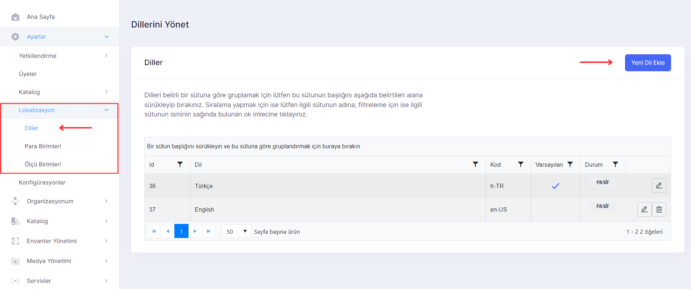<figcaption>
Yeni Dil Ekleme
</figcaption></figure>

 

<figure><figcaption>
Yeni Dil Ekleme Ekranı
</figcaption></figure>

#### Para Birimleri&#x20;

Para birimleri yönetimi: PIM üzerinde ürün bilgilerinin bir parçası olarak fiyat listeleri de yönetilebilmektedir. Bu fiyat listelerinde kullanılacak para birimleri ve bu birimlerin birbirine dönüşüm oranları merkezi olarak yönetilebilmektedir.

\

<figure>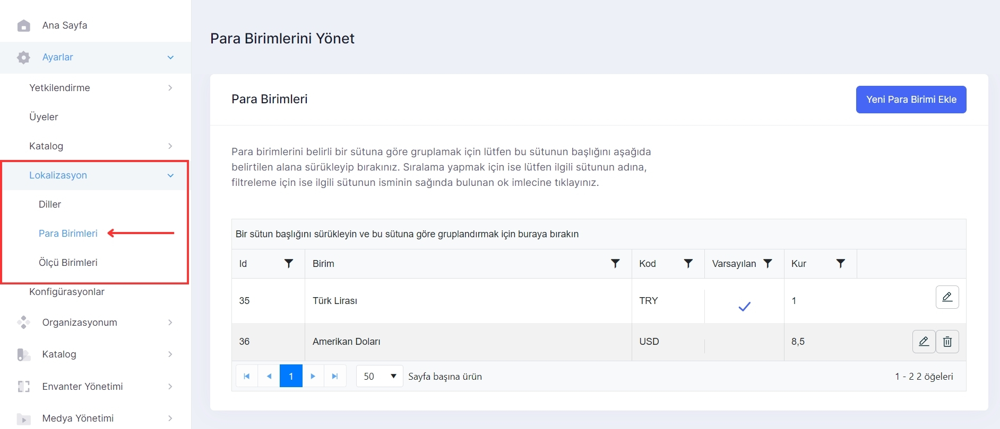<figcaption>
Para Birimleri
</figcaption></figure>

Yeni para birimi tanımlamak için "Yeni Para Birimi Ekle" butonuna tıklayarak, yeni dil ekleme ekranından oluşturulabilir. Eklenen para birimi para birimleri sayfasında listelenir.

<figure><figcaption>
Para Birimi Ekleme Ekranı
</figcaption></figure>

 

<figure><figcaption>
Eklenen Para Birimi Listeleme
</figcaption></figure>

#### Ölçü Birimleri

Ölçü birimleri yönetimi: PIM üzerinde yönetilen ürün bilgileri kapsamında ürünlere ait ölçüler de bulunmaktadır. Bu ölçülere ait birimler merkezi olarak yönetilebilmektedir.

<figure><figcaption>
Ölçü Birimleri Ekranı
</figcaption></figure>

Yeni ölçü birimi tanımlamak için "Yeni Ölçü Birimi Ekle" butonuna tıklayarak, yeni ölçü ekleme ekranından oluşturulabilir. Eklenen yeni birim ölçü birimleri sayfasında listelenir.

<figure><figcaption>
Yeni Ölçü Birimi Ekleme
</figcaption></figure>

 

<figure><figcaption>
Eklenen Birimi Listeleme
</figcaption></figure>

## Organizasyonum

Organizasyonlar ile ilgili ayrıntılı bilgilere erişebildiğimiz, aboneliklerin yönetimi ve Lidia ürünlerinin yönetimini organize edebildiğimiz alandır. _**Organizasyon; "Detaylar", "Abonelikler" ve "Lidia Uygulamaları" olmak üzere 3 bölüme ayrılır.**_

### Detaylar

Organizasyonum detaylar sayfasında organizasyonlar ile ilgili ayrıntılı bilgiler (şirket adı, organizasyon tipi, organizasyon alan adı, organizasyon kodu ve açıklama) görüntülenebilir ve düzenlenebilir.&#x20;

<figure><figcaption>
Detaylar
</figcaption></figure>

### Abonelikler

Abonelikler yönetimi kapsamında var olan abonelikler görüntülenebilir, düzenlenebilir.

<figure><figcaption></figcaption></figure>

 

<figure><figcaption></figcaption></figure>

### Lidia Uygulamaları

<figure><figcaption>
Uygulamalar
</figcaption></figure>

* Lidia uygulamalarını yönet ekranında var olan uygulamalar görüntülenir ve düzenlenir. Örneğin;
  * Merchant Console
  * PIM
  * Store

<figure><figcaption>
Uygulama Oluşturma
</figcaption></figure>

Yeni eklenen uygulamalar sayfasında listelenir. "Detaylar" seçeneği ile uygulamaya ait özellikler düzenlenebilir ve gerekli tanımlar yapılabilir.

<figure><figcaption>
Eklenen Uygulamaları Listeleme
</figcaption></figure>

 

<figure><figcaption>
Uygulama Detay Sayfası
</figcaption></figure>

### Katalog

#### Kategoriler

Kategoriler, bir PIM sistemi içinde ürünlerin sınıflandırıldığı ve organize edildiği gruplardır. Kategoriler, benzer özelliklere, özellik gruplarına veya kullanım amacına sahip ürünlerin bir araya getirildiği etiketlerdir. Kategoriler, PIM sistemi kullanıcılarına ürün verilerini daha yönetilebilir ve kullanıcı dostu bir şekilde sunma imkanı sağlar.

Örneğin, bir e-ticaret web sitesi için kategori örnekleri şunlar olabilir:

* **Elektronik:** Bilgisayarlar, cep telefonları, televizyonlar gibi elektronik ürünlerin bulunduğu kategori.
* **Giyim:** Kadın giyim, erkek giyim, çocuk giyim gibi farklı alt kategorilere ayrılmış giyim ürünlerinin bulunduğu kategori.
* **Ev Dekorasyonu:** Halılar, perdeler, duvar dekorasyonu gibi ev dekorasyonu ürünlerinin bulunduğu kategori.
* **Mobilya:** Oturma grupları, yemek masaları, yatak odası mobilyaları gibi mobilya ürünlerinin bulunduğu kategori.

Kategoriler, ürünlerin doğru bir şekilde sınıflandırılmasını ve müşterilere doğru ürünlerin sunulmasını sağlar. Aynı zamanda, PIM sistemi içinde ürünleri daha kolay bulmalarını, yönetmelerini ve güncellemelerini sağlar. Her PIM sistemi, kendi ihtiyaçlarına ve iş gereksinimlerine göre farklı kategoriler kullanabilir ve kategorileri kendi ürün veri yönetimi süreçlerinize uygun olarak özelleştirebilir.

<figure><figcaption>
Kategori Yönetim Ekranı 
</figcaption></figure>

#### Markalar

PIM markalar bölümü, bir şirketin veya bir ürünün marka yönetimini gerçekleştirdiği bir alanı içerebilir. Bu bölüm, markaların yönetimini ve kullanımını kolaylaştıran bir dizi özellik ve fonksiyonlar sunabilir.

Bir PIM sistemi içinde markalar bölümü aşağıdaki öğeleri içerebilir:

* Marka bilgileri: Markanın adı, logosu, sloganı, sembolü, renkleri, sesi, kokusu gibi marka unsurlarını içeren bilgileri barındırabilir.
* Marka ilişkileri: Birden fazla markanın ilişkilerini yönetebileceğiniz bir bölüm olabilir. Örneğin, ana marka ve alt markalar arasındaki ilişkileri, marka ağaçlarını veya marka portföyünü yönetmek için kullanılabilir.

PIM’de ürün yüklemeden önce kategori, marka gibi özellikleri tanımlanmalıdır.&#x20;

<figure><figcaption>
Marka Yönetim Ekranı 
</figcaption></figure>

### Özel Listeler

#### Ürünler

<figure><figcaption>
Ürünler Yönetim Ekranı 
</figcaption></figure>

#### Varyantlar&#x20;

Ürünlerin varyantları renk ve beden gibi farklı özelliklere sahip bir ürün, çeşitleriyle birlikte tek bir ürün sayfasında gruplandığında kullanılır.

<figure><figcaption>
Varyanlar Yönetim Ekranı
</figcaption></figure>

#### Veri Kilitleri

Veri kilitleri, bir PIM (Product Information Management) sistemi içinde ürün verilerinin güvenliğini sağlamak ve değişikliklerin kontrol altında tutulmasını sağlamak için kullanılan mekanizmalardır. Veri kilitleri, kullanıcıların belirli ürün veya ürün grubu verilerini güncellerken, başka kullanıcıların aynı verilere aynı anda erişmelerini engelleyerek çakışmaları önler.

Veri kilitleri, aşağıdaki durumlarda kullanışlıdır:

* Eş zamanlı güncelleme: Birden fazla kullanıcının aynı anda aynı ürün veya ürün grubu üzerinde güncelleme yapması durumunda veri kilitleri, güncellemelerin çakışmasını önler ve tutarlı bir veri durumunu korur.
* Veri güvenliği: Veri kilitleri, yetkisiz kullanıcıların belirli ürün verilerini değiştirmesini veya silmesini engeller ve veri güvenliğini sağlar.
* İçerik yönetimi: PIM sistemi kullanıcıları, belirli bir ürün veya ürün grubu üzerinde çalışırken, veri kilitleri sayesinde o ürün veya ürün grubunun verilerini güncellemek, düzenlemek veya silmek gibi değişiklikleri kontrol edebilir.
* Çakışan güncellemeleri önleme: Birden fazla kullanıcının aynı anda aynı ürün üzerinde güncelleme yapması durumunda veri kilitleri, güncellemelerin çakışmasını engelleyerek veri bütünlüğünü korur.
* Veri yönetimi süreçlerini düzenleme: Veri kilitleri, PIM sistemi kullanıcılarının belirli ürün verilerini güncellerken, değişikliklerin uygun süreçlere göre yönetilmesini sağlar ve veri yönetimi süreçlerini düzenler.\

PIM’de kullanım sektörüne, ihtiyaçlarına ve iş gereksinimlerine göre farklı veri kilitleri kullanabilir ve veri kilitlerini kendi veri yönetimi süreçlerine uygun olarak özelleştirebilir.

### Envanter

#### Fiyat Listeleri&#x20;

<figure><figcaption>
Fiyat Listeleri Yönetim Ekranı
</figcaption></figure>

### Medya

Lidia PIM üzerinde ürün verisi ile eşleştirilebilecek aşağıdaki medya ögeleri de yönetilebilmektedir:

* Ürün görselleri
* Ürün dosyaları
* Ürün videoları

<figure><figcaption>
Görsel yönetimi ekranı
</figcaption></figure>

### Servisler&#x20;

#### Havuzlar

<figure><figcaption>
Havuz Listesi Yönetim Ekranı 
</figcaption></figure>

#### Akışlar

Lidia PIM uygulamasının ana yeteneklerinden biri canlı sisteme alınan ürün verilerinin istenen 3.parti kanallara beslenebilmesidir. Ürün verisinin dış dünyaya Akış (Feed) ismi verilen yapılar üzerinden aktarılabilmektedir.&#x20;

PIM kullanıcıları uygulama üzerinde yeni bir akış oluşturup bu akış ile aşağıda başlıklarda bir filtre eşleştirebilir.

* Kategoriler: Herhangi bir akışa sadece belirli kategorilerdeki ürünler dahil edilebilir.
* Markalar: Herhangi bir akışa sadece belirli markalardaki ürünler dahil edilebilir.
* Özel listeler: Herhangi bir akışa sadece belirli özel listelerdeki ürünler dahil edilebilir.
* Özellikler: Herhangi bir akışa sadece belirli bir özelliğe sahip (ör: Malzemesi %100 deri olan) ürünler eklenebilir.
* Seçenekler: Herhangi bir akışa sadece belirli bir seçeneğe uygun olan (ör: Sadece Kırmızı renkteki, Small beden) ürünler eklenebilir.
* Etiketler: Herhangi bir akışa sadece belirli bir etikete sahip olan ürünler eklenebilir.

PIM kullanıcıları, bir akışın filtre kurulumu yapılarak dahil edilecek ürün grubu belirlendikten sonra bu ürün grubuna ait verinin hangi kapsamda ilgili akış üzerinden dışa aktarılacağını da belirleyebilir. Bu amaçla kullanılan yapıya koleksiyonlar ismi verilmektedir.

Özellikler, seçenekler ve etiketler ile eşleştirilen koleksiyonlar ürün akışlarına eklenebilir. Bu doğrultuda Lidia PIM üzerinde oluşturulan bir ürün akışının çıktısı uygulama tarafından aşağıdaki adımlarda oluşturulmaktadır:

* İlgili akışın filtresine uygun şekilde ürün listesi belirlenir
* Bu ürünlerin herhangi bir koleksiyona dahil edilmemiş özellikleri, seçenekleri ve etiketleri ürün çıktısına eklenir
* İlgili akışa eklenmiş koleksiyon bulunuyorsa bu koleksiyon kapsamında yer alan özellikler, seçenekler ve etiketler de ürün çıktısına eklenir

### Raporlar

Raporlar, bir PIM sistemi tarafından kullanıcıların iş verilerini analiz etmek, performanslarını değerlendirmek ve kararlarını desteklemek için sunulan özet veya ayrıntılı bilgilerin sunulduğu belgelerdir. PIM sistemi, ürün verileriyle ilgili çeşitli raporlar sunarak kullanıcılara veri odaklı görüşler ve bilgiler sağlar.

PIM sistemi içinde bulunan raporlar, genellikle aşağıdaki alanlarda kullanılabilir:

* Ürün performansı: Ürün verilerine dayalı raporlar, ürünlerin satışları, envanter seviyeleri, fiyatlar, müşteri geri bildirimleri gibi performans metriklerini analiz ederek ürün performansını değerlendirmeye yardımcı olur. Bu tür raporlar, ürün stratejilerini optimize etmek için kullanıcıları bilgilendirir.
* Müşteri analitiği: Müşteri verilerine dayalı raporlar, müşteri davranışlarını, tercihlerini ve alışkanlıklarını analiz ederek müşteri segmentasyonunu, müşteri sadakatini ve müşteri memnuniyetini değerlendirmeye yardımcı olur. Bu tür raporlar, müşteri ilişkilerini güçlendirmek için kullanıcıları bilgilendirir.
* Veri doğruluk ve eksiklik analitiği: Ürün veri doğruluk ve eksikliklerini analiz eden raporlar, kullanıcılara hangi ürün verilerinin eksik veya hatalı olduğunu belirleme ve doğru veri girişi süreçlerini optimize etme konusunda yardımcı olur. Bu tür raporlar, veri kalitesini artırmak için kullanıcıları bilgilendirir.
* Ürün yayılımı: Ürünlerin hangi pazarlarda, kanallarda veya bölgelerde yayımlandığına dair raporlar, kullanıcılara ürünlerin yayılımını izleme ve yönetme konusunda bilgi sağlar. Bu tür raporlar, ürünlerin pazara sunulma stratejilerini ve performansını değerlendirmek için kullanıcıları bilgilendirir.
* Kategori analitiği: Kategori verilerine dayalı raporlar, kategori performansını, trendleri, müşteri taleplerini ve rekabetçi analizleri analiz ederek kategori yönetimini optimize etmeye yardımcı olur. Bu tür raporlar, kategori yönetimi stratejilerini geliştirmek için kullanıcıları bilgilendirir.

\

\
\
