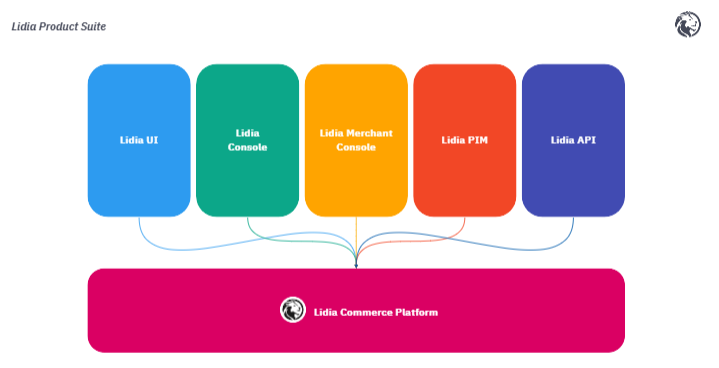

# Overview

**Lidia,** is a complete e-commerce solution for enterprises. It includes a micro-service based, scalable e-commerce engine for developers and management apps for admins and merchants. It can run both on cloud and on-premise.

<figure><figcaption>
Lidia Commerce Platform 
</figcaption></figure>

Lidia Commerce Platform includes a **digital commerce engine** developed with a MACH (Microservices-based, API-first, Cloud-native, and Headless) approach. Every service in this engine exposes it's own api's. More details about API endpoints you can found in our developer site.

* **Lidia UI** - One semi-developed web application code base which can be used as a template for your user interface
* ****[**Lidia Console**](broken-reference) - Ready to use administration panel for your application.&#x20;
* ****[**Lidia Merchant Console** ](broken-reference)- Self-service portal for your merchants, mainly used in B2B or B2B2C(marketplace) applications.&#x20;
* ****[**Lidia PIM**](broken-reference) **** - Cloud based product information management tool with advanced import and export capabilities
* **Lidia API** - The high-level orchestration API for all the features exposed by the engine services

&#x20;                                                  [More details about the platform](broken-reference)
