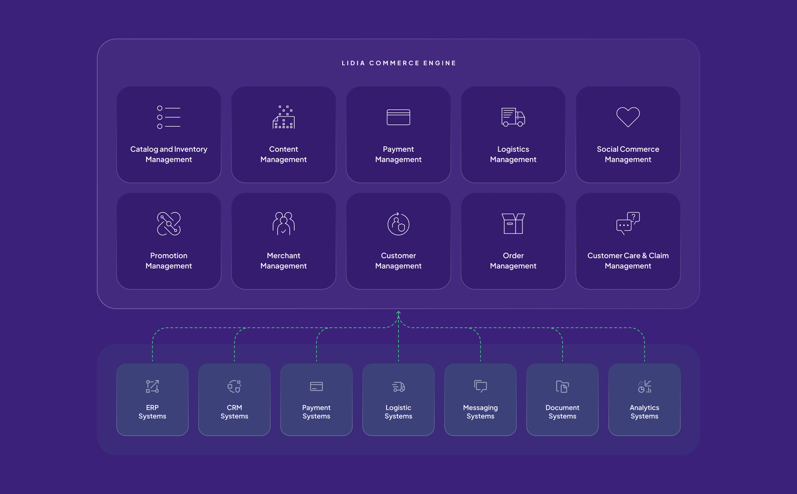
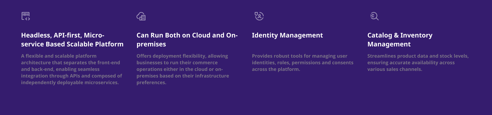
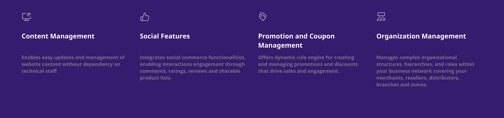
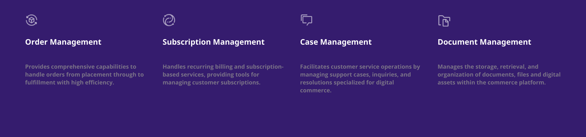
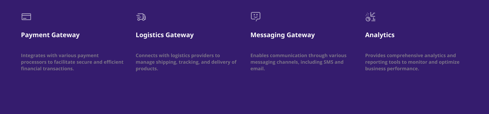

# Features

## The Powerhouse for Your Digital Success!

Lidia Commerce Engine is the core component of Lidia Commerce Platform and the powerhouse behind all operations.It is a state-of-the-art Backend as a Service (BaaS) solution, designed to empower mid and large businesses with the tools and flexibility needed to excel in the digital commerce space.

<figure><figcaption>
Lidia Commerce Engine
</figcaption></figure>

## Key Features

It is core component of Lidia Commerce Platform and the powerhouse behind all operations. It is a state-of-the-art Backend as a Service (BaaS) solution, designed to empower mid and large businesses with the tools and flexibility needed to excel in the digital commerce space.

<figure><figcaption></figcaption></figure>

<figure><figcaption></figcaption></figure>

<figure><figcaption></figcaption></figure>

<figure><figcaption></figcaption></figure>
