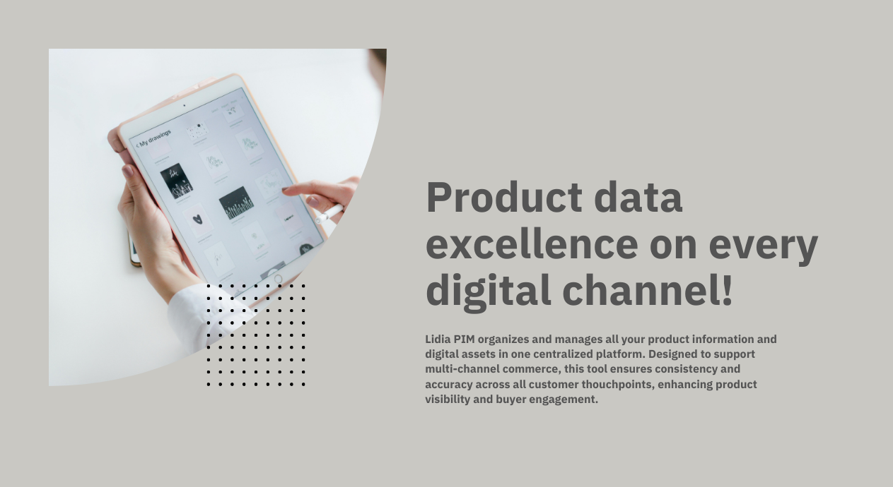

# Lidia PIM

Lidia PIM (Product Information Management)  is a centralized platform designed to simplify the management of product data and digital assets across various digital channels. It addresses the challenges businesses face in maintaining accurate and consistent product information, ensuring that all customer touchpoints are aligned with the latest data.

<figure><figcaption></figcaption></figure>

#### Product History

With the rise of the Internet in the 2000s, businesses began to use the web as an active sales and marketing channel, which highlighted the need for enriched product data. While ERP systems initially managed product data, the increasing demand for high-resolution images, product videos, and detailed descriptions for online sales surpassed the capabilities of these traditional systems. This need led to the development of specialized PIM systems, and Lidia PIM emerged as a solution to these challenges.

Development of Lidia PIM began in 2021 by T\&G Workshop, with its first alpha version released in mid-2022. The system was designed to address the modern needs of digital product data management, moving beyond the limitations of ERP systems by offering tools for product data enrichment, media management, and seamless data distribution across digital channels.

Product data can be imported into the Lidia PIM application by integration using the Lidia PIM API or by using Excel files.

**Ability to edit and enrich product data (Product data management & enrichment)**

Within the Lidia PIM application, it is possible to manage product data according to certain standards and The following processes can be operated / capabilities can be used for enrichment.

**Product catalog design;**&#x20;

* Product features / options o Product labels
* &#x20;Product relationships o Size / Dimension uses
* Product brands
* Product categories and their data schemas (now called product families)&#x20;
* Product lists (special lists)

**Media management;**&#x20;

* Product images
* Product documentation&#x20;
* Product videos

**Additional requirements for product data management;**

* Data locks Ability to transfer product data to external stakeholders without the need for technical support (Product publication)&#x20;

With the help of Lidia PIM application, channels to be fed with product data can be created and feeds can be set up for these channels. Filters can be added for the products to be included in the feeds, and the envelope (including/excluding which fields) of the products to be exported as a result of the filter can be set.

