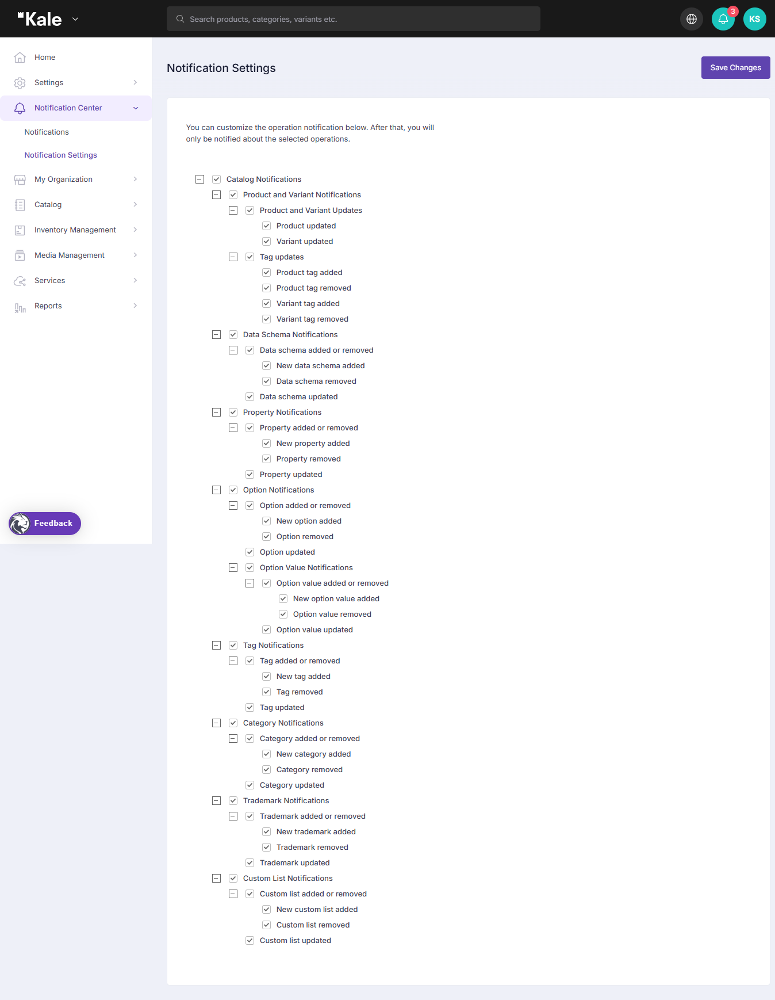

# Notifications

## **Notification Center in PIM System**

The **Notification Center** in the PIM system allows users to customize and manage notifications for various platform operations. Users can configure which updates they want to receive notifications for and view past notifications related to product data, catalog updates, and system changes.

***

### **Notifications Page**

The **Notifications** page provides an overview of all system notifications, helping users track updates and changes in real time. The key features of this page include:

* **Search and Filter Options**
  * Users can search for specific notifications by keywords.
  * Filters allow sorting notifications by **Notification Type** and **Date**.
* **Unread Notifications Toggle**
  * Users can choose to display only unread notifications for better focus.
* **Notification Entries**
  * Each notification includes details such as:
    * **Event Type** (e.g., "Custom list updated," "Data schema updated")
    * **User or System Action** (e.g., "Aysu Acar has updated the 'Minimalist Bathroom Furniture' custom list.")
    * **Date of Update**
* **Mark All as Read**
  * Users can mark all notifications as read to clear alerts.

<figure><figcaption></figcaption></figure>

***

### **Notification Settings Page**

The **Notification Settings** page enables users to select the types of notifications they wish to receive. The available notification categories include:

* **Catalog Notifications**
  * **Product and Variant Notifications**: Users can receive notifications when a product or variant is updated.
  * **Tag Updates**: Users can be notified when product tags are added, removed, or updated.
* **Data Schema Notifications**
  * Users are notified when a new data schema is added, updated, or removed.
* **Property Notifications**
  * Notifications are sent when a new property is added, updated, or removed.
* **Option Notifications**
  * Users receive updates when options or option values are added, removed, or modified.
* **Tag Notifications**
  * Users can enable notifications for when tags are added, updated, or removed.
* **Category Notifications**
  * Notifications for category additions, removals, or updates.
* **Trademark Notifications**
  * Users can receive alerts when trademarks are added, removed, or modified.
* **Custom List Notifications**
  * Users are notified when a new custom list is created, modified, or deleted.

The **Save Changes** button allows users to confirm their notification preferences.

<figure><figcaption>
Settings
</figcaption></figure>

This structured notification system ensures that users stay informed about critical updates while allowing them to customize their preferences for a streamlined experience.
