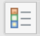

# Özellik ve Seçenek nasıl tanımlanır?

## :rocket:<mark style="color:$primary;background-color:purple;">Özellik ve Seçenekleri Yapılandırın</mark>

Özellikler ve seçenekler, ürün kartının hangi bilgileri içereceğini ve bu bilgilerin sistemde nasıl yönetileceğini belirler. Doğru yapılandırıldığında, ürün verisi daha tutarlı ilerler ve varyant yönetimi daha kontrollü şekilde yapılır.

#### :arrow\_forward:<mark style="color:$info;">Özellik Nedir?</mark>

**Özellik**, ürünün teknik veya açıklayıcı niteliklerini tanımlamak için kullanılan veri alanıdır. Özellikler, ürün kartında gösterilen bilgileri oluşturur ve ürünün filtrelenmesini, karşılaştırılmasını ve detaylandırılmasını sağlar.

Özellikler fiyat veya stok değişikliğine neden olmaz; ürünün niteliğini tanımlar.


* <mark style="background-color:purple;">**Özellik Veri Tipi Nedir?**</mark>

Bir özellik oluşturulduktan sonra, bu özelliğin hangi formatta veri kabul edeceği belirlenir. Buna veri tipi denir.

```
Desteklenen veri tipleri: 
-Tekil Kod   -Tek Satır Metin   -Uzun Metin   -Zengin Metin   -Tekli Seçim  -Çoklu Seçim
-Liste   -Var/Yok   -Tarih   -E-posta   -Tel No   -URL   -Fiyat   -Yüzde   -Süre   -Ölçü
```

Veri tipi olarak **Tekli Seçim** veya **Çoklu Seçim** seçildiğinde, özellik için kullanılacak değerleri önceden tanımlamalısınız. Bu değerleri sistemde siz oluşturur ve ihtiyaçlarınıza göre istediğiniz kadar ekleyebilir veya düzenleyebilirsiniz.

> Televizyon örneğinden devam edelim, önce bir özellik tanımlayalım ve veri tipini 'çoklu seçim' olarak seçelim:
>
> * **Özellik:** Enerji Sınıfı
> * **Veri Tipi:** Çoklu Seçim
> * **Tanımlanan Değerler:** A, B, C, D, E, F
> *
>
>     <div align="left" data-with-frame="true"><figure><figcaption></figcaption></figure></div>
>
> Bu sayede ürün oluşturma sırasında kullanıcı yalnızca tanımladığınız değerler arasından seçim yapabilir. Yeni değer girilemez; yalnızca mevcut seçenekler kullanılabilir.

Bu yöntemle veri girişini kontrol altında tutarsınız ve tutarlı bir ürün yapısı oluşturursunuz.


* <mark style="background-color:purple;">**Özellik Grubu Nedir?**</mark>

**Özellik grubu**, benzer özellikleri bir arada düzenlemek için kullanılır. Özellik grupları, PIM kullanıcısı olarak ürün verinizi daha düzenli yönetmenize yardımcı olur. İlgili özellikleri aynı başlık altında toplayarak hem ürün girişini hem de veri yönetimini kolaylaştırabilirsiniz.

> Örneğin televizyon ürünü için **Ekran Boyutu, Çözünürlük ve Panel Teknolojisi** gibi özellikleri oluşturduysanız, bu özellikleri **Ekran Özellikleri** adlı bir özellik grubu altında toplayın. Bu şekilde ilgili özellikleri aynı başlık altında düzenleyebilir ve ürün kartında daha düzenli bir yapı oluşturabilirsiniz.

#### :arrow\_forward:<mark style="color:$info;">Seçenek Nedir?</mark>

**Seçenek**, ürünün farklı versiyonlarını oluşturmak için kullanılan alanlardır. Genellikle fiyat veya stokta farklılık yaratan bilgiler seçenek olarak tanımlanır.

> Örneğin televizyon ürününde **Çözünürlük** bir seçenek olabilir. Bu seçenek, televizyonun hangi çözünürlükte sunulduğunu belirler ve kendine ait seçenek değerleri içerir, kendine ait seçenek değerleri vardır.

Bir seçenek oluştururken, seçeneğin hangi veri tipinde değer alacağını belirleyebilirsiniz.

Desteklenen veri tipleri şunlardır:

* [x] Metin, Tam Sayı, Ondalık Sayı, Ölçü


* <mark style="background-color:purple;">**Seçenek Değeri Nedir?**</mark>

**Seçenek değeri**, bir seçeneğe ait kullanılabilir değerleri ifade eder. Bir seçenek oluşturduktan sonra, o seçeneğe ait istediğiniz kadar seçenek değeri ekleyebilirsiniz.

> Örneğin **Çözünürlük** bir TV seçeneği ise, buna ait seçenek değerleri **4K**, **8K** gibi değerler olabilir. Ürün oluştururken kullanıcı bu değerler arasından seçim yapar.\
> Başka bir örnek olarak **Renk** seçeneğini düşünün. Bu seçeneğe ait değerler **Siyah**, **Mavi**, **Bebek Mavisi** gibi farklı renkler olabilir.

Seçenek değerlerini tamamen ihtiyaçlarınıza göre tanımlayabilirsiniz.


* <mark style="background-color:purple;">**Seçenek Değer Grubu Nedir?**</mark>

**Seçenek değer grubu**, benzer seçenek değerlerini bir arada düzenlemek için kullanılır. Çok sayıda seçenek değeri bulunan alanlarda değerleri daha düzenli yönetmenize yardımcı olur.

> Örneğin televizyon ürünü için **Renk** seçeneğini oluşturduğunuzu düşünün. Bu seçeneğe ait değerler **Gri, Gümüş, Antrasit, Beyaz, Siyah** gibi farklı tonlar olabilir. Bu değerlerden benzer gördüklerinizi örneğin gri+gümüş+antrasit üçlüsünü **Gri Tonları** adlı bir seçenek değer grubunda toplayabilirsiniz.

Seçenek değer grubu oluşturmak için:

1. **Ayarlar > Katalog > Seçenekler > Seçenek Değer Grupları** sayfasına gidin.
2. **Seçenek Değer Grubu Ekle** butonuna tıklayın.
3. Açılan pencerede **Seçenek Değer Grubu Adı** , **Görüntülenecek Ad** ve **Değer Grubu Kodu** alanlarını doldurun, kaydedin.
4.

    <div align="left" data-with-frame="true"><figure><figcaption></figcaption></figure></div>
5. Seçenek değerlerini oluşturduktan sonra ilgili değerin **detay sayfası**na gidin ve bu değeri oluşturduğunuz **seçenek değer grubuna** bağlayın.

Bu sayede benzer seçenek değerlerini aynı grup altında düzenleyebilirsiniz.


* <mark style="background-color:purple;">**Seçenek Grubu Nedir?**</mark>

**Seçenek grubu**, birden fazla seçeneği mantıksal olarak aynı başlık altında toplamak için kullanılır. Bu yapı özellikle çok sayıda seçenek bulunan ürünlerde yönetimi kolaylaştırır.

> Örneğin televizyon ürününde **Renk**, **Panel Teknolojisi,** **Çözünürlük, Dahili Wi-Fi** gibi birden fazla farklı seçenek oluşturduysanız, bu seçeneklerden renk, panel teknolojisi ve çözünürlüğü ekran özelliği olarak nitelendirebilir, **Ekran Özellikleri** adlı bir seçenek grubunda bir araya getirebilirsiniz.

Seçenek değer grubu oluşturmak için:

1. **Ayarlar > Katalog > Seçenekler > Seçenek Grupları** sayfasına gidin.
2. **Seçenek Grubu Ekle** butonuna tıklayın.
3. Açılan pencerede **Seçenek Grubu Adı, Görüntülenecek Ad** ve **Grubu Kodu** alanlarını doldurun, kaydedin.
4.

    <div align="left" data-with-frame="true"><figure><figcaption></figcaption></figure></div>
5. Seçenek grubu oluşturduktan sonra, ilgili seçeneğin detay sayfasına gidin ve **Seçenek Grubu** alanından oluşturduğunuz grubu seçerek seçeneği bu gruba bağlayın.

Bu şekilde televizyon ürününe ait varyant seçeneklerini düzenli bir yapı içinde yönetebilirsiniz.


#### :arrow\_forward:<mark style="color:$info;">Seçenek ve Özellik Aralarındaki Fark Nedir?</mark>

**Özellikler**, ürünün teknik veya açıklayıcı niteliklerini ifade eder. Ürünü tanımlar ancak fiyat veya stokta farklılık oluşturmaz.

**Seçenekler** ise ürünün farklı versiyonlarını oluşturmak için kullanılır. Genellikle fiyat veya stokta farklılık yaratan bilgiler seçenek olarak tanımlanır.


Alan tanımlarken şu kuralı kullanabilirsiniz: Ürünün farklı bir versiyonunu oluşturuyorsa **seçenek**, yalnızca ürün bilgisini tanımlıyorsa **özellik** olarak tanımlayın.


> Örneğin televizyon ürünü için **Enerji Sınıfı**, **Garanti Süresi** veya **Model Yılı** gibi bilgiler genellikle **özellik** olarak tanımlanır. Bu bilgiler ürünü tanımlar ancak çoğu senaryoda farklı bir varyant oluşturmaz.
>
> Buna karşılık **Ekran Boyutu**, **Renk** veya **Çözünürlük** gibi alanlar genellikle **seçenek** olarak tanımlanır. Bu alanların farklı değerleri ürünün farklı versiyonlarını oluşturabilir ve fiyat veya stok bilgisini etkileyebilir.
>
> Ancak bu ayrım tamamen sizin ürün modelleme tercihinize bağlıdır. Örneğin bazı işletmeler için **Enerji Sınıfı** ürün fiyatını etkileyen bir varyant olabilir. Böyle bir durumda bu alanı **seçenek** olarak tanımlayabilirsiniz.

Lidia PIM’de ürün veri modelinizi iş ihtiyaçlarınıza göre esnek şekilde kurgulayabilir, hangi alanların **özellik** hangi alanların **seçenek** olacağına siz karar verebilirsiniz.

#### :arrow\_forward:<mark style="color:$info;">Özellik nasıl oluşturulur?</mark>



**Ayarlar > Katalog > Özellikler sayfasına gidin.**



**Özellik Ekle butonuna tıklayın.**

<table data-view="cards"><thead><tr><th></th><th data-hidden data-card-cover data-type="image">Cover image</th></tr></thead><tbody><tr><td><p>Açılan modalda:</p><ul><li><strong>Özellik Adı</strong> → Zorunlu</li><li><strong>Özellik Kodu</strong> → Zorunlu</li><li><strong>Özellik Grubu</strong> → Opsiyonel</li></ul><p>Bu alanlar doldurulduktan sonra <strong>Devam Et</strong> butonuna tıklayın.</p><p>Özellik oluşturulur ve detay sayfasına yönlendirilirsiniz.</p></td><td data-object-fit="fill"><a href="../../../.gitbook/assets/Ekran görüntüsü 2026-03-04 003712.png">Ekran görüntüsü 2026-03-04 003712.png</a></td></tr></tbody></table>



**Detay sayfasında ilgili özelleştirmeleri yapın.**

<table data-view="cards"><thead><tr><th></th><th data-hidden data-card-cover data-type="image">Cover image</th></tr></thead><tbody><tr><td><p></p><ul><li>Veri Tipi seçilir</li><li>Gerekirse özellik grubu bağlanır</li><li>Seçim tipindeyse değerler eklenir</li></ul><p>Kaydedin.</p></td><td data-object-fit="contain"><a href="../../../.gitbook/assets/Ekran görüntüsü 2026-03-04 123437.png">Ekran görüntüsü 2026-03-04 123437.png</a></td></tr></tbody></table>



🎉**Özellik başarıyla oluşturuldu.**



#### :arrow\_forward:<mark style="color:$info;">Seçenek nasıl oluşturulur?</mark>



**Ayarlar > Katalog > Seçenekler > Seçenekler sayfasına gidin.**



**Seçenek Ekle butonuna tıklayın.**

<table data-view="cards"><thead><tr><th></th><th data-hidden data-card-cover data-type="image">Cover image</th></tr></thead><tbody><tr><td><p></p><p>Açılan <strong>Yeni Seçenek Ekle</strong> penceresinde aşağıdaki alanları doldurun:</p><ul><li><strong>Seçenek Grubu (Opsiyonel)</strong></li><li><strong>Seçenek Adı (Zorunlu)</strong></li><li><strong>Görüntülenecek Ad (Zorunlu)</strong></li><li><strong>Seçenek Kodu (Zorunlu)</strong></li><li><strong>Veri Tipi (Zorunlu)</strong><br><em>Metin</em>, <em>Tam Sayı</em>, <em>Ondalık Sayı</em> veya <em>Ölçü</em>.</li></ul><p>Alanları doldurduktan sonra <strong>Devam Et</strong> butonuna tıklayın.<br>Seçenek oluşturulur ve detay sayfasına yönlendirilirsiniz.</p></td><td data-object-fit="contain"><a href="../../../.gitbook/assets/Ekran görüntüsü 2026-03-04 155611.png">Ekran görüntüsü 2026-03-04 155611.png</a></td></tr></tbody></table>



**Detay sayfasında ilgili özelleştirmeleri yapın.**

<table data-view="cards"><thead><tr><th></th><th data-hidden data-card-cover data-type="image">Cover image</th></tr></thead><tbody><tr><td><p></p><ul><li>Veri Tipi seçilir, değiştirilir.</li><li>Gerekirse seçenek grubu bağlanır</li></ul></td><td data-object-fit="contain"><a href="../../../.gitbook/assets/Ekran görüntüsü 2026-03-04 160316.png">Ekran görüntüsü 2026-03-04 160316.png</a></td></tr></tbody></table>



**Detay sayfasında Seçenek Değerleri tab’ine gidin.**



**Değer Ekle butonuna tıklayın.**

<table data-view="cards"><thead><tr><th></th><th data-hidden data-card-cover data-type="image">Cover image</th></tr></thead><tbody><tr><td><p>Açılan pencerede aşağıdaki alanları doldurun:</p><ul><li><strong>Değer Adı (Zorunlu)</strong></li><li><strong>Değer Kodu (Zorunlu)</strong></li></ul><p>Alanları doldurduktan sonra <strong>Devam Et</strong> butonuna tıklayın.<br>Seçenek değeri oluşturulur ve ilgili seçeneğe eklenmiş olur.<br>İstenirse seçenek değer grubu bağlanır</p></td><td data-object-fit="contain"><a href="../../../.gitbook/assets/Ekran görüntüsü 2026-03-04 161248.png">Ekran görüntüsü 2026-03-04 161248.png</a></td></tr></tbody></table>



🎉**Seçenek başarıyla oluşturuldu.**



#### :arrow\_forward:<mark style="color:$info;">Örnek Kullanım Senaryosu: Televizyon</mark>

Bir televizyon ürünü için ürün modelimizi oluştururken hem **özellikleri** hem de **seçenekleri** birlikte tanımlayalım.

Öncelikle televizyon ürününü tanımlayan **özellikleri** oluşturalım. Bu alanlar ürünün teknik bilgilerini tutar ve genellikle varyant oluşturmaz.



<mark style="color:$primary;">**Enerji Sınıfı Özelliğini Oluşturma**</mark>

1. **Ayarlar > Katalog > Özellikler** sayfasına gidin.
2. **Özellik Ekle** butonuna tıklayın.
3.  Açılan pencerede aşağıdaki alanları doldurun:

    * **Özellik Adı:** Enerji Sınıfı
    * **Özellik Kodu:** ENRJ-1
    *

        <div align="left" data-with-frame="true"><figure><figcaption></figcaption></figure></div>


4. **Devam Et** butonuna tıklayın.

Özellik oluşturulduktan sonra detay sayfasına yönlendirilirsiniz.

5. **Veri Tipi** olarak **Çoklu Seçim** seçin.
6. **Değer Ekle** butonuna tıklayarak aşağıdaki değerleri oluşturun:
   * A
   * B
   * C
   * D

<div align="left" data-with-frame="true"><figure><figcaption></figcaption></figure></div>

:tada:Enerji sınıfı özelliği oluşturulmuş olur, artık veri şemasına bağlayabilirsiniz.



<mark style="color:$primary;">**Garanti Süresi Özelliğini Oluşturma**</mark>

1. **Ayarlar > Katalog > Özellikler** sayfasına gidin.
2. **Özellik Ekle** butonuna tıklayın.
3. Açılan pencerede aşağıdaki alanları doldurun:
   * **Özellik Adı:** Garanti Süresi (Ay)
   * **Özellik Kodu:** GRNT
   *

       <div align="left" data-with-frame="true"><figure><figcaption></figcaption></figure></div>
4. **Devam Et** butonuna tıklayın.

Özellik oluşturulduktan sonra detay sayfasına yönlendirilirsiniz.

5. **Veri Tipi** olarak **Tam Sayı** seçin.

<div align="left" data-with-frame="true"><figure><figcaption></figcaption></figure></div>

Garanti süresi özelliği oluşturulmuş olur, artık veri şemasına bağlayabilirsiniz.



<mark style="color:$primary;">**Model Yılı Özelliğini Oluşturma**</mark>

1. **Ayarlar > Katalog > Özellikler** sayfasına gidin.
2. **Özellik Ekle** butonuna tıklayın.
3. Açılan pencerede aşağıdaki alanları doldurun:
   * **Özellik Adı:** Model Yılı
   * **Özellik Kodu:** MDL
   *

       <div align="left" data-with-frame="true"><figure><figcaption></figcaption></figure></div>
4. **Devam Et** butonuna tıklayın.

Özellik oluşturulduktan sonra detay sayfasına yönlendirilirsiniz. Detay sayfasında:

5. **Veri Tipi** olarak **Tam Sayı** seçin.

<div align="left" data-with-frame="true"><figure><figcaption></figcaption></figure></div>

Model yılı özelliği oluşturulmuş olur, artık veri şemasına bağlayabilirsiniz.



<mark style="color:$primary;">**Dahili Uydu Alıcı Özelliğini Oluşturma**</mark>

1. **Ayarlar > Katalog > Özellikler** sayfasına gidin.
2. **Özellik Ekle** butonuna tıklayın.
3. Açılan pencerede aşağıdaki alanları doldurun:
   * **Özellik Adı:** Dahili Uydu Alıcı
   * **Özellik Kodu:** dahili\_uydu\_alici
   *

       <div align="left" data-with-frame="true"><figure><figcaption></figcaption></figure></div>
4. **Devam Et** butonuna tıklayın.

Özellik oluşturulduktan sonra detay sayfasına yönlendirilirsiniz. Detay sayfasında:

5. **Veri Tipi** olarak **Var/Yok** seçin.

<div align="left" data-with-frame="true"><figure><figcaption></figcaption></figure></div>

Dahili uydu alıcı özelliği oluşturulmuş olur, artık veri şemasına bağlayabilirsiniz.




Şimdi ürünün farklı versiyonlarını oluşturmak için **seçenekleri** tanımlayalım. Bu alanlar ürünün varyantlarını oluşturur ve fiyat veya stok bilgisini etkileyebilir.



<mark style="color:$primary;">**Ekran Boyutu Seçeneğini Oluşturma**</mark>

1. **Ayarlar > Katalog > Seçenekler > Seçenekler** sayfasına gidin.
2. **Seçenek Ekle** butonuna tıklayın.
3. Açılan **Yeni Seçenek Ekle** penceresinde aşağıdaki alanları doldurun:
   * **Seçenek Adı:** Ekran Boyutu (inç)              _(Zorunlu)_
   * **Görüntülenecek Ad:** Ekran Boyutu (inç)  _(Zorunlu)_
   * **Seçenek Kodu:** ekrn12                               _(Zorunlu)_
   * **Veri Tipi:** Ölçü                                             _(Zorunlu)_
   *

       <div align="left" data-with-frame="true"><figure><figcaption></figcaption></figure></div>
4. **Devam Et** butonuna tıklayın.

Seçenek oluşturulduktan sonra detay sayfasına yönlendirilirsiniz.

<div align="left" data-with-frame="true"><figure><figcaption></figcaption></figure></div>

5. **Seçenek Değerleri** tab’ine gidin.
6. **Değer Ekle** butonuna tıklayın.
7.  Açılan **Yeni Değer** penceresinde aşağıdaki alanları doldurun:

    * **Değer Adı:** 75 inç           &#x20;
    * **Görüntülenecek Değer Adı:** 75 inç &#x20;
    * **Değer Kodu:** 75
    *

        <div align="left" data-with-frame="true"><figure><figcaption></figcaption></figure></div>


8. Tek tek aşağıdaki değerleri oluşturun:

* **55 inç**
* **65 inç**
* **75 inç**

:tada:Ekran Boyutu seçeneği ve değerleri oluşturulmuş olur, artık veri şemasına bağlayabilirsiniz.



<mark style="color:$primary;">**Çözünürlük Seçeneğini Oluşturma**</mark>

1. **Ayarlar > Katalog > Seçenekler > Seçenekler** sayfasına gidin.
2. **Seçenek Ekle** butonuna tıklayın.
3. Açılan pencerede aşağıdaki alanları doldurun:
   * **Seçenek Adı:** Çözünürlük              _(Zorunlu)_
   * **Görüntülenecek Ad:** Çözünürlük  _(Zorunlu)_
   * **Seçenek Kodu:** CZNRLK                _(Zorunlu)_
   * **Veri Tipi:** Metin                               _(Zorunlu)_
   *

       <div align="left" data-with-frame="true"><figure><figcaption></figcaption></figure></div>
4. **Devam Et** butonuna tıklayın.

Seçenek oluşturulduktan sonra detay sayfasına yönlendirilirsiniz.

<div align="left" data-with-frame="true"><figure><figcaption></figcaption></figure></div>

5. **Seçenek Değerleri** tab’ine gidin.
6. **Değer Ekle** butonuna tıklayın.
7. Açılan **Yeni Değer** penceresinde aşağıdaki alanları doldurun:
   * **Değer Adı:** 4K         &#x20;
   * **Görüntülenecek Değer Adı:** 4K  &#x20;
   * **Değer Kodu:** 4K &#x20;
   *

       <div align="left" data-with-frame="true"><figure><figcaption></figcaption></figure></div>
8. Tek tek aşağıdaki değerleri oluşturun:
   * **4K**
   * **8K**

Çözünürlük seçeneği oluşturulmuş olur, artık veri şemasına bağlayabilirsiniz.



<mark style="color:$primary;">**Panel Teknolojisi Seçeneğini Oluşturma**</mark>

1. **Ayarlar > Katalog > Seçenekler > Seçenekler** sayfasına gidin.
2. **Seçenek Ekle** butonuna tıklayın.
3. Açılan pencerede aşağıdaki alanları doldurun:
   * **Seçenek Adı:** Panel Teknolojisi               _(Zorunlu)_
   * **Görüntülenecek Ad:** Panel Teknolojisi   _(Zorunlu)_
   * **Seçenek Kodu:** PNL-TKNLJ                    _(Zorunlu)_
   * **Veri Tipi:** Metin                                         _(Zorunlu)_
   *

       <div align="left" data-with-frame="true"><figure><figcaption></figcaption></figure></div>
4. **Devam Et** butonuna tıklayın.

Seçenek oluşturulduktan sonra detay sayfasına yönlendirilirsiniz.

<div align="left" data-with-frame="true"><figure><figcaption></figcaption></figure></div>

5. **Seçenek Değerleri** tab’ine gidin.
6. **Değer Ekle** butonuna tıklayın.
7.  Açılan **Yeni Değer** penceresinde aşağıdaki alanları doldurun:

    * **Değer Adı:** LED         &#x20;
    * **Görüntülenecek Değer Adı:** LED         &#x20;
    * **Değer Kodu:** LED           &#x20;
    *

        <div align="left" data-with-frame="true"><figure><figcaption></figcaption></figure></div>


8. Tek tek aşağıdaki değerleri oluşturun:
   * **LED**
   * **OLED**
   * **QLED**

Panel Teknolojisi seçeneği oluşturulmuş olur, artık veri şemasına bağlayabilirsiniz.



<mark style="color:$primary;">**Renk Seçeneğini Oluşturma**</mark>

1. **Ayarlar > Katalog > Seçenekler > Seçenekler** sayfasına gidin.
2. **Seçenek Ekle** butonuna tıklayın.
3. Açılan pencerede aşağıdaki alanları doldurun:
   * **Seçenek Adı:** Renk              _(Zorunlu)_
   * **Görüntülenecek Ad:** Renk  _(Zorunlu)_
   * **Seçenek Kodu:** RENK          _(Zorunlu)_
   * **Veri Tipi:** Metin                     _(Zorunlu)_
   *

       <div align="left" data-with-frame="true"><figure><figcaption></figcaption></figure></div>
4. **Devam Et** butonuna tıklayın.

Seçenek oluşturulduktan sonra detay sayfasına yönlendirilirsiniz.

<div align="left" data-with-frame="true"><figure><figcaption></figcaption></figure></div>

5. **Seçenek Değerleri** tab’ine gidin.
6. **Değer Ekle** butonuna tıklayın.
7. Açılan **Yeni Değer** penceresinde aşağıdaki alanları doldurun:
   * **Değer Adı:** Siyah         &#x20;
   * **Görüntülenecek Değer Adı:** LED         &#x20;
   * **Değer Kodu:** SYH
   *

       <div align="left" data-with-frame="true"><figure><figcaption></figcaption></figure></div>
8. Tek tek aşağıdaki değerleri oluşturun:

* **Siyah**
* **Gri**

Renk seçeneği oluşturulmuş olur, artık veri şemasına bağlayabilirsiniz.



#### :arrow\_forward:<mark style="color:$info;">Özellikler ve seçenekler veri şemasına nasıl eklenir?</mark>

Özellikleri ve seçenekleri oluşturduktan sonra, bu alanları ürün veri modelinizde kullanabilmek için veri şemasına eklemelisiniz.

Bunun için:



**Ayarlar > Katalog > Ürün Aileleri** sayfasına gidin.



Özellik ve seçenekleri eklemek istediğiniz veri şemasını açın.



Veri şeması detay sayfasında **Veri Şeması Alanları** tab’ine gidin.



**Yeni Alan Ekle** butonuna tıklayın.

* Alan Adı (Zorunlu)\
  Veri şemasına eklemek istediğiniz alanın adını girin.
* Alan Türü (Zorunlu)\
  Eklemek istediğiniz alanın türünü seçin.
  * Özellik eklemek için    -> Özellik
  * Seçenek eklemek için -> Seçenek
* Alan Değeri (Zorunlu)\
  Alan Türü olarak **Özellik** veya **Seçenek** seçtiğinizde bu alan görünür.\
  Bu bölümden daha önce oluşturduğunuz özelliği veya seçeneği seçin.



Alanları doldurduktan sonra Kaydet butonuna tıklayın.



Alan veri şemasına eklenir ve ürün oluşturma sırasında kullanılabilir hale gelir.

:tada:Artık veri şemamızı <mark style="background-color:purple;">kategoriye</mark> bağlayabilir, havuz oluşturma işlemine geçebiliriz.



> Televizyon örneğimizden devam edelim ve veri şeması için oluşturduğunuz özellikleri veri şemasına ekleyelim.
>
> Öncelikle <mark style="background-color:purple;">**Televizyon veri şeması**</mark>**nın** detay sayfasına gidin ve **Yeni Alan Ekle** butonuna tıklayın. Açılan pencerede <mark style="background-color:purple;">**Alan Türü**</mark> <mark style="background-color:purple;"></mark><mark style="background-color:purple;">olarak</mark> <mark style="background-color:purple;"></mark><mark style="background-color:purple;">**Özellik**</mark> seçin. Ardından Alan Değeri alanından daha önce oluşturduğunuz özelliklerden birini seçin, eklemeyi tamamlayın:
>
> * Enerji Sınıfı
> * Garanti Süresi
> * Model Yılı
> * Dahili Uydu Alıcı
>
> Aynı adımları izleyerek seçenekleri de veri şemasına ekleyebilirsiniz. Bunun için <mark style="background-color:purple;">**Alan Türü**</mark> <mark style="background-color:purple;"></mark><mark style="background-color:purple;">olarak Seçenek</mark> seçin ve Alan Değeri alanından daha önce oluşturduğunuz seçenekleri ekleyin:
>
> * Ekran Boyutu
> * Çözünürlük
> * Panel Teknolojisi
> * Renk
>
> Bu şekilde televizyon ürünleri için tanımladığınız özellik ve seçenekleri veri şemasına ekleyebilir ve ürün modelinizde kullanabilirsiniz.
