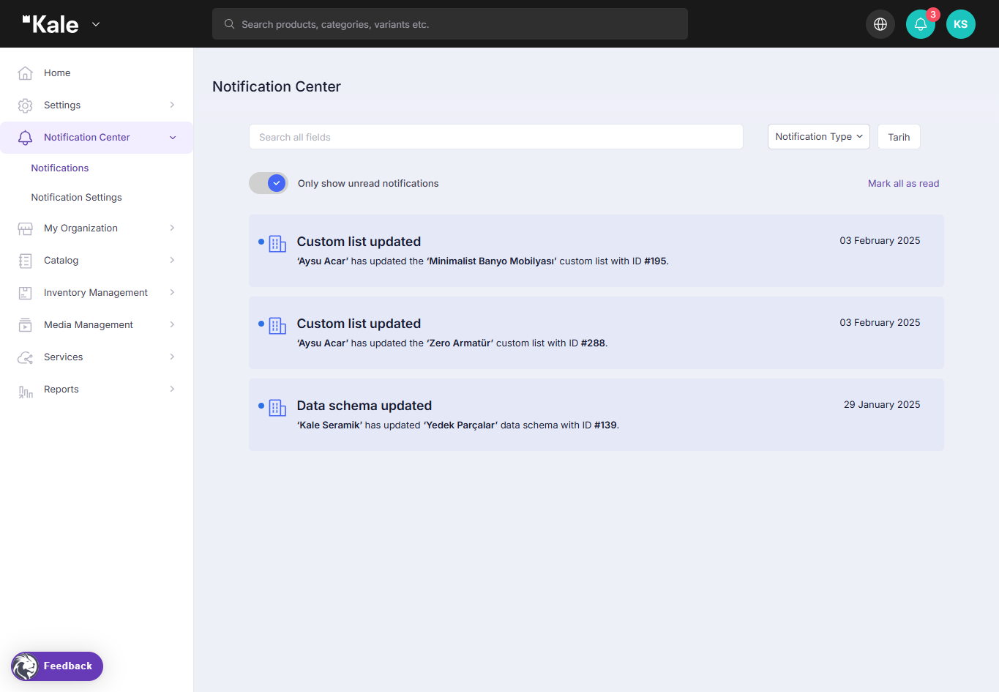
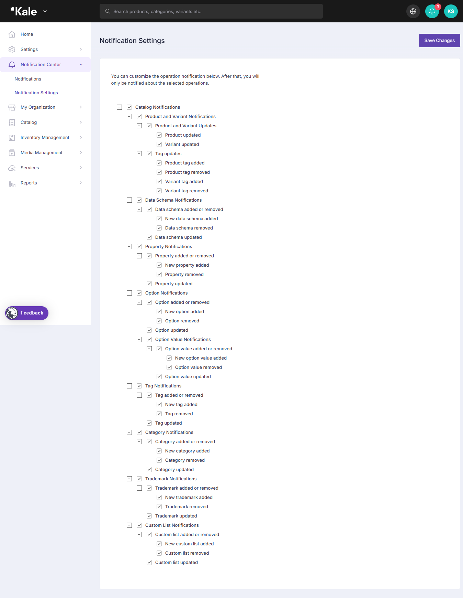

# Turkish

## Başlarken

Başlamak için [https://pim.lidiacommerce.com/](https://pim.lidiacommerce.com/) adresini ziyaret edin. Giriş ekranı ile karşılaşacaksınız. Size atanmış e-posta ve şifre ile giriş yapabilirsiniz.\
Giriş yaptıktan sonra ana sayfaya yönlendirileceksiniz.

### Ana Sayfa

Ana sayfa, Lidia PIM’e giriş yaptığınızda karşılaştığınız ilk ekrandır. Bu ekranda sol menüden yönetim işlemleri yapılabilir, hesap bilgileri ve organizasyonlar görüntülenebilir, ayrıca dil değiştirilebilir.

Ana sayfa aşağıdaki bölümlerden oluşur:

* **Katalog Veri Kalitesi**: Ürün verilerinin kalitesine genel bir bakış sunar ve eksik veya tamamlanmamış bilgileri vurgular. Bu sayede verilerin doğruluğu ve tutarlılığı sağlanabilir.
* **Ürün Durumu**: Sistemdeki ürünlerin mevcut durumunu gösterir. Ürünlerin taslak, onay bekliyor, yayınlanmış veya pasif olup olmadığını takip etmeye yardımcı olur.
* **Ürün Aileleri**: Ürünleri, ortak özelliklere ve kategorilere göre önceden tanımlanmış gruplara ayırır. Benzer ürün türlerini daha verimli yönetmeyi sağlar.
* **Veri Havuzları**: Ürün verilerinin işlenebileceği, zenginleştirilebileceği ve çeşitli kanallara yayınlanabileceği veri koleksiyonlarını temsil eder.
* **Kategoriler**: Ürün kataloğunun hiyerarşik yapısını belirler. Ürünlerin sektör standartlarına veya şirket içi sınıflandırmalara göre düzenlenmesini sağlar.
* **Özel Listeler**: Belirli kriterlere dayalı olarak kişiselleştirilmiş ürün grupları oluşturmayı ve yönetmeyi sağlar. Böylece ürün verilerinin daha iyi segmentasyonu ve filtrelenmesi mümkündür.
* **Markalar**: Ürünlerle ilişkili tescilli marka adlarını ve logoları yönetir. Bu, marka kimliğinin farklı satış ve pazarlama kanallarında doğru şekilde sunulmasını sağlar.
* **Kanallar ve Akışlar**: Ürün verilerinin e-ticaret siteleri, pazar yerleri ve diğer üçüncü taraf sistemlere aktarılmasını yönetir. Kullanıcılar kanalları yapılandırabilir ve veri akışlarını otomatikleştirmek için ayarlamalar yapabilir.

Bu yapı, kullanıcıların ürün bilgilerini ve dağıtım süreçlerini daha verimli yönetmesine yardımcı olur.

<figure><figcaption>
Dashboard
</figcaption></figure>

***

### Sol Menü

Sol menü, PIM sistemini yönetmek için kullanılan bölümleri içerir.

#### **Sol Menü Navigasyonu**

* **Ayarlar**: Sistem tercihlerini, kullanıcı rollerini ve genel yapılandırmaları yönetin.
* **Bildirim Merkezi**: Sistem bildirimlerini, uyarıları ve güncellemeleri görüntüleyin ve yönetin.
* **Organizasyonum**: Organizasyon detaylarını, kullanıcı rollerini ve aktif abonelikleri yönetin.
* **Katalog**: Ürün verilerini, kategorileri ve nitelikleri görüntüleyin ve yönetin.
* **Stok Yönetimi**: Stok seviyelerini, depo bilgilerini ve ürün bulunabilirliğini takip edin.
* **Medya Yönetimi**: Ürün görsellerini, videolarını ve dijital varlıkları yükleyin, organize edin ve yönetin.
* **Hizmetler**: PIM sistemiyle ilgili ek özelliklere ve entegrasyonlara erişin.
* **Raporlar**: Analiz ve performans raporlarını oluşturun ve görüntüleyin.

<figure><figcaption>
Left Menu
</figcaption></figure>

***

### **Hesap Bilgileri**

Hesap bilgilerini, organizasyon detaylarını veya dili değiştirmek için sağ üst köşedeki profil bölümüne tıklayın.

#### **Kullanıcı Bilgileri**

Aşağıdaki bilgiler güncellenebilir:

* Profil fotoğrafı
* Ad ve soyad
* E-posta adresi
* Telefon numarası
* Şifre güncelleme

#### **Organizasyon Bilgileri**

Organizasyon detayları altında kullanıcılar şunları yapabilir:

* Organizasyon adını ve açıklamasını güncelleme
* Aktif organizasyon aboneliklerini görüntüleme
* Organizasyon kullanıcılarını yönetme (Sadece "Uygulama Yöneticisi" rolüne sahip kullanıcılar yeni kullanıcı oluşturabilir ve mevcut kullanıcıları güncelleyebilir.)
* Mevcut Lidia uygulamalarını görüntüleme (Console, Merchant Console vb.)

Bu yapı sayesinde kullanıcılar hesap bilgilerini ve organizasyonlarını kolayca yönetebilirler.

## Ayarlar

Ayarlar bölümü, PIM kullanıcılarının sistem genelindeki ayarları yapılandırmasına ve yönetmesine olanak tanıyan sayfaları içerir. Bu ayarlar, platform yönetimini ve özelleştirmesini etkili bir şekilde sağlamaya yardımcı olur.

### **Yetkilendirme**

Yetkilendirme bölümü, PIM sisteminde kullanıcı rolleri ve izinlerinin tanımlandığı ve yönetildiği sayfalardan oluşur. İki ana kategoriye ayrılır:

* **Kullanıcılar**: Kullanıcılar sayfası, PIM sistemine kayıtlı tüm kullanıcıların listesini gösterir. Kullanıcılar detaylı olarak görüntülenebilir, güncellenebilir, silinebilir ve durumlarına göre filtrelenebilir.
* **Roller**: Roller sayfası, önceden tanımlanmış rolleri ve her role atanmış aktif kullanıcı sayısını listeler. Yeni roller oluşturulabilir, mevcut roller (yönetici rolleri dahil) düzenlenebilir. Belirli sayfalara ait izinler ayarlanabilir ve pasif roller silinebilir.

### **Kişiler**

Kişiler bölümü, PIM sisteminde tanımlanmış kullanıcıların listelenmesine ve yönetilmesine olanak tanır. Bu bölümden kullanıcı detayları ve erişim izinleri değiştirilebilir.

***

### **Katalog**

Katalog menüsü, ürün verilerini düzenlemek, yönetmek ve sürdürmek için kullanılan sayfaları içerir.

* **Ürün Aileleri**: Ürün Aileleri sayfası, benzer özelliklere sahip ürünleri gruplamak için kullanılır. Örneğin, bir elektronik mağazası "Telefonlar" veya "Bilgisayarlar" gibi ürün aileleri oluşturabilir.
* **Koleksiyonlar**: Koleksiyonlar bölümü, mevcut koleksiyonları görüntülemeye ve yeni koleksiyonlar oluşturmaya olanak tanır.

#### **Özellikler**

Özellikler menüsü, ürünler için belirli nitelikler tanımlayarak daha ayrıntılı ürün açıklamaları yapılmasını sağlar. İki alt bölüme ayrılır:

* **Özellikler**: Bu sayfa, "Disk Kapasitesi" altında "128 GB Depolama" gibi ürün özelliklerini tanımlamak ve yönetmek için kullanılır.
* **Özellik Grupları**: Benzer özellikleri "Teknik Özellikler" veya "Boyutlar" gibi kategorilere ayırarak daha iyi bir organizasyon sağlar.

***

#### **Seçenekler**

Seçenekler menüsü, ek ürün özelleştirmelerini ve varyasyonlarını yönetmek için kullanılır. Üç alt bölüme ayrılır:

* **Seçenekler**: Ürünlerin farklı renk veya beden gibi varyasyonlarını tanımlar.
* **Seçenek Grupları**: Benzer seçenekleri gruplandırarak (örneğin "Renkler" veya "Bedenler") daha kolay yönetim sağlar.
* **Seçenek Değer Grupları**: Belirli bir seçenek için olası değerleri saklar. Örneğin, "Renkler" grubu içinde "Kırmızı", "Mavi" ve "Yeşil" gibi değerler bulunur.

***

#### **Veri Kilitleme**

Veri Kilitleme sayfası, ürün bilgileri veya fiyatlandırma gibi kritik verilerin yanlışlıkla değiştirilmesini önler.

***

#### **Ürün İlişkileri**

Ürün İlişkileri, ürünler arasındaki bağlantıları tanımlamak için kullanılır. Farklı türde ilişkiler oluşturulabilir:

* **Ana ve Alt Ürün İlişkisi**
* **İlgili Ürün İlişkisi**
* **Aksesuar Ürün İlişkisi**

***

#### **Kategori Boyutları**

Kategori Boyutları, PIM sisteminde ürün kategorileri için filtreler oluşturarak ürünlerin daha iyi yönetilmesini sağlar.

***

### **Kanallar**

PIM sistemlerinde **Kanallar**, ürün verilerinin farklı satış platformları, pazar yerleri, e-ticaret siteleri, fiziksel mağazalar ve sosyal medya platformlarında nasıl yönetileceğini ve sunulacağını tanımlar.

Kanallar, ürün verilerinin her platformun özel gereksinimlerine göre doğru formatta, optimize edilmiş ve güncel bir şekilde dağıtılmasını sağlar.\
Bu sayede işletmeler:

* Ürünlerin doğru ve güncel bilgilerle yayınlanmasını sağlayarak müşteri deneyimini ve satış performansını artırabilir.
* Ürün verilerini her platform için takip edebilir, güncelleyebilir ve raporlayabilir.

***

### **Etiketler**

Etiketler, ürünlere, kategorilere, markalara ve listelere atanan etiketlerin yönetildiği merkezi bir alan sağlar.

***

### **Yerelleştirme**

Yerelleştirme, ürünlerin ve hizmetlerin kültürel, dilsel ve coğrafi faktörlere göre belirli pazarlara uyarlanmasını ifade eder. **Yerelleştirme menüsü** dört bölümden oluşur:

* **Çoklu Dil**: PIM sisteminde diller merkezi olarak tanımlanabilir, böylece ürün verileri birden fazla dilde çevrilebilir ve yönetilebilir.
* **Çoklu Para Birimi**: Para birimi yönetimi, ürün fiyatlandırma listelerinin birden fazla para biriminde tutulmasını sağlar ve döviz kurları merkezi olarak yönetilir.
* **Ölçü Birimleri**: Ölçü birimi yönetimi, ürünlerin boyut ve ağırlık gibi ölçümlerinin tutarlı bir şekilde yönetilmesini sağlar.

***

Bu yapı, kullanıcıların PIM sistemindeki ürün verilerini ve yönetim süreçlerini daha verimli ve düzenli bir şekilde kontrol etmelerine yardımcı olur.

## Bildirimler

PIM sistemindeki **Bildirim Merkezi**, kullanıcıların çeşitli platform işlemleri için bildirimleri özelleştirmesine ve yönetmesine olanak tanır. Kullanıcılar hangi güncellemeler için bildirim almak istediklerini yapılandırabilir ve ürün verileri, katalog güncellemeleri ve sistem değişiklikleriyle ilgili geçmiş bildirimleri görüntüleyebilirler.

***

### **Bildirimler Sayfası**

**Bildirimler Sayfası**, tüm sistem bildirimlerine genel bir bakış sunarak kullanıcıların güncellemeleri ve değişiklikleri gerçek zamanlı olarak takip etmelerini sağlar. Bu sayfanın temel özellikleri şunlardır:

#### **Arama ve Filtreleme Seçenekleri**

* Kullanıcılar belirli bildirimleri anahtar kelimelerle arayabilir.
* Filtreler sayesinde bildirimler **Bildirim Türü** ve **Tarih** bazında sıralanabilir.

#### **Okunmamış Bildirimler Filtreleme**

* Kullanıcılar sadece **okunmamış bildirimleri** görüntülemeyi seçerek önemli güncellemelere daha iyi odaklanabilirler.

### **Bildirim Kayıtları**

Her bildirim aşağıdaki detayları içerir:

* **Olay Türü** (Örn: "Özel liste güncellendi", "Veri şeması güncellendi")
* **Kullanıcı veya Sistem İşlemi** (Örn: _"Aysu Acar, 'Minimalist Banyo Mobilyası' özel listesini güncelledi."_)
* **Güncelleme Tarihi**

**Tümünü Okundu Olarak İşaretle**

* Kullanıcılar tüm bildirimleri **okundu olarak işaretleyerek** bildirim ekranını temizleyebilirler.

<figure><figcaption></figcaption></figure>

***

### **Bildirim Ayarları Sayfası**

**Bildirim Ayarları Sayfası**, kullanıcıların hangi tür bildirimleri almak istediklerini seçmelerini sağlar. Mevcut bildirim kategorileri şunlardır:

**Katalog Bildirimleri**

* **Ürün ve Varyant Bildirimleri**: Bir ürün veya varyant güncellendiğinde bildirim alınmasını sağlar.
* **Etiket Güncellemeleri**: Ürün etiketleri eklendiğinde, kaldırıldığında veya güncellendiğinde bildirim gönderilir.

**Veri Şeması Bildirimleri**

* Yeni bir **veri şeması eklendiğinde, güncellendiğinde veya kaldırıldığında** kullanıcılar bilgilendirilir.

**Özellik Bildirimleri**

* Yeni bir **özellik** eklendiğinde, güncellendiğinde veya kaldırıldığında bildirim alınır.

**Seçenek Bildirimleri**

* **Seçenekler veya seçenek değerleri eklendiğinde, kaldırıldığında veya değiştirildiğinde** bildirim gönderilir.

**Etiket Bildirimleri**

* **Etiketler eklendiğinde, güncellendiğinde veya kaldırıldığında** bildirim alınır.

**Kategori Bildirimleri**

* **Kategori ekleme, kaldırma veya güncelleme işlemleri** için bildirimler etkinleştirilebilir.

**Marka Bildirimleri**

* **Yeni marka eklendiğinde, kaldırıldığında veya güncellendiğinde** bildirim alınabilir.

**Özel Liste Bildirimleri**

* Yeni bir **özel liste oluşturulduğunda, değiştirildiğinde veya silindiğinde** kullanıcılar bilgilendirilir.

**Değişiklikleri Kaydet**

* Kullanıcılar tercih ettikleri bildirim ayarlarını **Kaydet** düğmesi ile onaylayabilirler.

<figure><figcaption>
Settings
</figcaption></figure>

Bu yapılandırılmış **bildirim sistemi**, kullanıcıların kritik güncellemeler hakkında bilgilendirilmesini sağlarken, bildirim tercihlerini özelleştirmelerine de olanak tanır. Böylece kullanıcılar gereksiz bildirimlerden kaçınarak yalnızca önemli güncellemelere odaklanabilirler.

## Organizasyon

## Katalog

## Envanter

## Medya Yönetimi

## Akışlar

## Raporlar
