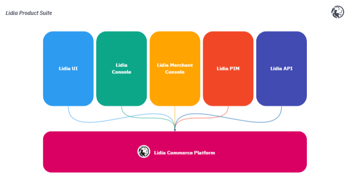

# Lidia Solutions

Lidia offers a comprehensive suite of digital commerce solutions designed to help businesses streamline their operations, engage with customers, and adapt to rapidly changing market dynamics. With a modular, API-first architecture, Lidia provides flexibility, scalability, and the ability to customize solutions for various business models, including B2C, B2B, and marketplace environments.

## **Core Product Suites**


[lidia-marketplace-suite](suites/lidia-marketplace-suite/)



[lidia-b2c-suite](suites/lidia-b2c-suite/)



[lidia-b2b-suite](suites/lidia-b2b-suite/)


### **Flexibility and Customization**

* **Deployment Options**: Lidia supports both on-premise and cloud-based deployments across multiple platforms, including AWS, Azure, and Kubernetes. This allows businesses to scale their infrastructure as needed, ensuring optimal performance​.
* **No-Code Tools**: Lidia offers no-code schema design tools, allowing companies to easily configure product data schemas without developer support. This makes it easier to manage product information for different sales channels​.

### **Consulting and Support Services**

* **Expert Consultation**: Lidia provides senior consultancy services to help businesses define their requirements, design their commerce platforms, and manage successful implementations​.
* **Training and Documentation**: Comprehensive training sessions and detailed documentation are provided for all platforms to ensure that teams can operate Lidia’s tools effectively​​.

## Key Components of Lidia Solutions

**Lidia,** is a complete e-commerce solution for enterprises. It includes a micro-service based, scalable e-commerce engine for developers and management apps for admins and merchants. It can run both on cloud and on-premise.

<figure><figcaption>
Lidia Commerce Platform 
</figcaption></figure>

Lidia Commerce Platform includes a **digital commerce engine** developed with a MACH (Microservices-based, API-first, Cloud-native, and Headless) approach. Every service in this engine exposes it's own api's. More details about API endpoints you can found in our developer site.

### Components


[lidia-console](components/lidia-console/)



[lidia-merchant-console](components/lidia-merchant-console/)



[Broken link](broken-reference)



[api-documantation](products/lidia-commerce-engine/api-documantation/)



[lidia-worker.md](components/lidia-worker.md)



[lidia-static.md](components/lidia-static.md)


## [More details about the platform](https://www.lidiacommerce.com/)
