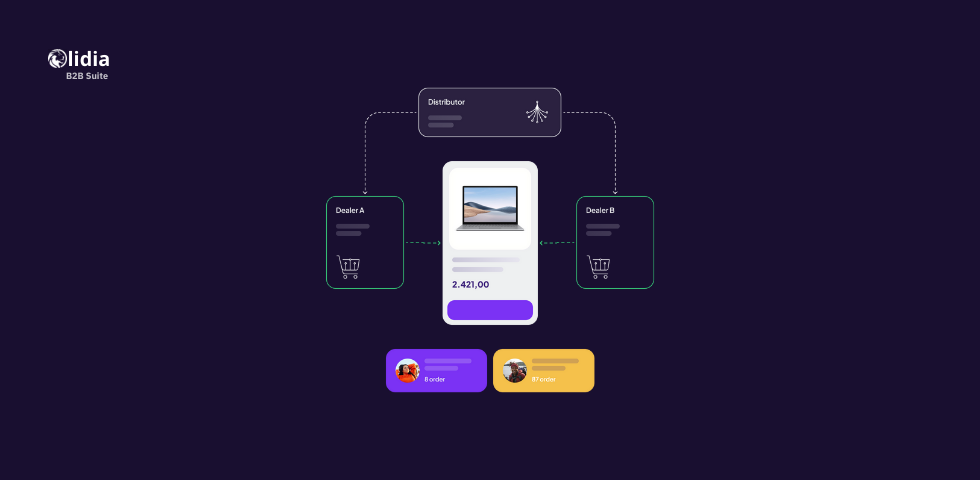

# Lidia B2B Suite

## **Overview**

The **Lidia B2B Suite** is a robust platform tailored to meet the complexities of business-to-business (B2B) commerce. Designed to empower organizations across diverse industries, it supports seamless operations by centralizing product and service catalogs, optimizing partner relationships, and automating order and logistics management. Its API-first, micro-service architecture ensures high flexibility, scalability, and easy integration with existing ERP, CRM, and other enterprise systems. Equipped with tools like the Lidia Network Console, the suite enhances collaboration, simplifies payment tracking, and provides advanced features for tender management and bulk ordering. With the Lidia B2B Suite, businesses can streamline their workflows, scale their operations, and adapt to the unique demands of the B2B digital commerce landscape.

<figure><figcaption></figcaption></figure>

### Traditional commerce re-defined

Lidia B2B Suite is engineered to address the unique complexities of B2B business model, offering robust tools to manage partner relationships, product / service portfolio, orders, and logistics seamlessly.


### Seamless collaboration with your network!

Transform your B2B commerce with the Lidia B2B Suite, designed to streamline partner management, order processing, and logistics. Benefit from robust capabilities that enhance efficiency, reduce costs, and improve customer relationships through seamless integrations and advanced digital solutions. Elevate your business operations and stay competitive with tools tailored for the unique demands of B2B transactions.\
[Request Demo](https://www.lidiacommerce.com/get-in-touch)


### Enables Quick Digital Reseller or Partner Onboarding

The Lidia B2B Suite streamlines the onboarding process for resellers and partners, allowing them to join the platform with minimal friction. By using simple online forms and automated validation processes (e.g., ID, email, and phone verification), businesses can onboard new partners in just a few steps. Additionally, customizable workflows enable the generation and submission of contracts, ensuring that compliance requirements are met. This rapid onboarding reduces time-to-market for resellers and allows businesses to scale their partner network efficiently.

### Makes Hundreds of Different B2C-Type Promotions Available for B2B Transactions

Lidia B2B Suite incorporates a flexible promotions engine, enabling businesses to create and manage a variety of marketing campaigns traditionally associated with B2C commerce. These include volume-based discounts, bundle offers, loyalty rewards, and time-sensitive deals. Such features help businesses attract and retain partners by providing incentives for bulk purchases, repeat orders, or seasonal promotions. This adaptability drives engagement and creates opportunities for partners to benefit from competitive pricing and special offers.

### Serves Partners with Real-Time Product Catalog and Related Digital Assets

The suite provides partners with a centralized, real-time product catalog integrated with rich digital assets like high-quality images, specifications, and marketing materials. Powered by the Lidia Commerce Engine and its advanced APIs, the platform ensures that partners always have access to up-to-date product information. This reduces miscommunication, enhances transparency, and enables partners to make informed purchasing decisions. The real-time synchronization ensures that any changes in inventory, pricing, or product details are immediately reflected across all channels.
