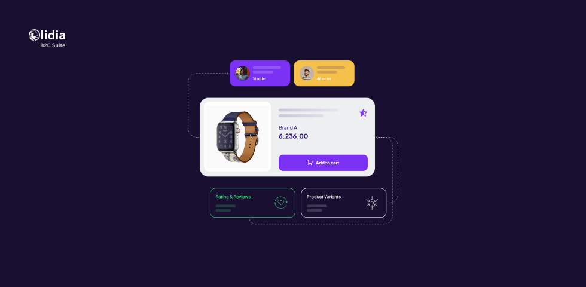

# Lidia B2C Suite

## Overview

The **Lidia B2C Suite** is a comprehensive platform designed to empower businesses to build and optimize their direct-to-consumer (D2C) operations. Perfectly suited for enterprises across industries, it facilitates seamless e-commerce experiences by centralizing product catalogs, streamlining order and customer management, and integrating with payment and logistics providers. Built on Lidia’s API-first, micro-service architecture, the suite offers unmatched flexibility, scalability, and integration capabilities, enabling businesses to adapt to the evolving digital commerce landscape.

<figure><figcaption></figcaption></figure>

### State of the art omnichannel shopping experience

Lidia B2C Suite equips you with an agile, feature-rich platform tailored for the dynamic needs of B2C commerce. It integrates cutting-edge tools for sales, marketing, and customer service into one seamless solution to build a modern omni-channel capable 7/24 accessible sales channel.


### Engage, Manage, Thrive!

Empower your direct-to-consumer business with the Lidia B2C Suite. Transform your B2C strategy with advanced digital commerce tools, ensuring seamless customer engagement and efficient order management. Unleash the power of direct sales to boost your brand's reach and enhance customer satisfaction.\
[Request Demo](https://www.lidiacommerce.com/get-in-touch)


### 24/7 Sales Channel Accessibility

The **Lidia B2C Suite** ensures that your business remains open and accessible to customers around the clock. With robust infrastructure and seamless integration, it supports continuous operations without downtime, enabling customers to browse, purchase, and engage with your platform whenever they want. This feature maximizes sales opportunities and improves customer satisfaction by catering to modern consumer expectations for always-available shopping experiences.

***

### Omni-Channel Capabilities for a Unified Customer Experience

The **Lidia B2C Suite** integrates online and offline channels to create a seamless and cohesive customer experience. By leveraging tools like the optional **Lidia Network Console**, businesses can synchronize inventory, orders, and customer data across physical stores, mobile apps, and online platforms. This approach allows for features like in-store pickups, returns of online purchases at physical locations, and consistent communication across all touchpoints, strengthening customer loyalty and enhancing brand perception.

***

### Tailor-Made, Flexible, and Scalable Architecture

The suite is built on Lidia’s API-first, micro-service architecture, offering unparalleled customization and adaptability. Businesses can tailor the platform to their specific needs, whether it's custom user interfaces, unique checkout flows, or specialized integrations with existing systems like ERP or CRM. The scalable design ensures that the suite grows with your business, effortlessly handling increased traffic, larger catalogs, and expanded geographic reach without compromising performance.
